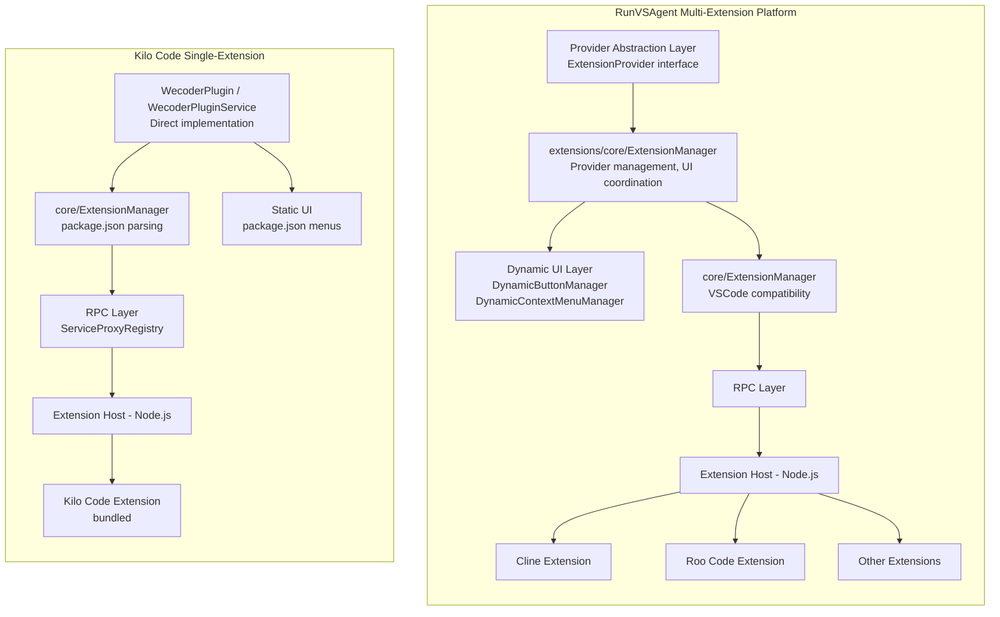

# RunVSAgent vs Kilo Code: Architectural Differences

## Overview

This document clarifies the differences between RunVSAgent's multi-extension platform architecture and Kilo Code's single-extension implementation. The `docs/jetbrains/EXAMPLE_INTEGRATION_EN.md` file describes RunVSAgent's architecture, which Kilo Code does NOT fully implement.

## Context

- **RunVSAgent** is a platform for running multiple VSCode extensions (Cline, Roo Code, etc.) in JetBrains IDEs
- **Kilo Code** is a specific implementation that wraps a single VSCode extension

## Key Differences

### 1. Extension Provider Abstraction

| Feature                     | RunVSAgent                                                                                     | Kilo Code                   |
| --------------------------- | ---------------------------------------------------------------------------------------------- | --------------------------- |
| ExtensionProvider interface | ✅ Unified contract                                                                            | ❌ Does not exist           |
| Multiple extension support  | ✅ ClineExtensionProvider, etc.                                                                | ❌ Single-extension only    |
| Methods                     | getExtensionId(), getDisplayName(), initialize(), isAvailable(), getConfiguration(), dispose() | N/A - direct implementation |

**Analysis**: RunVSAgent uses a provider abstraction to support multiple extensions dynamically. Kilo Code does not need this abstraction because it only supports one extension.

### 2. ExtensionManager Layers

**RunVSAgent has TWO ExtensionManagers**:

- `extensions/core/ExtensionManager` - Project-level provider management, UI coordination
- `core/ExtensionManager` - VSCode compatibility layer, package.json parsing, RPC activation

**Kilo Code has:**

- `core/ExtensionManager` (Kotlin) - Parses package.json, registers extensions, activates via RPC
- `extensionManager.ts` (TypeScript) - Parallel implementation on Node.js side

These are NOT the same two-layer pattern. Kilo Code's managers are parallel implementations (Kotlin and TypeScript) of the same VSCode extension host pattern, not a provider management layer.

### 3. UI Dynamic Adaptation

| Component                 | RunVSAgent                             | Kilo Code         |
| ------------------------- | -------------------------------------- | ----------------- |
| DynamicButtonManager      | ✅ Generates provider-specific buttons | ❌ Does not exist |
| DynamicContextMenuManager | ✅ Provider-specific menus             | ❌ Does not exist |
| ButtonProvider            | ✅ Per-extension UI customization      | ❌ Does not exist |
| ContextMenuProvider       | ✅ Per-extension menu policies         | ❌ Does not exist |

**Kilo Code Reality**: UI is defined statically in `package.json` using VSCode's standard command/menu contribution points.

### 4. Configuration System

| Feature                        | RunVSAgent                       | Kilo Code         |
| ------------------------------ | -------------------------------- | ----------------- |
| ExtensionConfiguration service | ✅ Centralized config            | ❌ Does not exist |
| ExtensionType enum             | ✅ CLINE, etc.                   | ❌ Does not exist |
| VsixManager                    | ✅ Manages extension directories | ❌ Does not exist |

**Kilo Code Reality**: Configuration comes from direct `package.json` parsing.

### 5. Command Dispatch

| Feature         | RunVSAgent                                           | Kilo Code                                 |
| --------------- | ---------------------------------------------------- | ----------------------------------------- |
| Custom dispatch | ✅ `executeCommand("cline.xxx")` via actions package | ❌ Different pattern                      |
| Registration    | ✅ Custom actions package                            | ✅ VSCode native commands in package.json |

**Kilo Code Reality**: Uses VSCode's native command registration and dispatch system.

## What Kilo Code DOES Implement

The accurate Kilo Code architecture (documented in `docs/jetbrains/00-10` series):

1. **Process Isolation**: JVM Plugin + Node.js Extension Host subprocess
2. **VSCode Protocol Replication**: 13-byte binary protocol, RPC proxies
3. **Service Proxy Pattern**: 73 MainThread actors + 69 ExtHost proxies
4. **JCEF Webview**: Chromium embedding with VSCode API mock injection
5. **Single Extension**: Runs bundled Kilo Code extension only

## Architecture Comparison Diagram

## Recommendations

### For EXAMPLE_INTEGRATION_EN.md

The `docs/jetbrains/EXAMPLE_INTEGRATION_EN.md` document describes RunVSAgent's architecture, not Kilo Code's. Consider:

1. **Add disclaimer**: Note that this document describes RunVSAgent's platform, not Kilo Code
2. **Reference correct docs**: Point readers to `docs/jetbrains/00-architecture-overview.md` for Kilo Code's actual architecture

### For Developers

For accurate Kilo Code architecture documentation, refer to:

- `docs/jetbrains/00-architecture-overview.md` - High-level overview
- `docs/jetbrains/01-plugin-initialization.md` - Plugin startup
- `docs/jetbrains/02-extension-host-ipc.md` - IPC protocol
- `docs/jetbrains/03-vscode-api-bridging.md` - API translation
- `docs/jetbrains/04-webview-communication.md` - Webview integration

## Summary

| Aspect               | RunVSAgent                 | Kilo Code                  |
| -------------------- | -------------------------- | -------------------------- |
| Purpose              | Multi-extension platform   | Single-extension wrapper   |
| Provider abstraction | Yes (ExtensionProvider)    | No (direct implementation) |
| Dynamic UI           | Yes (managers + providers) | No (static package.json)   |
| Configuration        | Centralized service        | Direct package.json        |
| Extension support    | Multiple (switchable)      | One (bundled)              |

The core VSCode compatibility layer (RPC, protocol, proxies) is similar, but RunVSAgent adds an additional abstraction layer for multi-extension support that Kilo Code does not require.
