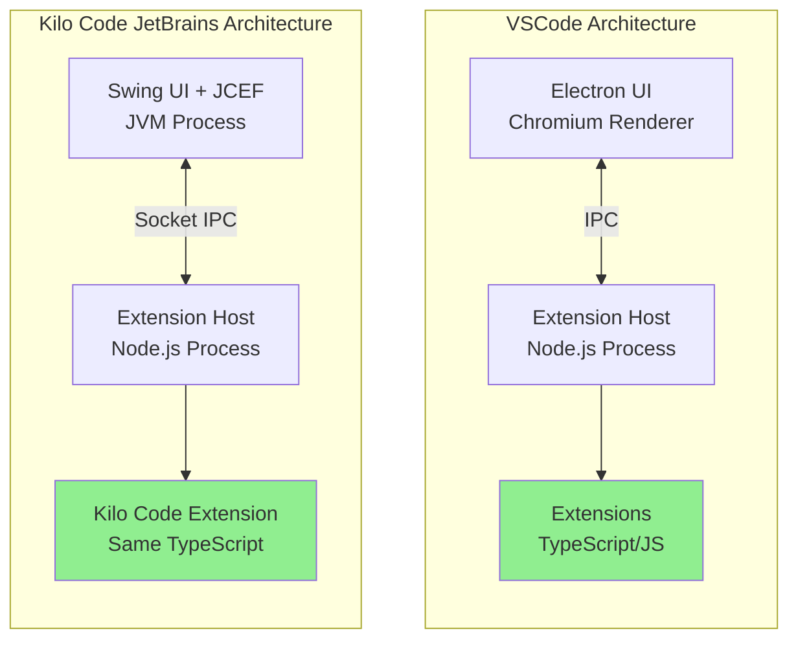
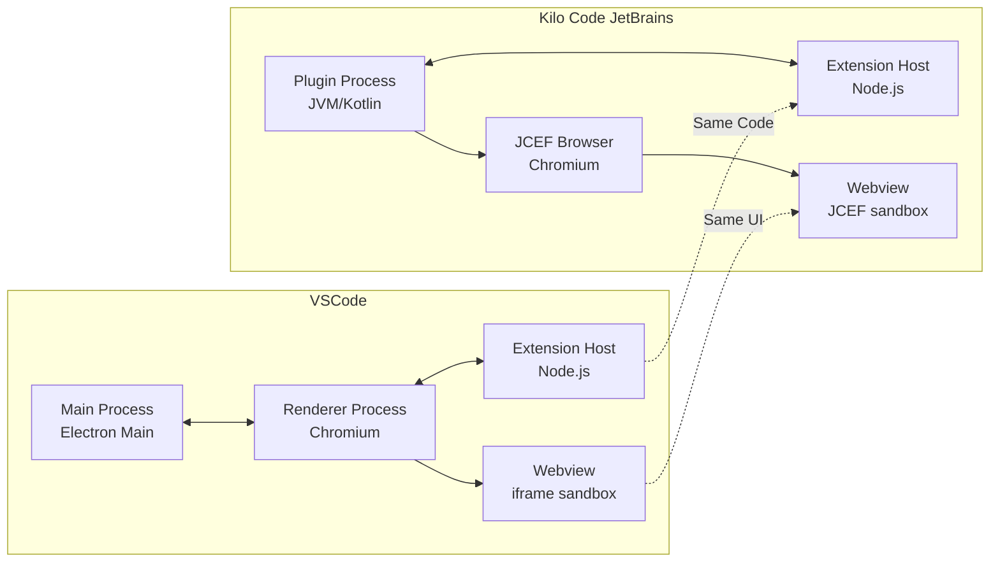
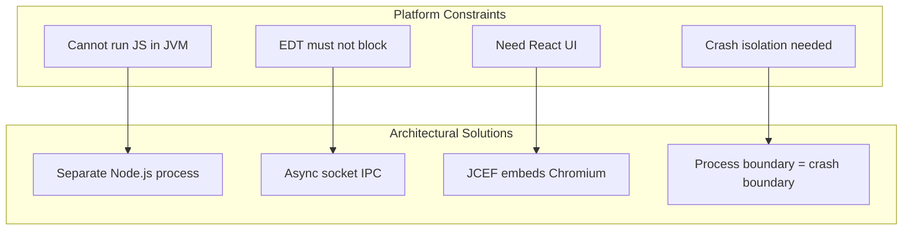
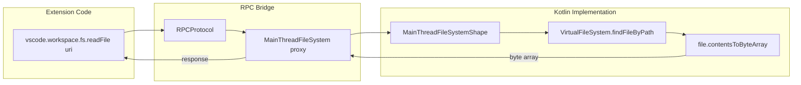

# Architecture Overview: The Big Picture

This document provides a comprehensive introduction to the Kilo Code JetBrains plugin architecture, explaining the fundamental design principles, the problem it solves, and how it achieves cross-platform code reuse between VSCode and JetBrains IDEs.

## Table of Contents

- [Architecture Attribution](#architecture-attribution)
- [The Problem: Cross-Platform Extension Development](#the-problem-cross-platform-extension-development)
- [The Fundamental Insight](#the-fundamental-insight)
- [Architectural Parallel: VSCode vs Kilo Code JetBrains](#architectural-parallel-vscode-vs-kilo-code-jetbrains)
- [Platform Constraints That Shaped the Design](#platform-constraints-that-shaped-the-design)
- [How the Architecture Achieves Code Reuse](#how-the-architecture-achieves-code-reuse)
- [Key Architectural Decisions](#key-architectural-decisions)
- [Document Roadmap](#document-roadmap)

---

## Architecture Attribution

This architecture was originally designed and implemented by the **WeCode-AI Team at Weibo Inc.** in their open-source project [RunVSAgent](https://github.com/wecode-ai/RunVSAgent), with **Naituw** serving as Project Architect. The fundamental design pattern of running VSCode extensions in JetBrains IDEs through a Node.js subprocess was conceived and built by this team.

### Development Timeline

1. **RunVSAgent Foundation (Pre-August 2025)**: The WeCode-AI Team created the original architecture implementing VSCode's process model in JetBrains IDEs, establishing the core patterns for IPC, API bridging, and webview communication.

2. **Kilo Code Integration (August 29 - September 3, 2025)**: Adam Hill contributed Kilo Code support to RunVSAgent through [PR #103](https://github.com/wecode-ai/RunVSAgent/pull/103), following the established architectural patterns.

3. **Kilo Team Adaptation (September 4, 2025)**: The Kilo team, led by Catriel Muller, integrated the RunVSAgent codebase into the Kilo repository via [PR #2129](https://github.com/kilocode-ai/kilocode/pull/2129). The team adapted the architecture specifically for Kilo Code, removing multi-extension support and customizing it for their needs.

4. **Ongoing Development (September 2025 - Present)**: The Kilo team has continued to enhance and extend the architecture with 51+ pull requests and 8+ issue fixes, adding features and improvements while maintaining the core architectural principles.

### License

The original RunVSAgent project is licensed under the [Apache License 2.0](https://github.com/wecode-ai/RunVSAgent/blob/main/LICENSE), which permits use, modification, and distribution.

### Acknowledgments

This document describes an architecture built on the excellent foundation created by the RunVSAgent team. The Kilo team gratefully acknowledges their pioneering work in solving the challenge of running VSCode extensions in JetBrains IDEs, and we continue to build upon and improve their innovative design.

---

## The Problem: Cross-Platform Extension Development

Kilo Code started as a VSCode extension written in TypeScript. Like most VSCode extensions, it relies heavily on:

1. **Node.js Runtime**: The extension uses npm packages, async/await patterns, and Node.js APIs
2. **VSCode Extension API**: `vscode.commands`, `vscode.window`, `vscode.workspace`, etc.
3. **Webview UI**: A React-based interface rendered in VSCode's webview

When the WeCode-AI Team set out to create RunVSAgent to support JetBrains IDEs (IntelliJ IDEA, WebStorm, PyCharm, etc.), they faced a fundamental challenge:

> **How do you run a TypeScript/Node.js extension in a JVM-based IDE without rewriting everything?**

The naive approaches all had serious drawbacks:

| Approach                   | Problem                                                  |
| -------------------------- | -------------------------------------------------------- |
| Rewrite in Kotlin          | Duplicates all business logic; two codebases to maintain |
| Embed JavaScript in JVM    | GraalVM/Nashorn lack Node.js APIs and npm ecosystem      |
| Compile TS to JVM bytecode | Lose access to npm packages; complex tooling             |
| Use shared WebAssembly     | Still need platform glue; no UI sharing                  |

---

## The Fundamental Insight

The RunVSAgent team's breakthrough came from studying how VSCode itself works:

> **VSCode already runs extensions in a separate process** with well-defined RPC boundaries. The RunVSAgent architecture replicates this pattern, running the same Node.js code in a subprocess while implementing the host-side APIs in Kotlin. Kilo Code builds upon this foundation.

This is the "Church and State" separation pattern from VSCode:

- **"State"** (extension logic) runs in an isolated process with its own runtime
- **"Church"** (IDE integration) provides the APIs and UI surface



**Key insight**: The extension code (green boxes) is _identical_ in both architectures. Only the host-side implementation differs.

---

## Architectural Parallel: VSCode vs Kilo Code JetBrains

### Side-by-Side Comparison



### Component Mapping

| VSCode Component       | JetBrains Equivalent   | Kilo Code Implementation                                                                                                |
| ---------------------- | ---------------------- | ----------------------------------------------------------------------------------------------------------------------- |
| Main Process           | Plugin Process         | [`WecoderPluginService`](../../jetbrains/plugin/src/main/kotlin/ai/kilocode/jetbrains/plugin/WecoderPlugin.kt#L188)     |
| Extension Host Process | Extension Host Process | Same Node.js subprocess                                                                                                 |
| IPC (Electron)         | Socket IPC             | [`PersistentProtocol`](../../jetbrains/plugin/src/main/kotlin/ai/kilocode/jetbrains/ipc/PersistentProtocol.kt#L19)      |
| Webview (iframe)       | Webview (JCEF)         | [`WebViewInstance`](../../jetbrains/plugin/src/main/kotlin/ai/kilocode/jetbrains/webview/WebViewManager.kt#L507)        |
| `acquireVsCodeApi()`   | Mock injection         | See [VSCode API Mock](./04-webview-communication.md#vscode-api-mock-injection)                                          |
| Extension API          | MainThread Actors      | [`ServiceProxyRegistry`](../../jetbrains/plugin/src/main/kotlin/ai/kilocode/jetbrains/core/ServiceProxyRegistry.kt#L60) |

---

## Platform Constraints That Shaped the Design

### JetBrains IDE Constraints

1. **JVM Runtime**: IntelliJ plugins run in the JVM; cannot directly execute JavaScript
2. **EDT Threading**: Event Dispatch Thread cannot block; all UI must be async
3. **Swing-Based UI**: Cannot render React components natively
4. **Plugin Sandboxing**: Plugins share the IDE process; crashes affect the whole IDE

### VSCode Extension Constraints (that became advantages)

1. **Process Isolation**: Extensions already run in separate processes → easy to replicate
2. **Message-Based API**: All extension calls are already async RPC → natural socket bridge
3. **Webview Sandboxing**: UI is already iframe-isolated → JCEF equivalent exists
4. **Declarative Manifest**: `package.json` describes capabilities → can be parsed statically

### How Constraints Drive Architecture



---

## How the Architecture Achieves Code Reuse

### The 90%+ Code Reuse Story

The architecture enables massive code reuse across three dimensions:

#### 1. Extension Logic (100% Reuse)

The entire TypeScript codebase for Kilo Code runs unmodified:

- AI conversation logic
- Tool execution
- File operations (via bridged API)
- State management

```typescript
// This code runs identically on both platforms
vscode.commands.registerCommand('kilocode.startChat', async () => {
    const panel = vscode.window.createWebviewPanel(...);
    // All business logic here
});
```

#### 2. Webview UI (100% Reuse)

The React application is the same:

- Same components
- Same styling (Tailwind CSS)
- Same messaging protocol

```tsx
// This React component works on both platforms
const vscode = acquireVsCodeApi()
vscode.postMessage({ type: "userMessage", content: text })
```

#### 3. VSCode API Surface (Bridged)

The plugin implements VSCode APIs by translating to JetBrains equivalents:

| VSCode Call                        | Translation                                |
| ---------------------------------- | ------------------------------------------ |
| `vscode.workspace.fs.readFile()`   | `VirtualFileSystem.contentsToByteArray()`  |
| `vscode.window.createTerminal()`   | `TerminalView.createLocalTerminalWidget()` |
| `vscode.commands.executeCommand()` | `ActionManager.tryToExecute()`             |

### The Translation Layer



---

## Key Architectural Decisions

### Decision 1: Separate Node.js Process

**Why**: Cannot effectively run JavaScript in the JVM. GraalVM lacks Node.js APIs. Embedding would lose npm ecosystem.

**Result**: Spawn Node.js as subprocess, communicate via sockets.

**Trade-off**: Process management complexity, but enables full Node.js compatibility.

### Decision 2: Binary Protocol Matching VSCode

**Why**: The extension host already speaks VSCode's protocol. Matching it minimizes translation.

**Result**: [`PersistentProtocol`](../../jetbrains/plugin/src/main/kotlin/ai/kilocode/jetbrains/ipc/PersistentProtocol.kt#L19) implements VSCode's 13-byte header framing.

**Trade-off**: Protocol complexity, but proven reliability.

### Decision 3: MainThread/ExtHost Proxy Pattern

**Why**: VSCode's API is organized into MainThread (IDE side) and ExtHost (extension side). Mirroring this enables direct code reuse.

**Result**: 73 MainThread actors, 69 ExtHost proxies in [`ServiceProxyRegistry`](../../jetbrains/plugin/src/main/kotlin/ai/kilocode/jetbrains/core/ServiceProxyRegistry.kt#L240).

**Trade-off**: Large API surface to maintain, but 1:1 mapping simplifies debugging.

### Decision 4: JCEF for Webviews

**Why**: Need to render the same React UI. JCEF (Chromium embedded) is the same engine as VSCode's webviews.

**Result**: Same HTML/CSS/JS runs unchanged in [`WebViewInstance`](../../jetbrains/plugin/src/main/kotlin/ai/kilocode/jetbrains/webview/WebViewManager.kt#L507).

**Trade-off**: Heavy dependency (~100MB), but Perfect web compatibility.

### Decision 5: Mock `acquireVsCodeApi()`

**Why**: The React app calls `acquireVsCodeApi()` expecting VSCode's API. Must provide equivalent.

**Result**: JavaScript injection provides compatible API backed by `JBCefJSQuery`.

**Trade-off**: Must maintain compatibility, but UI code needs zero changes.

---

## Document Roadmap

This overview introduces the architecture. The following documents provide deep dives into each component:

### Foundation Documents

| Document                                                                             | Purpose                                                      |
| ------------------------------------------------------------------------------------ | ------------------------------------------------------------ |
| [06-intellij-platform-foundations.md](./06-intellij-platform-foundations.md)         | IntelliJ Platform SDK concepts: services, EDT, VFS, JCEF     |
| [07-vscode-extension-host-foundations.md](./07-vscode-extension-host-foundations.md) | VSCode Extension Host architecture: processes, RPC, webviews |

### Design Rationale

| Document                                                                 | Purpose                          |
| ------------------------------------------------------------------------ | -------------------------------- |
| [08-why-this-architecture.md](./08-why-this-architecture.md)             | Why each major decision was made |
| [09-design-constraints-analysis.md](./09-design-constraints-analysis.md) | How constraints drove the design |

### Implementation Details

| Document                                                         | Purpose                                  |
| ---------------------------------------------------------------- | ---------------------------------------- |
| [01-plugin-initialization.md](./01-plugin-initialization.md)     | Plugin startup sequence                  |
| [02-extension-host-ipc.md](./02-extension-host-ipc.md)           | Socket communication and binary protocol |
| [03-vscode-api-bridging.md](./03-vscode-api-bridging.md)         | RPC proxy system                         |
| [04-webview-communication.md](./04-webview-communication.md)     | JCEF and message passing                 |
| [05-architecture-diagrams.md](./05-architecture-diagrams.md)     | Visual reference                         |
| [10-implementation-patterns.md](./10-implementation-patterns.md) | Key patterns in the codebase             |

---

## Summary

The Kilo Code JetBrains plugin, built on the RunVSAgent foundation, achieves cross-platform support by:

1. **Replicating VSCode's process architecture** within JetBrains IDEs
2. **Running the same Node.js extension code** in a subprocess
3. **Bridging VSCode APIs** to JetBrains Platform equivalents via RPC
4. **Embedding the same React UI** in JCEF (Chromium)
5. **Mocking `acquireVsCodeApi()`** to make webviews work unchanged

This architecture, originally designed by the RunVSAgent team and enhanced by Kilo Code, enables **~90% code reuse** while respecting both platforms' constraints. The complexity is concentrated in the bridge layer (Kotlin plugin), not duplicated in business logic.

---

## Related Documentation

- [01-plugin-initialization.md](./01-plugin-initialization.md) - Start here for implementation details
- [08-why-this-architecture.md](./08-why-this-architecture.md) - Deep dive into design rationale
- [09-design-constraints-analysis.md](./09-design-constraints-analysis.md) - Platform constraint analysis
