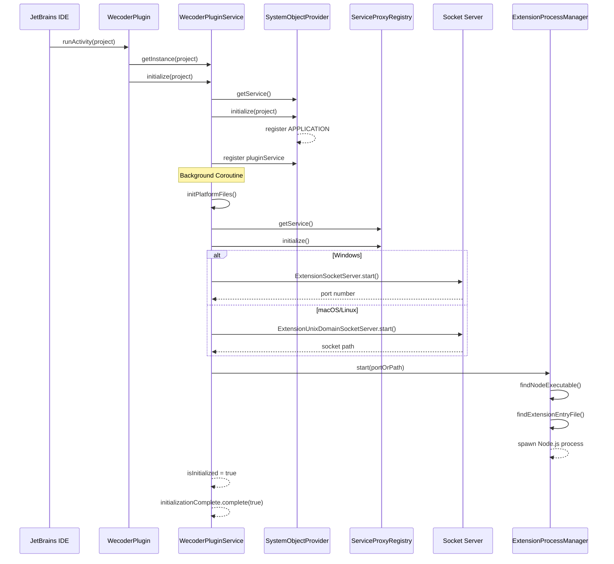

# Plugin Entry and Initialization

This document details the JetBrains plugin initialization process, from IDE startup to extension host activation.

## Table of Contents

- [Plugin Configuration](#plugin-configuration)
- [Entry Point: WecoderPlugin](#entry-point-wecoderplugin)
- [Plugin Service: WecoderPluginService](#plugin-service-wecoderpluginservice)
- [System Object Provider](#system-object-provider)
- [Initialization Sequence](#initialization-sequence)
- [Debug Mode Support](#debug-mode-support)

---

## Plugin Configuration

The plugin is configured via [`plugin.xml.template`](../../jetbrains/plugin/src/main/resources/META-INF/plugin.xml.template), which defines all extension points, services, and actions.

### Key Registrations

```xml
<!-- Project-level service for plugin lifecycle management -->
<projectService serviceImplementation="ai.kilocode.jetbrains.plugin.WecoderPluginService"/>

<!-- Post-startup activity - the main entry point -->
<postStartupActivity implementation="ai.kilocode.jetbrains.plugin.WecoderPlugin"/>

<!-- Tool window for WebView UI -->
<toolWindow factoryClass="ai.kilocode.jetbrains.ui.RooToolWindowFactory"
            id="Kilo Code"
            secondary="true"
            icon="/icons/kilo-dark.svg"
            anchor="right" />
```

**Source Reference:** [`plugin.xml.template`](../../jetbrains/plugin/src/main/resources/META-INF/plugin.xml.template#L43-L52)

### Registered Services

| Service                                                                                                                   | Level       | Purpose                               |
| ------------------------------------------------------------------------------------------------------------------------- | ----------- | ------------------------------------- |
| [`WecoderPluginService`](../../jetbrains/plugin/src/main/kotlin/ai/kilocode/jetbrains/plugin/WecoderPlugin.kt#L18)        | Project     | Core plugin lifecycle management      |
| [`WebViewManager`](../../jetbrains/plugin/src/main/kotlin/ai/kilocode/jetbrains/webview/WebViewManager.kt#L68)            | Project     | WebView instance management           |
| [`SystemObjectProvider`](../../jetbrains/plugin/src/main/kotlin/ai/kilocode/jetbrains/plugin/SystemObjectProvider.kt#L20) | Project     | Object registry for dependency access |
| [`ServiceProxyRegistry`](../../jetbrains/plugin/src/main/kotlin/ai/kilocode/jetbrains/core/ServiceProxyRegistry.kt#L60)   | Project     | RPC proxy registration                |
| [`CommitMessageService`](../../jetbrains/plugin/src/main/resources/META-INF/plugin.xml.template#L58)                      | Application | Git commit message handling           |

---

## Entry Point: WecoderPlugin

The [`WecoderPlugin`](../../jetbrains/plugin/src/main/kotlin/ai/kilocode/jetbrains/plugin/WecoderPlugin.kt#L47) class is the main entry point, implementing `StartupActivity.DumbAware` to run after IDE startup.

### Class Definition

```kotlin
class WecoderPlugin : StartupActivity.DumbAware {
    override fun runActivity(project: Project) {
        // Plugin initialization logic
    }
}
```

**Source:** [`WecoderPlugin.kt:47`](../../jetbrains/plugin/src/main/kotlin/ai/kilocode/jetbrains/plugin/WecoderPlugin.kt#L47)

### DumbAware Interface

Implementing `StartupActivity.DumbAware` means the plugin initializes even during indexing, ensuring immediate availability when the IDE starts.

### Initialization in runActivity()

The [`runActivity()`](../../jetbrains/plugin/src/main/kotlin/ai/kilocode/jetbrains/plugin/WecoderPlugin.kt#L115) method performs:

1. **Log System Information:**

    ```kotlin
    LOG.info(
        "Initializing Kilo Code plugin for project: ${project.name}, " +
        "OS: $osName $osVersion ($osArch), " +
        "IDE: ${appInfo.fullApplicationName} (build ${appInfo.build}), " +
        "Plugin version: $pluginVersion, " +
        "JCEF supported: ${JBCefApp.isSupported()}"
    )
    ```

2. **Initialize Plugin Service:**

    ```kotlin
    val pluginService = getInstance(project)
    pluginService.initialize(project)
    ```

3. **Initialize WebViewManager:**

    ```kotlin
    val webViewManager = project.getService(WebViewManager::class.java)
    Disposer.register(project, webViewManager)
    ```

4. **Register Disposal Handler:**

    ```kotlin
    Disposer.register(project, Disposable {
        LOG.info("Disposing Kilo Code plugin for project: ${project.name}")
        pluginService.dispose()
    })
    ```

**Source:** [`WecoderPlugin.runActivity()`](../../jetbrains/plugin/src/main/kotlin/ai/kilocode/jetbrains/plugin/WecoderPlugin.kt#L115-L154)

### Project Manager Listener

A static [`ProjectManagerListener`](../../jetbrains/plugin/src/main/kotlin/ai/kilocode/jetbrains/plugin/WecoderPlugin.kt#L52-L85) handles project lifecycle events:

```kotlin
private val projectManagerListener = object : ProjectManagerListener {
    override fun projectOpened(project: Project) {
        val pluginService = getInstance(project)
        pluginService.initialize(project)
    }

    override fun projectClosed(project: Project) {
        val pluginService = getInstance(project)
        pluginService.dispose()
    }

    override fun projectClosing(project: Project) {
        project.getService(WebViewManager::class.java).onProjectSwitch()
    }
}
```

---

## Plugin Service: WecoderPluginService

The [`WecoderPluginService`](../../jetbrains/plugin/src/main/kotlin/ai/kilocode/jetbrains/plugin/WecoderPlugin.kt#L188) is a project-level service that manages the plugin lifecycle.

### Service Declaration

```kotlin
@Service(Service.Level.PROJECT)
class WecoderPluginService(private var currentProject: Project) : Disposable {
    private val socketServer = ExtensionSocketServer()
    private val udsSocketServer = ExtensionUnixDomainSocketServer()
    private val processManager = ExtensionProcessManager()

    private val coroutineScope = CoroutineScope(Dispatchers.IO + SupervisorJob())
}
```

**Source:** [`WecoderPluginService`](../../jetbrains/plugin/src/main/kotlin/ai/kilocode/jetbrains/plugin/WecoderPlugin.kt#L188-L204)

### Core Components

| Component                                                                                                      | Type                              | Purpose                            |
| -------------------------------------------------------------------------------------------------------------- | --------------------------------- | ---------------------------------- |
| [`socketServer`](../../jetbrains/plugin/src/main/kotlin/ai/kilocode/jetbrains/plugin/WecoderPlugin.kt#L202)    | `ExtensionSocketServer`           | TCP socket for Windows             |
| [`udsSocketServer`](../../jetbrains/plugin/src/main/kotlin/ai/kilocode/jetbrains/plugin/WecoderPlugin.kt#L203) | `ExtensionUnixDomainSocketServer` | Unix domain socket for macOS/Linux |
| [`processManager`](../../jetbrains/plugin/src/main/kotlin/ai/kilocode/jetbrains/plugin/WecoderPlugin.kt#L204)  | `ExtensionProcessManager`         | Node.js process management         |

### Initialize Method

The [`initialize()`](../../jetbrains/plugin/src/main/kotlin/ai/kilocode/jetbrains/plugin/WecoderPlugin.kt#L267) method orchestrates the startup sequence:

```kotlin
fun initialize(project: Project) {
    // Check for duplicate initialization
    if (isInitialized && this.currentProject == project) {
        return
    }

    // Initialize system object provider
    var systemObjectProvider = project.getService(SystemObjectProvider::class.java)
    systemObjectProvider.initialize(project)

    // Register to system object provider
    systemObjectProvider.register("pluginService", this)

    // Start initialization in background thread
    coroutineScope.launch {
        initPlatformFiles()

        // Initialize service registration
        project.getService(ServiceProxyRegistry::class.java).initialize()

        if (DEBUG_TYPE == DebugMode.ALL) {
            // Debug mode: connect to external debug server
            socketServer.connectToDebugHost(DEBUG_HOST, DEBUG_PORT)
        } else {
            // Normal mode: start Socket server and extension process
            val server: ISocketServer = if (SystemInfo.isWindows) socketServer else udsSocketServer
            val portOrPath = server.start(projectPath)

            // Start extension process
            processManager.start(portOrPath)
        }

        isInitialized = true
        initializationComplete.complete(true)
    }
}
```

**Source:** [`WecoderPluginService.initialize()`](../../jetbrains/plugin/src/main/kotlin/ai/kilocode/jetbrains/plugin/WecoderPlugin.kt#L267-L349)

### Platform File Initialization

The [`initPlatformFiles()`](../../jetbrains/plugin/src/main/kotlin/ai/kilocode/jetbrains/plugin/WecoderPlugin.kt#L352) method handles platform-specific binaries:

```kotlin
private fun initPlatformFiles() {
    val platformSuffix = when {
        SystemInfo.isWindows -> "windows-x64"
        SystemInfo.isMac -> when (System.getProperty("os.arch")) {
            "x86_64" -> "darwin-x64"
            "aarch64" -> "darwin-arm64"
            else -> ""
        }
        SystemInfo.isLinux -> "linux-x64"
        else -> ""
    }
    // Move platform-specific files to correct locations
}
```

### Cleanup and Disposal

The [`cleanup()`](../../jetbrains/plugin/src/main/kotlin/ai/kilocode/jetbrains/plugin/WecoderPlugin.kt#L405) method ensures proper resource release:

```kotlin
private fun cleanup() {
    // 1. Stop extension process first
    processManager.stop()

    // 2. Wait for process to stop
    Thread.sleep(500)

    // 3. Stop socket servers
    socketServer.stop()
    udsSocketServer.stop()

    // 4. Wait for connections to close
    Thread.sleep(1000)

    // 5. Clean up workspace file change listener
    currentProject?.getService(WorkspaceFileChangeManager::class.java)?.dispose()

    isInitialized = false
}
```

---

## System Object Provider

The [`SystemObjectProvider`](../../jetbrains/plugin/src/main/kotlin/ai/kilocode/jetbrains/plugin/SystemObjectProvider.kt#L20) is a project-scoped registry that provides unified access to IDEA system objects and prevents state sharing between projects.

### Class Definition

```kotlin
@Service(Service.Level.PROJECT)
class SystemObjectProvider(private val project: Project) : Disposable {
    // Mapping for storing system objects per project
    private val systemObjects = ConcurrentHashMap<String, Any>()
}
```

**Source:** [`SystemObjectProvider.kt:20-24`](../../jetbrains/plugin/src/main/kotlin/ai/kilocode/jetbrains/plugin/SystemObjectProvider.kt#L20-L24)

### Key Methods

| Method                                                                                                                   | Purpose                            |
| ------------------------------------------------------------------------------------------------------------------------ | ---------------------------------- |
| [`initialize(project)`](../../jetbrains/plugin/src/main/kotlin/ai/kilocode/jetbrains/plugin/SystemObjectProvider.kt#L39) | Register application-level objects |
| [`register(key, obj)`](../../jetbrains/plugin/src/main/kotlin/ai/kilocode/jetbrains/plugin/SystemObjectProvider.kt#L51)  | Store a system object              |
| [`get<T>(key)`](../../jetbrains/plugin/src/main/kotlin/ai/kilocode/jetbrains/plugin/SystemObjectProvider.kt#L62)         | Retrieve a system object           |
| [`remove(key)`](../../jetbrains/plugin/src/main/kotlin/ai/kilocode/jetbrains/plugin/SystemObjectProvider.kt#L70)         | Remove a system object             |
| [`dispose()`](../../jetbrains/plugin/src/main/kotlin/ai/kilocode/jetbrains/plugin/SystemObjectProvider.kt#L95)           | Clear all objects on project close |

### Predefined Keys

```kotlin
object Keys {
    const val APPLICATION = "application"
    const val PLUGIN_SERVICE = "pluginService"
}
```

**Source:** [`SystemObjectProvider.Keys`](../../jetbrains/plugin/src/main/kotlin/ai/kilocode/jetbrains/plugin/SystemObjectProvider.kt#L29-L33)

### Thread Safety

The registry uses `ConcurrentHashMap` for thread-safe operations across the plugin:

```kotlin
private val systemObjects = ConcurrentHashMap<String, Any>()
```

---

## Initialization Sequence



---

## Debug Mode Support

The plugin supports multiple debug modes for development via [`DebugMode`](../../jetbrains/plugin/src/main/kotlin/ai/kilocode/jetbrains/plugin/WecoderPlugin.kt#L160):

### Debug Mode Enum

```kotlin
enum class DebugMode {
    ALL,   // All debug modes - connect to external debug server
    IDEA,  // Only IDEA plugin debug
    NONE   // Debug not enabled (production)
}
```

**Source:** [`DebugMode`](../../jetbrains/plugin/src/main/kotlin/ai/kilocode/jetbrains/plugin/WecoderPlugin.kt#L160-L181)

### Configuration

Debug mode is configured via `plugin.properties`:

```kotlin
val configStream = WecoderPluginService::class.java
    .getResourceAsStream("/ai/kilocode/jetbrains/plugin/config/plugin.properties")

if (configStream != null) {
    properties.load(configStream)
    val debugModeStr = properties.getProperty("debug.mode", "none").lowercase()
    DEBUG_TYPE = DebugMode.fromString(debugModeStr)
    DEBUG_RESOURCE = properties.getProperty("debug.resource", null)
}
```

**Source:** [`WecoderPluginService static init`](../../jetbrains/plugin/src/main/kotlin/ai/kilocode/jetbrains/plugin/WecoderPlugin.kt#L221-L243)

### Debug Connection

In debug mode, the plugin connects to an external debug server instead of spawning its own:

```kotlin
if (DEBUG_TYPE == DebugMode.ALL) {
    // Debug mode: directly connect to extension process in debug
    socketServer.connectToDebugHost(DEBUG_HOST, DEBUG_PORT)  // 127.0.0.1:51234
}
```

---

## Related Documentation

- [Extension Host IPC](./02-extension-host-ipc.md) - How the Node.js extension host is spawned and communicates
- [VSCode API Bridging](./03-vscode-api-bridging.md) - How the ServiceProxyRegistry connects to extension APIs
- [Architecture Diagrams](./05-architecture-diagrams.md) - Visual overview of the initialization flow
