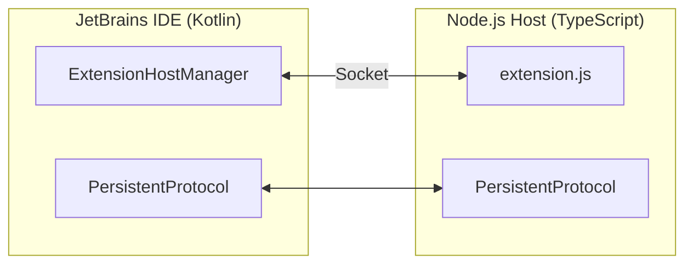
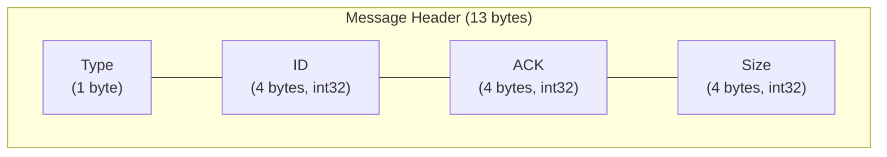
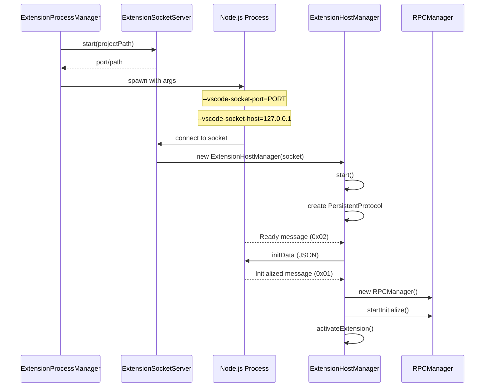
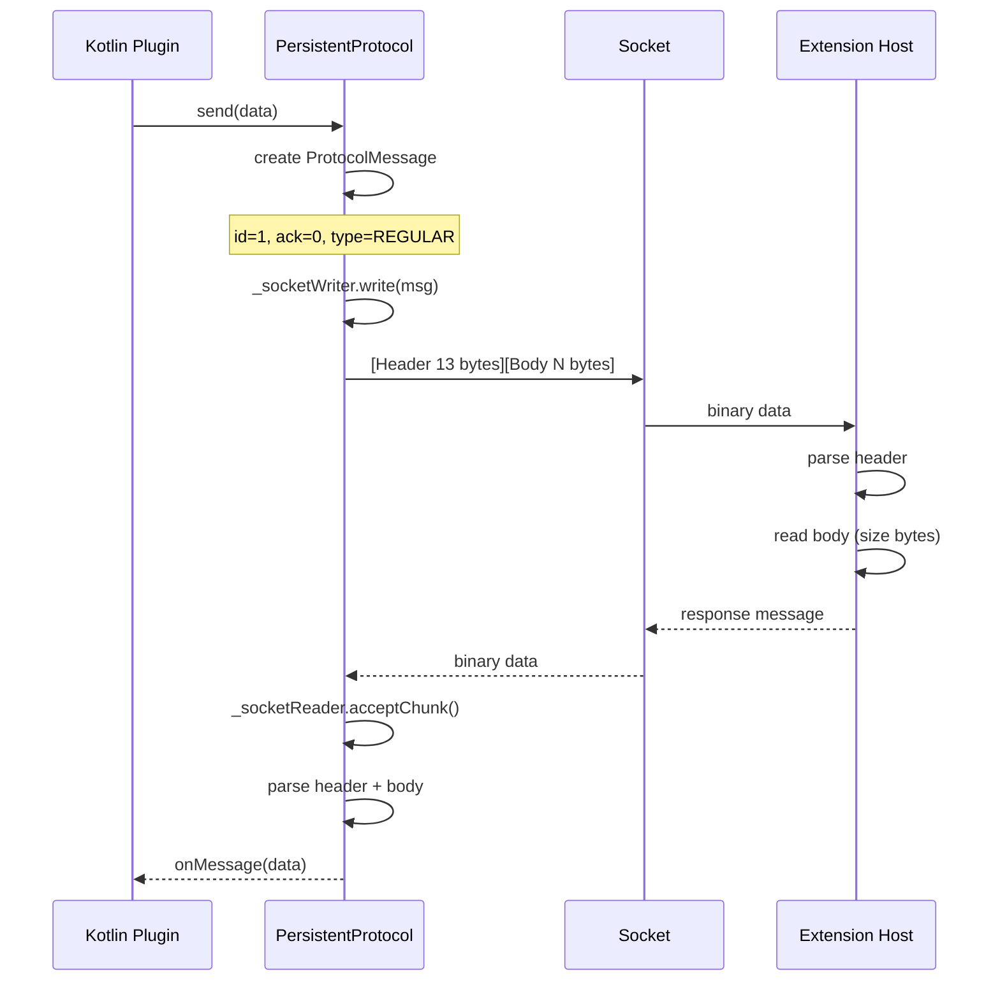

# Node.js Extension Host and IPC

This document describes how the JetBrains plugin spawns and communicates with the Node.js extension host process.

## Table of Contents

- [Overview](#overview)
- [Extension Process Manager](#extension-process-manager)
- [Socket Servers](#socket-servers)
- [PersistentProtocol Binary Framing](#persistentprotocol-binary-framing)
- [Extension Host Manager](#extension-host-manager)
- [Extension Host Message Types](#extension-host-message-types)
- [Message Flow Diagrams](#message-flow-diagrams)

---

## Overview

The plugin runs VSCode extension code in a separate Node.js process. Communication between the Kotlin plugin and Node.js uses:

- **TCP Sockets** on Windows
- **Unix Domain Sockets** on macOS and Linux
- **Binary framing protocol** matching VSCode's `PersistentProtocol`



---

## Extension Process Manager

The [`ExtensionProcessManager`](../../jetbrains/plugin/src/main/kotlin/ai/kilocode/jetbrains/core/ExtensionProcessManager.kt#L28) is responsible for spawning and managing the Node.js extension host process.

### Class Definition

```kotlin
class ExtensionProcessManager : Disposable {
    private var process: Process? = null
    private var monitorThread: Thread? = null
    @Volatile
    private var isRunning = false
}
```

**Source:** [`ExtensionProcessManager.kt:28-59`](../../jetbrains/plugin/src/main/kotlin/ai/kilocode/jetbrains/core/ExtensionProcessManager.kt#L28-L59)

### Start Method

The [`start()`](../../jetbrains/plugin/src/main/kotlin/ai/kilocode/jetbrains/core/ExtensionProcessManager.kt#L66) method spawns the Node.js process:

```kotlin
fun start(portOrPath: Any?): Boolean {
    val isUds = portOrPath is String

    // 1. Find Node.js executable
    val nodePath = findNodeExecutable()

    // 2. Check Node.js version (minimum 20.6.0)
    val nodeVersion = NodeVersionUtil.getNodeVersion(nodePath)
    if (!NodeVersionUtil.isVersionSupported(nodeVersion, MIN_REQUIRED_NODE_VERSION)) {
        // Show error notification
        return false
    }

    // 3. Find extension entry file
    val extensionPath = findExtensionEntryFile()

    // 4. Build command line arguments
    val commandArgs = mutableListOf(
        nodePath,
        "--experimental-global-webcrypto",
        "--no-deprecation",
        extensionPath,
        "--vscode-socket-port=${envVars["VSCODE_EXTHOST_SOCKET_PORT"]}",
        "--vscode-socket-host=${envVars["VSCODE_EXTHOST_SOCKET_HOST"]}",
        "--vscode-will-send-socket=${envVars["VSCODE_EXTHOST_WILL_SEND_SOCKET"]}"
    )

    // 5. Start process
    process = ProcessBuilder(commandArgs).start()

    // 6. Start monitor thread
    monitorThread = Thread { monitorProcess() }

    isRunning = true
    return true
}
```

**Source:** [`ExtensionProcessManager.start()`](../../jetbrains/plugin/src/main/kotlin/ai/kilocode/jetbrains/core/ExtensionProcessManager.kt#L66-L199)

### Environment Variables

| Variable                          | Purpose                 | Platform    |
| --------------------------------- | ----------------------- | ----------- |
| `VSCODE_EXTHOST_IPC_HOOK`         | Unix domain socket path | macOS/Linux |
| `VSCODE_EXTHOST_WILL_SEND_SOCKET` | Flag for socket mode    | Windows     |
| `VSCODE_EXTHOST_SOCKET_HOST`      | TCP socket host         | Windows     |
| `VSCODE_EXTHOST_SOCKET_PORT`      | TCP socket port         | Windows     |

### Node.js Version Requirement

```kotlin
private val MIN_REQUIRED_NODE_VERSION = NodeVersion(20, 6, 0, "20.6.0")
```

**Source:** [`ExtensionProcessManager.kt:46`](../../jetbrains/plugin/src/main/kotlin/ai/kilocode/jetbrains/core/ExtensionProcessManager.kt#L46)

### Extension Entry Point

The entry point is `runtime/extension.js`, compiled from TypeScript:

```kotlin
// Normal mode
val resourcesPath = PluginResourceUtil.getResourcePath(
    PLUGIN_ID,
    "$RUNTIME_DIR/$EXTENSION_ENTRY_FILE"  // "runtime/extension.js"
)
```

**Source:** [`findExtensionEntryFile()`](../../jetbrains/plugin/src/main/kotlin/ai/kilocode/jetbrains/core/ExtensionProcessManager.kt#L337-L357)

---

## Socket Servers

### TCP Socket Server (Windows)

The [`ExtensionSocketServer`](../../jetbrains/plugin/src/main/kotlin/ai/kilocode/jetbrains/core/ExtensionSocketServer.kt#L26) handles Windows communication:

```kotlin
class ExtensionSocketServer : ISocketServer {
    private var serverSocket: ServerSocket? = null
    private val clientManagers = ConcurrentHashMap<Socket, ExtensionHostManager>()

    override fun start(projectPath: String): Int {
        // Use port 0 for random port assignment
        serverSocket = ServerSocket(0)
        val port = serverSocket?.localPort ?: -1

        // Start accept thread
        serverThread = thread(name = "ExtensionSocketServer") {
            acceptConnections()
        }

        return port
    }
}
```

**Source:** [`ExtensionSocketServer.kt:26-84`](../../jetbrains/plugin/src/main/kotlin/ai/kilocode/jetbrains/core/ExtensionSocketServer.kt#L26-L84)

### Unix Domain Socket Server (macOS/Linux)

The [`ExtensionUnixDomainSocketServer`](../../jetbrains/plugin/src/main/kotlin/ai/kilocode/jetbrains/core/ExtensionUnixDomainSocketServer.kt#L20) handles Unix systems:

```kotlin
class ExtensionUnixDomainSocketServer : ISocketServer {
    private var udsServerChannel: ServerSocketChannel? = null
    private var udsSocketPath: Path? = null

    override fun start(projectPath: String): String? {
        val sockPath = createSocketFile()  // /tmp/kilocode-idea-extension-ipc-XXXXX.sock
        val udsAddr = UnixDomainSocketAddress.of(sockPath)
        udsServerChannel = ServerSocketChannel.open(StandardProtocolFamily.UNIX)
        udsServerChannel!!.bind(udsAddr)

        serverThread = thread(name = "ExtensionUDSSocketServer") {
            acceptUdsConnections()
        }

        return sockPath.toString()
    }
}
```

**Source:** [`ExtensionUnixDomainSocketServer.kt:20-74`](../../jetbrains/plugin/src/main/kotlin/ai/kilocode/jetbrains/core/ExtensionUnixDomainSocketServer.kt#L20-L74)

### Socket File Creation

```kotlin
private fun createSocketFile(): Path {
    val tmpDir = java.nio.file.Paths.get("/tmp")
    val sockPath = Files.createTempFile(tmpDir, "kilocode-idea-extension-ipc-", ".sock")
    Files.deleteIfExists(sockPath)  // Ensure it does not exist
    return sockPath
}
```

**Source:** [`createSocketFile()`](../../jetbrains/plugin/src/main/kotlin/ai/kilocode/jetbrains/core/ExtensionUnixDomainSocketServer.kt#L215-L219)

### Client Connection Handling

Both servers create an [`ExtensionHostManager`](../../jetbrains/plugin/src/main/kotlin/ai/kilocode/jetbrains/core/ExtensionHostManager.kt#L35) for each client:

```kotlin
private fun handleClient(clientSocket: Socket, manager: ExtensionHostManager) {
    manager.start()

    // Health check loop
    while (clientSocket.isConnected && !clientSocket.isClosed && isRunning) {
        // Check connection health every 15 seconds
        if (!isSocketHealthy(clientSocket)) {
            break
        }
        Thread.sleep(500)
    }

    manager.dispose()
    clientManagers.remove(clientSocket)
}
```

---

## PersistentProtocol Binary Framing

The [`PersistentProtocol`](../../jetbrains/plugin/src/main/kotlin/ai/kilocode/jetbrains/ipc/PersistentProtocol.kt#L19) implements VSCode's binary message framing protocol.

### Protocol Constants

```kotlin
object ProtocolConstants {
    const val HEADER_LENGTH = 13          // bytes
    const val ACKNOWLEDGE_TIME = 2000     // 2 seconds
    const val TIMEOUT_TIME = 20000        // 20 seconds
    const val KEEP_ALIVE_SEND_TIME = 5000 // 5 seconds
}
```

**Source:** [`ProtocolConstants.kt`](../../jetbrains/plugin/src/main/kotlin/ai/kilocode/jetbrains/ipc/ProtocolConstants.kt#L11-L41)

### Message Header Format (13 bytes)



| Field | Size    | Description                            |
| ----- | ------- | -------------------------------------- |
| Type  | 1 byte  | Message type (see ProtocolMessageType) |
| ID    | 4 bytes | Message sequence ID                    |
| ACK   | 4 bytes | Last acknowledged message ID           |
| Size  | 4 bytes | Body size in bytes                     |

### Header Parsing

```kotlin
// From ProtocolReader.kt
val buffer = ByteBuffer.wrap(buff)
val messageTypeByte = buffer.get(0)
val id = buffer.getInt(1)
val ack = buffer.getInt(5)
val messageSize = buffer.getInt(9)
```

**Source:** [`ProtocolReader.kt:62-66`](../../jetbrains/plugin/src/main/kotlin/ai/kilocode/jetbrains/ipc/ProtocolReader.kt#L62-L66)

### Protocol Message Types

The [`ProtocolMessageType`](../../jetbrains/plugin/src/main/kotlin/ai/kilocode/jetbrains/ipc/ProtocolMessageType.kt#L11) enum defines transport-level message types:

| Type             | Value | Description                |
| ---------------- | ----- | -------------------------- |
| `NONE`           | 0     | Undefined                  |
| `REGULAR`        | 1     | Regular data message       |
| `CONTROL`        | 2     | Control message            |
| `ACK`            | 3     | Acknowledgment             |
| `DISCONNECT`     | 5     | Disconnect signal          |
| `REPLAY_REQUEST` | 6     | Request to replay messages |
| `PAUSE`          | 7     | Pause writing              |
| `RESUME`         | 8     | Resume writing             |
| `KEEP_ALIVE`     | 9     | Keep connection alive      |

**Source:** [`ProtocolMessageType.kt:11-56`](../../jetbrains/plugin/src/main/kotlin/ai/kilocode/jetbrains/ipc/ProtocolMessageType.kt#L11-L56)

### PersistentProtocol Class

```kotlin
class PersistentProtocol(
    opts: PersistentProtocolOptions,
    msgListener: ((data: ByteArray) -> Unit)? = null
) : IMessagePassingProtocol {

    private val _outgoingUnackMsg = LinkedBlockingQueue<ProtocolMessage>()
    private val _outgoingMsgId = AtomicInteger(0)
    private val _outgoingAckId = AtomicInteger(0)

    private val _incomingMsgId = AtomicInteger(0)
    private val _incomingAckId = AtomicInteger(0)

    private var _socketWriter: ProtocolWriter
    private var _socketReader: ProtocolReader
}
```

**Source:** [`PersistentProtocol.kt:19-56`](../../jetbrains/plugin/src/main/kotlin/ai/kilocode/jetbrains/ipc/PersistentProtocol.kt#L19-L56)

### Send Method

```kotlin
override fun send(buffer: ByteArray) {
    val myId = _outgoingMsgId.incrementAndGet()
    val currentIncomingAckId = _incomingMsgId.get()
    _incomingAckId.set(currentIncomingAckId)

    val msg = ProtocolMessage(
        ProtocolMessageType.REGULAR,
        myId,
        currentIncomingAckId,
        buffer
    )

    _outgoingUnackMsg.add(msg)

    if (!_isReconnecting.get()) {
        _socketWriter.write(msg)
        _recvAckCheck()
    }
}
```

**Source:** [`PersistentProtocol.send()`](../../jetbrains/plugin/src/main/kotlin/ai/kilocode/jetbrains/ipc/PersistentProtocol.kt#L138-L148)

### Message Reception

```kotlin
private fun _receiveMessage(msg: ProtocolMessage) {
    // Update acknowledgment tracking
    if (msg.ack > _outgoingAckId.get()) {
        _outgoingAckId.set(msg.ack)
        // Remove acknowledged messages from queue
        while (_outgoingUnackMsg.isNotEmpty()) {
            val first = _outgoingUnackMsg.peek()
            if (first != null && first.id <= msg.ack) {
                _outgoingUnackMsg.poll()
            } else break
        }
    }

    when (msg.type) {
        ProtocolMessageType.REGULAR -> {
            _incomingMsgId.set(msg.id)
            _onMessage.fire(msg.data)
        }
        ProtocolMessageType.CONTROL -> _onControlMessage.fire(msg.data)
        ProtocolMessageType.DISCONNECT -> _onDidDispose.fire(Unit)
        ProtocolMessageType.REPLAY_REQUEST -> {
            // Resend unacknowledged messages
            _outgoingUnackMsg.forEach { _socketWriter.write(it) }
        }
        // ... other types
    }
}
```

**Source:** [`_receiveMessage()`](../../jetbrains/plugin/src/main/kotlin/ai/kilocode/jetbrains/ipc/PersistentProtocol.kt#L248-L313)

---

## Extension Host Manager

The [`ExtensionHostManager`](../../jetbrains/plugin/src/main/kotlin/ai/kilocode/jetbrains/core/ExtensionHostManager.kt#L35) manages the connection with the extension host.

### Class Definition

```kotlin
class ExtensionHostManager : Disposable {
    private val project: Project
    private var nodeSocket: NodeSocket
    private var protocol: PersistentProtocol? = null
    private var rpcManager: RPCManager? = null
    private var extensionManager: ExtensionManager? = null
}
```

**Source:** [`ExtensionHostManager.kt:35-57`](../../jetbrains/plugin/src/main/kotlin/ai/kilocode/jetbrains/core/ExtensionHostManager.kt#L35-L57)

### Start Method

```kotlin
fun start() {
    // Initialize extension manager
    extensionManager = ExtensionManager()
    val extensionPath = PluginResourceUtil.getResourcePath(
        PluginConstants.PLUGIN_ID,
        PluginConstants.PLUGIN_CODE_DIR
    )
    rooCodeIdentifier = extensionManager!!.registerExtension(extensionPath).identifier.value

    // Create protocol
    protocol = PersistentProtocol(
        PersistentProtocol.PersistentProtocolOptions(
            socket = nodeSocket,
            initialChunk = null,
            loadEstimator = null,
            sendKeepAlive = true
        ),
        this::handleMessage
    )
}
```

**Source:** [`ExtensionHostManager.start()`](../../jetbrains/plugin/src/main/kotlin/ai/kilocode/jetbrains/core/ExtensionHostManager.kt#L82-L103)

### Message Handling

```kotlin
private fun handleMessage(data: ByteArray) {
    if (data.size == 1) {
        // Extension host protocol message
        when (ExtensionHostMessageType.fromData(data)) {
            ExtensionHostMessageType.Ready -> handleReadyMessage()
            ExtensionHostMessageType.Initialized -> handleInitializedMessage()
            ExtensionHostMessageType.Terminate -> LOG.info("Received Terminate")
            null -> LOG.debug("Unknown message type")
        }
    }
}
```

**Source:** [`handleMessage()`](../../jetbrains/plugin/src/main/kotlin/ai/kilocode/jetbrains/core/ExtensionHostManager.kt#L146-L159)

---

## Extension Host Message Types

The [`ExtensionHostMessageType`](../../jetbrains/plugin/src/main/kotlin/ai/kilocode/jetbrains/core/ExtensionHostMessageType.kt#L11) defines application-level messages:

| Type          | Data Value | Description                           |
| ------------- | ---------- | ------------------------------------- |
| `Initialized` | 1          | Extension host is initialized         |
| `Ready`       | 2          | Extension host is ready for init data |
| `Terminate`   | 3          | Extension host is terminating         |

**Source:** [`ExtensionHostMessageType.kt:11-27`](../../jetbrains/plugin/src/main/kotlin/ai/kilocode/jetbrains/core/ExtensionHostMessageType.kt#L11-L27)

### Ready Message Handling

When the extension host sends `Ready`, the plugin sends initialization data:

```kotlin
private fun handleReadyMessage() {
    val initData = createInitData()
    val jsonData = gson.toJson(initData).toByteArray()
    protocol?.send(jsonData)
}
```

**Source:** [`handleReadyMessage()`](../../jetbrains/plugin/src/main/kotlin/ai/kilocode/jetbrains/core/ExtensionHostManager.kt#L165-L179)

### Initialization Data

```kotlin
private fun createInitData(): Map<String, Any?> {
    return mapOf(
        "commit" to "development",
        "version" to getIDEVersion(),
        "parentPid" to ProcessHandle.current().pid(),
        "environment" to mapOf(
            "appName" to getCurrentIDEName(),  // "wrapper|jetbrains|IU|2024.1"
            "appHost" to "node",
            "appRoot" to uriFromPath(pluginDir),
            "globalStorageHome" to uriFromPath("~/.kilocode/globalStorage"),
            "workspaceStorageHome" to uriFromPath("~/.kilocode/workspaceStorage"),
        ),
        "workspace" to mapOf(
            "id" to "intellij-workspace",
            "name" to "IntelliJ Workspace",
        ),
        "extensions" to mapOf(
            "allExtensions" to extensionManager?.getAllExtensionDescriptions(),
            "activationEvents" to /* activation events map */,
        ),
        "autoStart" to true,
        "uiKind" to 1,  // Desktop
    )
}
```

**Source:** [`createInitData()`](../../jetbrains/plugin/src/main/kotlin/ai/kilocode/jetbrains/core/ExtensionHostManager.kt#L224-L287)

### Initialized Message Handling

When the extension host sends `Initialized`, the RPC manager is created:

```kotlin
private fun handleInitializedMessage() {
    val protocol = this.protocol!!
    val extensionManager = this.extensionManager!!

    // Create RPC manager
    rpcManager = RPCManager(protocol, extensionManager, null, project)
    rpcManager?.startInitialize()

    // Start file monitoring
    project.getService(WorkspaceFileChangeManager::class.java)
    project.getService(EditorAndDocManager::class.java).initCurrentIdeaEditor()

    // Activate RooCode extension
    extensionManager.activateExtension(rooCodeId, rpcManager!!.getRPCProtocol())
}
```

**Source:** [`handleInitializedMessage()`](../../jetbrains/plugin/src/main/kotlin/ai/kilocode/jetbrains/core/ExtensionHostManager.kt#L185-L217)

---

## Message Flow Diagrams

### Extension Host Startup Sequence



### Binary Message Flow



---

## Related Documentation

- [Plugin Initialization](./01-plugin-initialization.md) - How the plugin starts up
- [VSCode API Bridging](./03-vscode-api-bridging.md) - How RPC protocol routes to MainThread/ExtHost proxies
- [Architecture Diagrams](./05-architecture-diagrams.md) - Complete protocol flow diagrams
