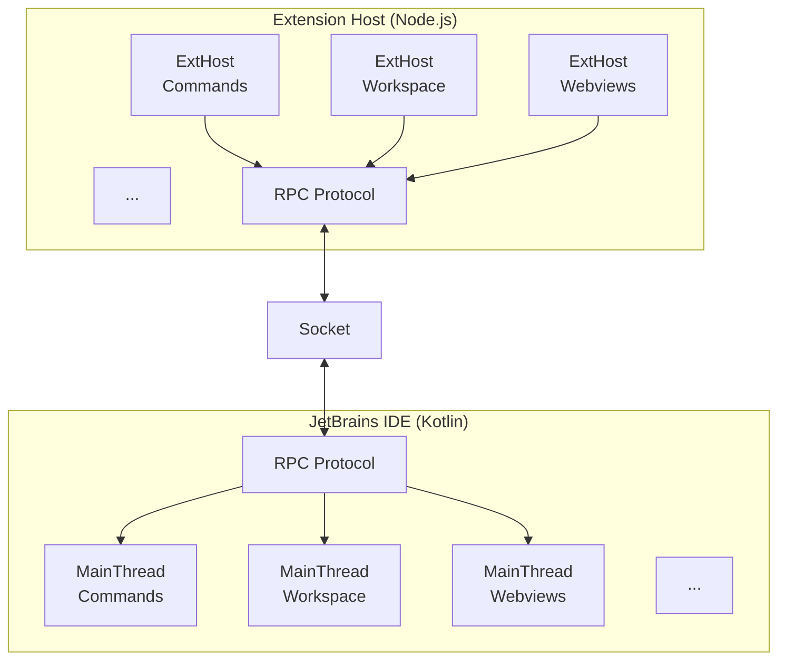
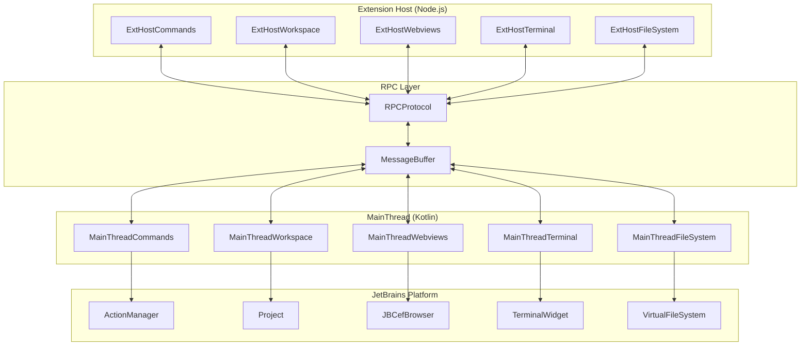

# VSCode API Bridging to Kotlin

This document describes how VSCode extension APIs are bridged to JetBrains IDE functionality through the proxy system.

## Table of Contents

- [Overview](#overview)
- [Service Proxy Registry](#service-proxy-registry)
- [Proxy Identifier System](#proxy-identifier-system)
- [MainThread Actors](#mainthread-actors)
- [ExtHost Proxies](#exthost-proxies)
- [RPC Message Types](#rpc-message-types)
- [API Translation Examples](#api-translation-examples)
- [Concept Mapping Table](#concept-mapping-table)

---

## Overview

The plugin implements VSCode's extension API by bridging calls between:

- **MainThread** (Kotlin): Implements VSCode APIs using JetBrains Platform SDK
- **ExtHost** (Node.js): Runs VSCode extension code



---

## Service Proxy Registry

The [`ServiceProxyRegistry`](../../jetbrains/plugin/src/main/kotlin/ai/kilocode/jetbrains/core/ServiceProxyRegistry.kt#L60) is a project-level service that manages all proxy identifiers for RPC communication.

### Class Definition

```kotlin
@Service(Service.Level.PROJECT)
class ServiceProxyRegistry private constructor() {
    fun initialize() {
        initializeAllProxies()
    }
}
```

**Source:** [`ServiceProxyRegistry.kt:59-77`](../../jetbrains/plugin/src/main/kotlin/ai/kilocode/jetbrains/core/ServiceProxyRegistry.kt#L59-L77)

### MainContext Object

The [`MainContext`](../../jetbrains/plugin/src/main/kotlin/ai/kilocode/jetbrains/core/ServiceProxyRegistry.kt#L240) object defines **73 MainThread identifiers** for IDE-side services:

```kotlin
object MainContext {
    val MainThreadAuthentication = createProxyIdentifier<Any>("MainThreadAuthentication")
    val MainThreadBulkEdits = createProxyIdentifier<MainThreadBulkEditsShape>("MainThreadBulkEdits")
    val MainThreadClipboard = createProxyIdentifier<MainThreadClipboardShape>("MainThreadClipboard")
    val MainThreadCommands = createProxyIdentifier<MainThreadCommandsShape>("MainThreadCommands")
    val MainThreadConfiguration = createProxyIdentifier<MainThreadConfigurationShape>("MainThreadConfiguration")
    val MainThreadDocuments = createProxyIdentifier<MainThreadDocumentsShape>("MainThreadDocuments")
    val MainThreadFileSystem = createProxyIdentifier<MainThreadFileSystemShape>("MainThreadFileSystem")
    val MainThreadTerminalService = createProxyIdentifier<MainThreadTerminalServiceShape>("MainThreadTerminalService")
    val MainThreadWebviews = createProxyIdentifier<MainThreadWebviewsShape>("MainThreadWebviews")
    val MainThreadWindow = createProxyIdentifier<MainThreadWindowShape>("MainThreadWindow")
    // ... 63 more
}
```

**Source:** [`MainContext`](../../jetbrains/plugin/src/main/kotlin/ai/kilocode/jetbrains/core/ServiceProxyRegistry.kt#L240-L313)

### ExtHostContext Object

The [`ExtHostContext`](../../jetbrains/plugin/src/main/kotlin/ai/kilocode/jetbrains/core/ServiceProxyRegistry.kt#L318) object defines **69 ExtHost identifiers** for extension-side proxies:

```kotlin
object ExtHostContext {
    val ExtHostCommands = createProxyIdentifier<ExtHostCommandsProxy>("...")
    val ExtHostConfiguration = createProxyIdentifier<ExtHostConfigurationProxy>("...")
    val ExtHostDocumentsAndEditors = createProxyIdentifier<ExtHostDocumentsAndEditorsProxy>("...")
    val ExtHostDocuments = createProxyIdentifier<ExtHostDocumentsProxy>("...")
    val ExtHostEditors = createProxyIdentifier<ExtHostEditorsProxy>("...")
    val ExtHostTerminalService = createProxyIdentifier<ExtHostTerminalServiceProxy>("...")
    val ExtHostWebviews = createProxyIdentifier<ExtHostWebviewsProxy>("...")
    val ExtHostWorkspace = createProxyIdentifier<ExtHostWorkspaceProxy>("...")
    // ... 61 more
}
```

**Source:** [`ExtHostContext`](../../jetbrains/plugin/src/main/kotlin/ai/kilocode/jetbrains/core/ServiceProxyRegistry.kt#L318-L387)

---

## Proxy Identifier System

### ProxyIdentifier Class

The [`ProxyIdentifier`](../../jetbrains/plugin/src/main/kotlin/ai/kilocode/jetbrains/ipc/proxy/ProxyIdentifier.kt#L11) uniquely identifies each service:

```kotlin
class ProxyIdentifier<T> private constructor(
    val sid: String,  // String identifier (e.g., "MainThreadCommands")
    val nid: Int      // Numeric identifier (auto-incremented)
) {
    companion object {
        var count = 0

        internal fun <T> create(sid: String): ProxyIdentifier<T> {
            return ProxyIdentifier<T>(sid, ++count)
        }
    }
}
```

**Source:** [`ProxyIdentifier.kt:11-46`](../../jetbrains/plugin/src/main/kotlin/ai/kilocode/jetbrains/ipc/proxy/ProxyIdentifier.kt#L11-L46)

### Identifier Creation

```kotlin
fun <T> createProxyIdentifier(identifier: String): ProxyIdentifier<T> {
    val result = ProxyIdentifier.create<T>(identifier)

    // Store in identifiers list for lookup by nid
    while (identifiers.size <= result.nid) {
        identifiers.add(ProxyIdentifier.createPlaceholder<Any>("placeholder", identifiers.size))
    }
    identifiers[result.nid] = result

    return result
}
```

**Source:** [`createProxyIdentifier()`](../../jetbrains/plugin/src/main/kotlin/ai/kilocode/jetbrains/ipc/proxy/ProxyIdentifier.kt#L59-L66)

### ID to String Lookup

```kotlin
fun getStringIdentifierForProxy(nid: Int): String {
    return identifiers[nid].sid
}
```

**Source:** [`getStringIdentifierForProxy()`](../../jetbrains/plugin/src/main/kotlin/ai/kilocode/jetbrains/ipc/proxy/ProxyIdentifier.kt#L73-L75)

---

## MainThread Actors

MainThread actors implement VSCode APIs using JetBrains Platform SDK. Each actor handles a specific domain.

### Actor Interface Pattern

All actors implement a "Shape" interface defining the methods available via RPC:

```kotlin
// Example: MainThreadCommandsShape
interface MainThreadCommandsShape {
    fun registerCommand(id: String): CompletableFuture<Unit>
    fun unregisterCommand(id: String): CompletableFuture<Unit>
    fun executeCommand(id: String, args: List<Any?>): CompletableFuture<Any?>
    fun getCommands(): CompletableFuture<List<String>>
}
```

### MainThread Actors Table

| Actor                                                                                                                            | Shape Interface                  | Purpose                        |
| -------------------------------------------------------------------------------------------------------------------------------- | -------------------------------- | ------------------------------ |
| [`MainThreadCommands`](../../jetbrains/plugin/src/main/kotlin/ai/kilocode/jetbrains/actors/MainThreadCommandsShape.kt)           | `MainThreadCommandsShape`        | Command registration/execution |
| [`MainThreadTerminal`](../../jetbrains/plugin/src/main/kotlin/ai/kilocode/jetbrains/actors/MainThreadTerminalServiceShape.kt)    | `MainThreadTerminalServiceShape` | Terminal creation/management   |
| [`MainThreadFileSystem`](../../jetbrains/plugin/src/main/kotlin/ai/kilocode/jetbrains/actors/MainThreadFileSystemShape.kt)       | `MainThreadFileSystemShape`      | File read/write operations     |
| [`MainThreadWindow`](../../jetbrains/plugin/src/main/kotlin/ai/kilocode/jetbrains/actors/MainThreadWindowShape.kt)               | `MainThreadWindowShape`          | Window/dialog operations       |
| [`MainThreadWebviews`](../../jetbrains/plugin/src/main/kotlin/ai/kilocode/jetbrains/actors/MainThreadWebviewsShape.kt)           | `MainThreadWebviewsShape`        | WebView management             |
| [`MainThreadDocuments`](../../jetbrains/plugin/src/main/kotlin/ai/kilocode/jetbrains/actors/MainThreadDocumentsShape.kt)         | `MainThreadDocumentsShape`       | Document operations            |
| [`MainThreadTextEditors`](../../jetbrains/plugin/src/main/kotlin/ai/kilocode/jetbrains/actors/MainThreadTextEditorsShape.kt)     | `MainThreadTextEditorsShape`     | Editor operations              |
| [`MainThreadConfiguration`](../../jetbrains/plugin/src/main/kotlin/ai/kilocode/jetbrains/actors/MainThreadConfigurationShape.kt) | `MainThreadConfigurationShape`   | Settings/configuration         |
| [`MainThreadStorage`](../../jetbrains/plugin/src/main/kotlin/ai/kilocode/jetbrains/actors/MainThreadStorageShape.kt)             | `MainThreadStorageShape`         | State persistence              |
| [`MainThreadClipboard`](../../jetbrains/plugin/src/main/kotlin/ai/kilocode/jetbrains/actors/MainThreadClipboardShape.kt)         | `MainThreadClipboardShape`       | Clipboard operations           |
| [`MainThreadDialogs`](../../jetbrains/plugin/src/main/kotlin/ai/kilocode/jetbrains/actors/MainThreadDiaglogsShape.kt)            | `MainThreadDiaglogsShape`        | Dialog/message boxes           |
| [`MainThreadStatusBar`](../../jetbrains/plugin/src/main/kotlin/ai/kilocode/jetbrains/actors/MainThreadStatusBarShape.kt)         | `MainThreadStatusBarShape`       | Status bar items               |
| [`MainThreadSearch`](../../jetbrains/plugin/src/main/kotlin/ai/kilocode/jetbrains/actors/MainThreadSearchShape.kt)               | `MainThreadSearchShape`          | File search operations         |
| [`MainThreadSecretState`](../../jetbrains/plugin/src/main/kotlin/ai/kilocode/jetbrains/actors/MainThreadSecretStateShape.kt)     | `MainThreadSecretStateShape`     | Secure credential storage      |

### Actors Directory Structure

```
actors/
├── MainThreadBulkEditsShape.kt
├── MainThreadClipboardShape.kt
├── MainThreadCommandsShape.kt
├── MainThreadConfigurationShape.kt
├── MainThreadConsoleShape.kt
├── MainThreadDebugServiceShape.kt
├── MainThreadDiaglogsShape.kt
├── MainThreadDocumentContentProvidersShape.kt
├── MainThreadDocumentsShape.kt
├── MainThreadEditorTabsShape.kt
├── MainThreadErrorsShape.kt
├── MainThreadExtensionServiceShape.kt
├── MainThreadFileSystemEventServiceShape.kt
├── MainThreadFileSystemShape.kt
├── MainThreadLanguageFeaturesShape.kt
├── MainThreadLanguageModelToolsShape.kt
├── MainThreadLoggerShape.kt
├── MainThreadMessageServiceShape.kt
├── MainThreadOutputServiceShape.kt
├── MainThreadSearchShape.kt
├── MainThreadSecretStateShape.kt
├── MainThreadStatusBarShape.kt
├── MainThreadStorageShape.kt
├── MainThreadTaskShape.kt
├── MainThreadTelemetryShape.kt
├── MainThreadTerminalServiceShape.kt
├── MainThreadTerminalShellIntegrationShape.kt
├── MainThreadTextEditorsShape.kt
├── MainThreadUrlsShape.kt
├── MainThreadWebviewsShape.kt
├── MainThreadWebviewViewsShape.kt
└── MainThreadWindowShape.kt
```

---

## ExtHost Proxies

ExtHost proxies allow the Kotlin plugin to call methods on the Node.js extension host.

### Proxy Interface Pattern

```kotlin
interface ExtHostCommandsProxy {
    fun executeContributedCommand(id: String, args: List<Any?>): CompletableFuture<Any?>
}

interface ExtHostWebviewsProxy {
    fun onMessage(handle: String, message: String, buffers: SerializableObjectWithBuffers<List<ByteArray>>): CompletableFuture<Unit>
}
```

### ExtHost Proxies Table

| Proxy                                                                                                                                                          | Interface                              | Purpose                    |
| -------------------------------------------------------------------------------------------------------------------------------------------------------------- | -------------------------------------- | -------------------------- |
| [`ExtHostCommands`](../../jetbrains/plugin/src/main/kotlin/ai/kilocode/jetbrains/ipc/proxy/interfaces/ExtHostCommandsProxy.kt)                                 | `ExtHostCommandsProxy`                 | Execute extension commands |
| [`ExtHostWorkspace`](../../jetbrains/plugin/src/main/kotlin/ai/kilocode/jetbrains/ipc/proxy/interfaces/ExtHostWorkspaceProxy.kt)                               | `ExtHostWorkspaceProxy`                | Workspace operations       |
| [`ExtHostDocuments`](../../jetbrains/plugin/src/main/kotlin/ai/kilocode/jetbrains/ipc/proxy/interfaces/ExtHostDocumentsProxy.kt)                               | `ExtHostDocumentsProxy`                | Document sync              |
| [`ExtHostDocumentsAndEditors`](../../jetbrains/plugin/src/main/kotlin/ai/kilocode/jetbrains/ipc/proxy/interfaces/ExtHostDocumentsAndEditorsProxy.kt)           | `ExtHostDocumentsAndEditorsProxy`      | Editor state sync          |
| [`ExtHostEditors`](../../jetbrains/plugin/src/main/kotlin/ai/kilocode/jetbrains/ipc/proxy/interfaces/ExtHostEditorsProxy.kt)                                   | `ExtHostEditorsProxy`                  | Editor events              |
| [`ExtHostTerminalService`](../../jetbrains/plugin/src/main/kotlin/ai/kilocode/jetbrains/ipc/proxy/interfaces/ExtHostTerminalServiceProxy.kt)                   | `ExtHostTerminalServiceProxy`          | Terminal events            |
| [`ExtHostWebviews`](../../jetbrains/plugin/src/main/kotlin/ai/kilocode/jetbrains/ipc/proxy/interfaces/ExtHostWebviewsProxy.kt)                                 | `ExtHostWebviewsProxy`                 | WebView messages           |
| [`ExtHostWebviewViews`](../../jetbrains/plugin/src/main/kotlin/ai/kilocode/jetbrains/ipc/proxy/interfaces/ExtHostWebviewViewsProxy.kt)                         | `ExtHostWebviewViewsProxy`             | WebView panel operations   |
| [`ExtHostConfiguration`](../../jetbrains/plugin/src/main/kotlin/ai/kilocode/jetbrains/ipc/proxy/interfaces/ExtHostConfigurationProxy.kt)                       | `ExtHostConfigurationProxy`            | Config change events       |
| [`ExtHostFileSystemEventService`](../../jetbrains/plugin/src/main/kotlin/ai/kilocode/jetbrains/ipc/proxy/interfaces/ExtHostFileSystemEventServiceProxy.kt)     | `ExtHostFileSystemEventServiceProxy`   | File change events         |
| [`ExtHostExtensionService`](../../jetbrains/plugin/src/main/kotlin/ai/kilocode/jetbrains/ipc/proxy/interfaces/ExtHostExtensionServiceProxy.kt)                 | `ExtHostExtensionServiceProxy`         | Extension lifecycle        |
| [`ExtHostEditorTabs`](../../jetbrains/plugin/src/main/kotlin/ai/kilocode/jetbrains/ipc/proxy/interfaces/ExtHostEditorTabsProxy.kt)                             | `ExtHostEditorTabsProxy`               | Tab state sync             |
| [`ExtHostTerminalShellIntegration`](../../jetbrains/plugin/src/main/kotlin/ai/kilocode/jetbrains/ipc/proxy/interfaces/ExtHostTerminalShellIntegrationProxy.kt) | `ExtHostTerminalShellIntegrationProxy` | Shell integration          |

### Proxy Usage Example

```kotlin
// Getting a proxy from the RPC protocol
val protocol = project.getService(PluginContext::class.java).getRPCProtocol()
val proxy = protocol.getProxy(ServiceProxyRegistry.ExtHostContext.ExtHostWebviews)

// Calling a method on the extension host
proxy.onMessage(viewId, message, SerializableObjectWithBuffers(emptyList()))
```

---

## RPC Message Types

The [`MessageType`](../../jetbrains/plugin/src/main/kotlin/ai/kilocode/jetbrains/ipc/proxy/MessageType.kt:11) enum defines RPC-level message types:

### Request Types

| Type                               | Value | Description                     |
| ---------------------------------- | ----- | ------------------------------- |
| `RequestJSONArgs`                  | 1     | Request with JSON arguments     |
| `RequestJSONArgsWithCancellation`  | 2     | Request with cancellation token |
| `RequestMixedArgs`                 | 3     | Request with mixed arguments    |
| `RequestMixedArgsWithCancellation` | 4     | Mixed args with cancellation    |

### Response Types

| Type                     | Value | Description                 |
| ------------------------ | ----- | --------------------------- |
| `Acknowledged`           | 5     | Request acknowledged        |
| `Cancel`                 | 6     | Request cancelled           |
| `ReplyOKEmpty`           | 7     | Success, no return value    |
| `ReplyOKVSBuffer`        | 8     | Success with binary buffer  |
| `ReplyOKJSON`            | 9     | Success with JSON response  |
| `ReplyOKJSONWithBuffers` | 10    | Success with JSON + buffers |
| `ReplyErrError`          | 11    | Error response              |
| `ReplyErrEmpty`          | 12    | Empty error                 |

**Source:** [`MessageType.kt:11-71`](../../jetbrains/plugin/src/main/kotlin/ai/kilocode/jetbrains/ipc/proxy/MessageType.kt#L11-L71)

---

## API Translation Examples

### Command Execution

**VSCode API:**

```typescript
vscode.commands.executeCommand("kilocode.openFile", uri)
```

**Flow:**

```
ExtHost.executeCommand('kilocode.openFile', [uri])
    ↓ RPC (RequestJSONArgs)
MainThreadCommands.executeCommand('kilocode.openFile', [uri])
    ↓
JetBrains: FileEditorManager.getInstance(project).openFile(...)
```

### File Operations

**VSCode API:**

```typescript
vscode.workspace.fs.readFile(uri)
```

**Flow:**

```
ExtHost.readFile(uri)
    ↓ RPC
MainThreadFileSystem.readFile(uri)
    ↓
JetBrains: VirtualFile.contentsToByteArray()
```

### Terminal Creation

**VSCode API:**

```typescript
vscode.window.createTerminal({ name: "My Terminal" })
```

**Flow:**

```
ExtHost.createTerminal({ name: 'My Terminal' })
    ↓ RPC
MainThreadTerminalService.createTerminal(...)
    ↓
JetBrains: TerminalView.createLocalTerminalWidget(...)
```

### WebView Messaging

**VSCode API (Extension):**

```typescript
panel.webview.postMessage({ type: 'update', data: ... });
```

**Flow:**

```
MainThreadWebviews.postMessage(handle, message)
    ↓
WebViewInstance.postMessageToWebView(message)
    ↓
JCEF: executeJavaScript("window.receiveMessageFromPlugin(...)")
```

---

## Concept Mapping Table

| VSCode Concept                   | JetBrains Equivalent       | Notes                |
| -------------------------------- | -------------------------- | -------------------- |
| `vscode.Uri`                     | `java.net.URI`             | URI handling         |
| `vscode.TextDocument`            | `Document`                 | Editor document      |
| `vscode.TextEditor`              | `Editor`                   | Text editor instance |
| `vscode.WorkspaceFolder`         | `Project.basePath`         | Workspace root       |
| `vscode.Terminal`                | `TerminalWidget`           | Terminal instance    |
| `vscode.WebviewPanel`            | `WebViewInstance`          | WebView container    |
| `vscode.window`                  | `WindowManager`            | Window operations    |
| `vscode.workspace.fs`            | `VirtualFileSystem`        | File operations      |
| `vscode.commands`                | `ActionManager`            | Command system       |
| `vscode.env.clipboard`           | `CopyPasteManager`         | Clipboard            |
| `vscode.workspace.configuration` | `PropertiesComponent`      | Settings storage     |
| `vscode.SecretStorage`           | `PasswordSafe`             | Secure storage       |
| `vscode.OutputChannel`           | `ConsoleView`              | Output logging       |
| `vscode.StatusBarItem`           | `StatusBar`                | Status bar           |
| `vscode.QuickPick`               | `ListPopup`                | Quick pick dialog    |
| `vscode.InputBox`                | `Messages.showInputDialog` | Input dialog         |

### URI Transformation

```kotlin
// UriTransformer converts between VSCode and JetBrains URIs
class UriTransformer {
    fun transformIncoming(uri: URI): URI { ... }
    fun transformOutgoing(uri: URI): URI { ... }
}
```

**Source:** [`UriTransformer.kt`](../../jetbrains/plugin/src/main/kotlin/ai/kilocode/jetbrains/ipc/proxy/uri/UriTransformer.kt)

---

## Proxy Architecture Diagram



---

## Related Documentation

- [Extension Host IPC](./02-extension-host-ipc.md) - Binary protocol details
- [WebView Communication](./04-webview-communication.md) - WebView-specific bridging
- [Architecture Diagrams](./05-architecture-diagrams.md) - Complete system diagrams
