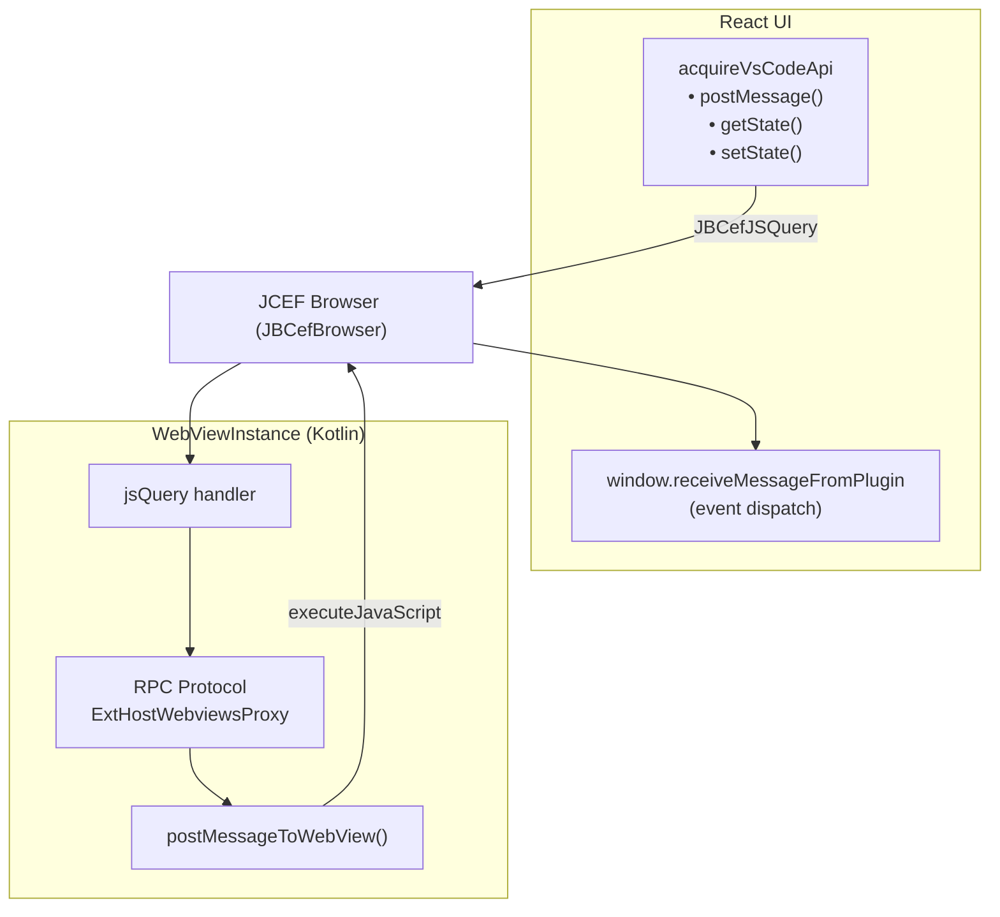
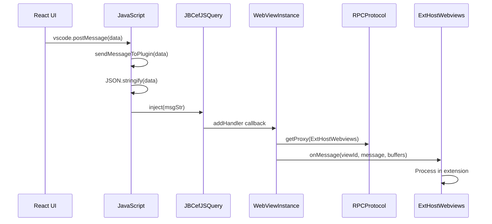
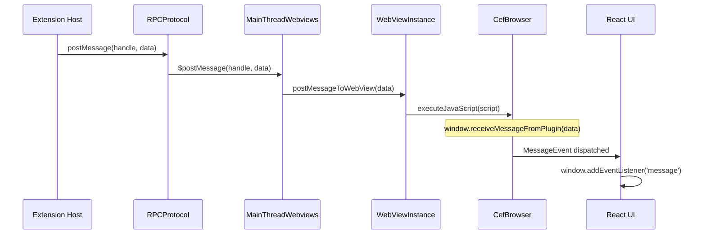
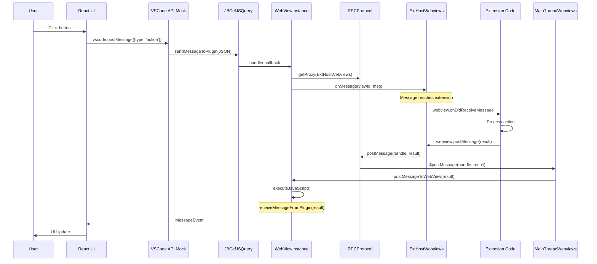

# WebView and Communication Bridge

This document describes how the JetBrains plugin renders the React UI in a WebView and handles bidirectional communication between JavaScript and Kotlin.

## Table of Contents

- [Overview](#overview)
- [WebViewManager](#webviewmanager)
- [WebViewInstance](#webviewinstance)
- [JCEF Initialization](#jcef-initialization)
- [VSCode API Mock Injection](#vscode-api-mock-injection)
- [JavaScript to Kotlin Communication](#javascript-to-kotlin-communication)
- [Kotlin to JavaScript Communication](#kotlin-to-javascript-communication)
- [LocalResHandler](#localreshandler)
- [RooToolWindowFactory](#rootoolwindowfactory)
- [Complete Message Flow](#complete-message-flow)

---

## Overview

The plugin uses JCEF (Java Chromium Embedded Framework) to render the React UI. Communication flows:



---

## WebViewManager

The [`WebViewManager`](../../jetbrains/plugin/src/main/kotlin/ai/kilocode/jetbrains/webview/WebViewManager.kt#L68) is a project-level service that manages all WebView instances.

### Class Definition

```kotlin
@Service(Service.Level.PROJECT)
class WebViewManager(var project: Project) : Disposable, ThemeChangeListener {
    @Volatile
    private var latestWebView: WebViewInstance? = null

    private val creationCallbacks = mutableListOf<WebViewCreationCallback>()

    @Volatile
    private var resourceRootDir: Path? = null

    private var currentThemeConfig: JsonObject? = null
    private var bodyThemeClass: String = "vscode-dark"
}
```

**Source:** [`WebViewManager.kt:68-94`](../../jetbrains/plugin/src/main/kotlin/ai/kilocode/jetbrains/webview/WebViewManager.kt#L68-L94)

### Provider Registration

When an extension registers a WebView provider, [`registerProvider()`](../../jetbrains/plugin/src/main/kotlin/ai/kilocode/jetbrains/webview/WebViewManager.kt#L241) creates the WebView:

```kotlin
fun registerProvider(data: WebviewViewProviderData) {
    // Clean up existing WebView
    disposeLatestWebView()

    // Extract resource path from extension location
    val location = extension.get("location") as? Map<String, Any?>
    val fsPath = location?.get("fsPath") as? String
    resourceRootDir = Paths.get(fsPath)

    // Initialize theme manager
    initializeThemeManager(fsPath)

    // Get RPC protocol
    val protocol = project.getService(PluginContext::class.java).getRPCProtocol()

    // Create WebView instance
    val viewId = UUID.randomUUID().toString()
    val webview = WebViewInstance(data.viewType, viewId, title, state, project, extension)

    // Notify extension host
    val proxy = protocol.getProxy(ServiceProxyRegistry.ExtHostContext.ExtHostWebviewViews)
    proxy.resolveWebviewView(viewId, data.viewType, title, state, null)

    latestWebView = webview
    notifyWebViewCreated(webview)
}
```

**Source:** [`registerProvider()`](../../jetbrains/plugin/src/main/kotlin/ai/kilocode/jetbrains/webview/WebViewManager.kt#L241-L301)

### HTML Content Update

The [`updateWebViewHtml()`](../../jetbrains/plugin/src/main/kotlin/ai/kilocode/jetbrains/webview/WebViewManager.kt#L314) method updates the WebView content:

```kotlin
fun updateWebViewHtml(data: WebviewHtmlUpdateData) {
    // Transform resource paths
    data.htmlContent = data.htmlContent
        .replace("/jetbrains/resources/kilocode/", "./")

    // Inject VSCode API mock (see next section)
    data.htmlContent = injectVSCodeApiMock(data.htmlContent)

    // Save HTML to resource directory
    val filename = "index.html"
    saveHtmlToResourceDir(data.htmlContent, filename)

    // Load via HTTP URL
    val url = "http://localhost:12345/$filename"
    webView.loadUrl(url)

    // Send theme config after load
    webView.sendThemeConfigToWebView(currentThemeConfig, bodyThemeClass)
}
```

**Source:** [`updateWebViewHtml()`](../../jetbrains/plugin/src/main/kotlin/ai/kilocode/jetbrains/webview/WebViewManager.kt#L314-L427)

---

## WebViewInstance

The [`WebViewInstance`](../../jetbrains/plugin/src/main/kotlin/ai/kilocode/jetbrains/webview/WebViewManager.kt#L507) class encapsulates a JCEF browser.

### Class Definition

```kotlin
class WebViewInstance(
    val viewType: String,
    val viewId: String,
    val title: String,
    val state: Map<String, Any?>,
    val project: Project,
    val extension: Map<String, Any?>
) : Disposable {

    // JCEF browser with off-screen rendering
    val browser = JBCefBrowser.createBuilder()
        .setOffScreenRendering(true)
        .build()

    // JavaScript query handler
    var jsQuery: JBCefJSQuery? = null

    private val coroutineScope = CoroutineScope(SupervisorJob() + Dispatchers.IO)
}
```

**Source:** [`WebViewInstance.kt:507-541`](../../jetbrains/plugin/src/main/kotlin/ai/kilocode/jetbrains/webview/WebViewManager.kt#L507-L541)

### Key Methods

| Method                                                                                                                            | Purpose                    |
| --------------------------------------------------------------------------------------------------------------------------------- | -------------------------- |
| [`loadUrl(url)`](../../jetbrains/plugin/src/main/kotlin/ai/kilocode/jetbrains/webview/WebViewManager.kt#L969)                     | Load content from URL      |
| [`loadHtml(html)`](../../jetbrains/plugin/src/main/kotlin/ai/kilocode/jetbrains/webview/WebViewManager.kt#L979)                   | Load HTML content directly |
| [`executeJavaScript(script)`](../../jetbrains/plugin/src/main/kotlin/ai/kilocode/jetbrains/webview/WebViewManager.kt#L993)        | Execute JS in browser      |
| [`postMessageToWebView(message)`](../../jetbrains/plugin/src/main/kotlin/ai/kilocode/jetbrains/webview/WebViewManager.kt#L828)    | Send message to React      |
| [`sendThemeConfigToWebView(config)`](../../jetbrains/plugin/src/main/kotlin/ai/kilocode/jetbrains/webview/WebViewManager.kt#L552) | Apply theme styling        |

---

## JCEF Initialization

### Browser Creation

```kotlin
val browser = JBCefBrowser.createBuilder()
    .setOffScreenRendering(true)  // Required for tool windows
    .build()
```

**Source:** [`WebViewInstance.kt:519`](../../jetbrains/plugin/src/main/kotlin/ai/kilocode/jetbrains/webview/WebViewManager.kt#L519)

### Handler Registration

```kotlin
init {
    setupJSBridge()
    enableResourceInterception(extension)
}
```

The [`enableResourceInterception()`](../../jetbrains/plugin/src/main/kotlin/ai/kilocode/jetbrains/webview/WebViewManager.kt#L845) method registers CEF handlers:

```kotlin
fun enableResourceInterception(extension: Map<String, Any?>) {
    val client = browser.jbCefClient

    // Console message handler
    client.addDisplayHandler(object : CefDisplayHandlerAdapter() {
        override fun onConsoleMessage(
            browser: CefBrowser?,
            level: CefSettings.LogSeverity?,
            message: String?,
            source: String?,
            line: Int
        ): Boolean {
            logger.info("WebView console: [$level] $message")
            return true
        }
    }, browser.cefBrowser)

    // Load handler for page lifecycle
    client.addLoadHandler(object : CefLoadHandlerAdapter() {
        override fun onLoadEnd(browser: CefBrowser?, frame: CefFrame?, httpStatusCode: Int) {
            isPageLoaded = true
            if (isInitialPageLoad) {
                injectTheme()
                pageLoadCallback?.invoke()
                isInitialPageLoad = false
            }
        }
    }, browser.cefBrowser)

    // Request handler for resource interception
    client.addRequestHandler(object : CefRequestHandlerAdapter() {
        override fun onBeforeBrowse(...): Boolean {
            // Open external links in system browser
            if (request?.url?.startsWith("http://localhost") == false) {
                BrowserUtil.browse(request.url)
                return true
            }
            return false
        }

        override fun getResourceRequestHandler(...): CefResourceRequestHandler? {
            if (fsPath != null && request?.url?.contains("localhost") == true) {
                return LocalResHandler(fsPath, request)
            }
            return null
        }
    }, browser.cefBrowser)
}
```

**Source:** [`enableResourceInterception()`](../../jetbrains/plugin/src/main/kotlin/ai/kilocode/jetbrains/webview/WebViewManager.kt#L845-L964)

---

## VSCode API Mock Injection

The plugin injects a mock `acquireVsCodeApi()` function that bridges to Kotlin.

### Injection Code

```kotlin
// From updateWebViewHtml()
data.htmlContent = data.htmlContent.replace(
    """<script\s+nonce="([A-Za-z0-9]{32})">""".toRegex(),
    """
    $str
    // Send messages to plugin
    window.sendMessageToPlugin = function(message) {
        const msgStr = JSON.stringify(message);
        ${getLatestWebView()?.jsQuery?.inject("msgStr")}
    };

    // VSCode API mock
    globalThis.acquireVsCodeApi = (function() {
        let acquired = false;
        let state = JSON.parse('$encodedState');

        // Setup message receiver
        if (!window.receiveMessageFromPlugin) {
            window.receiveMessageFromPlugin = (message) => {
                const event = new MessageEvent("message", { data: message });
                window.dispatchEvent(event);
            };
        }

        return () => {
            if (acquired) {
                throw new Error('Already acquired');
            }
            acquired = true;

            return Object.freeze({
                postMessage: function(message, transfer) {
                    window.sendMessageToPlugin(message);
                },
                setState: function(newState) {
                    state = newState;
                    window.sendMessageToPlugin(newState);
                    return newState;
                },
                getState: function() {
                    return state;
                }
            });
        };
    })();
    """
)
```

**Source:** [`updateWebViewHtml()`](../../jetbrains/plugin/src/main/kotlin/ai/kilocode/jetbrains/webview/WebViewManager.kt#L318-L379)

### API Methods

| VSCode Method      | Implementation                                        |
| ------------------ | ----------------------------------------------------- |
| `postMessage(msg)` | Calls `window.sendMessageToPlugin()` → `JBCefJSQuery` |
| `getState()`       | Returns local `state` variable                        |
| `setState(s)`      | Updates local `state` and sends to plugin             |

---

## JavaScript to Kotlin Communication

Messages from JavaScript are sent via `JBCefJSQuery`.

### JS Bridge Setup

```kotlin
private fun setupJSBridge() {
    @Suppress("DEPRECATION")
    jsQuery = JBCefJSQuery.create(browser)

    jsQuery?.addHandler { message ->
        coroutineScope.launch {
            val protocol = project.getService(PluginContext::class.java).getRPCProtocol()
            if (protocol != null) {
                logger.info("Received message from WebView: $message")

                val serializeParam = SerializableObjectWithBuffers(emptyList<ByteArray>())
                protocol.getProxy(ServiceProxyRegistry.ExtHostContext.ExtHostWebviews)
                    .onMessage(viewId, message, serializeParam)
            }
        }
        null  // No return value
    }
}
```

**Source:** [`setupJSBridge()`](../../jetbrains/plugin/src/main/kotlin/ai/kilocode/jetbrains/webview/WebViewManager.kt#L800-L822)

### Message Flow: JS → Kotlin → Extension Host



---

## Kotlin to JavaScript Communication

Messages from Kotlin are sent via `executeJavaScript()`.

### postMessageToWebView

```kotlin
fun postMessageToWebView(message: String) {
    if (!isDisposed) {
        val script = """
            if (window.receiveMessageFromPlugin) {
                window.receiveMessageFromPlugin($message);
            } else {
                console.warn("receiveMessageFromPlugin not available");
            }
        """.trimIndent()
        executeJavaScript(script)
    }
}
```

**Source:** [`postMessageToWebView()`](../../jetbrains/plugin/src/main/kotlin/ai/kilocode/jetbrains/webview/WebViewManager.kt#L828-L839)

### Message Flow: Extension Host → Kotlin → JS



---

## LocalResHandler

The [`LocalResHandler`](../../jetbrains/plugin/src/main/kotlin/ai/kilocode/jetbrains/webview/LocalResHandler.kt#L20) serves local files to the WebView via a fake HTTP server.

### Class Definition

```kotlin
class LocalResHandler(
    val resourcePath: String,
    val request: CefRequest?
) : CefResourceRequestHandlerAdapter() {

    override fun getResourceHandler(
        browser: CefBrowser?,
        frame: CefFrame?,
        request: CefRequest?
    ): CefResourceHandler {
        return LocalCefResHandle(resourcePath, request)
    }
}
```

**Source:** [`LocalResHandler.kt:20-27`](../../jetbrains/plugin/src/main/kotlin/ai/kilocode/jetbrains/webview/LocalResHandler.kt#L20-L27)

### LocalCefResHandle

The [`LocalCefResHandle`](../../jetbrains/plugin/src/main/kotlin/ai/kilocode/jetbrains/webview/LocalResHandler.kt#L29) implements `CefResourceHandler`:

```kotlin
class LocalCefResHandle(
    val resourceBasePath: String,
    val request: CefRequest?
) : CefResourceHandler {

    private var file: File? = null
    private var fileContent: ByteArray? = null
    private var offset = 0

    init {
        // Parse request path
        val requestPath = request?.url?.decodeURLPart()
            ?.replace("http://localhost:", "")
            ?.substringAfter("/")
            ?.substringBefore("?")

        val filePath = if (requestPath.isEmpty()) {
            "$resourceBasePath/index.html"
        } else {
            "$resourceBasePath/$requestPath"
        }

        file = File(filePath)
        if (file!!.exists()) {
            fileContent = file!!.readBytes()
        }
    }
}
```

**Source:** [`LocalCefResHandle.kt:29-61`](../../jetbrains/plugin/src/main/kotlin/ai/kilocode/jetbrains/webview/LocalResHandler.kt#L29-L61)

### MIME Type Detection

```kotlin
fun getMimeTypeForFile(filePath: String): String {
    return when {
        filePath.endsWith(".html", true) -> "text/html"
        filePath.endsWith(".css", true) -> "text/css"
        filePath.endsWith(".js", true) -> "application/javascript"
        filePath.endsWith(".json", true) -> "application/json"
        filePath.endsWith(".png", true) -> "image/png"
        filePath.endsWith(".svg", true) -> "image/svg+xml"
        filePath.endsWith(".woff2", true) -> "font/woff2"
        else -> "application/octet-stream"
    }
}
```

**Source:** [`getMimeTypeForFile()`](../../jetbrains/plugin/src/main/kotlin/ai/kilocode/jetbrains/webview/LocalResHandler.kt#L71-L88)

---

## RooToolWindowFactory

The [`RooToolWindowFactory`](../../jetbrains/plugin/src/main/kotlin/ai/kilocode/jetbrains/ui/RooToolWindowFactory.kt#L37) creates the tool window that hosts the WebView.

### Factory Implementation

```kotlin
class RooToolWindowFactory : ToolWindowFactory {

    override fun createToolWindowContent(project: Project, toolWindow: ToolWindow) {
        // Initialize plugin service
        val pluginService = WecoderPlugin.getInstance(project)
        pluginService.initialize(project)

        // Setup toolbar actions
        val titleActions = mutableListOf<AnAction>()
        val action = ActionManager.getInstance().getAction("WecoderToolbarGroup")
        if (action != null) {
            titleActions.add(action)
        }

        // Add dev tools button in debug mode
        if (WecoderPluginService.getDebugMode() != DebugMode.NONE) {
            titleActions.add(OpenDevToolsAction {
                project.getService(WebViewManager::class.java).getLatestWebView()
            })
        }
        toolWindow.setTitleActions(titleActions)

        // Create content
        val rooToolWindowContent = RooToolWindowContent(project, toolWindow)
        val contentFactory = ContentFactory.getInstance()
        val content = contentFactory.createContent(
            rooToolWindowContent.content, "", false
        )
        toolWindow.contentManager.addContent(content)
    }
}
```

**Source:** [`RooToolWindowFactory.kt:37-66`](../../jetbrains/plugin/src/main/kotlin/ai/kilocode/jetbrains/ui/RooToolWindowFactory.kt#L37-L66)

### RooToolWindowContent

The inner class [`RooToolWindowContent`](../../jetbrains/plugin/src/main/kotlin/ai/kilocode/jetbrains/ui/RooToolWindowFactory.kt#L68) manages the UI:

```kotlin
private class RooToolWindowContent(
    private val project: Project,
    private val toolWindow: ToolWindow
) : WebViewCreationCallback {

    private val webViewManager = project.getService(WebViewManager::class.java)
    private val contentPanel = JPanel(BorderLayout())

    init {
        // Check for existing WebView
        webViewManager.getLatestWebView()?.let { webView ->
            ApplicationManager.getApplication().invokeLater {
                addWebViewComponent(webView)
            }

            webView.setPageLoadCallback {
                ApplicationManager.getApplication().invokeLater {
                    hideSystemInfo()
                }
            }
        } ?: webViewManager.addCreationCallback(this, toolWindow.disposable)
    }

    override fun onWebViewCreated(instance: WebViewInstance) {
        ApplicationManager.getApplication().invokeLater {
            addWebViewComponent(instance)
        }
        instance.setPageLoadCallback {
            ApplicationManager.getApplication().invokeLater {
                hideSystemInfo()
            }
        }
    }

    private fun addWebViewComponent(webView: WebViewInstance) {
        contentPanel.add(webView.browser.component, BorderLayout.CENTER)
        setupDragAndDropSupport(webView)
        contentPanel.revalidate()
        contentPanel.repaint()
    }
}
```

**Source:** [`RooToolWindowContent.kt:68-292`](../../jetbrains/plugin/src/main/kotlin/ai/kilocode/jetbrains/ui/RooToolWindowFactory.kt#L68-L292)

---

## Complete Message Flow

### Full Round-Trip: User Action → Extension → Response



---

## Theme Integration

### Theme Change Handling

```kotlin
override fun onThemeChanged(themeConfig: JsonObject, isDarkTheme: Boolean) {
    this.currentThemeConfig = themeConfig
    this.bodyThemeClass = if (isDarkTheme) "vscode-dark" else "vscode-light"
    sendThemeConfigToWebViews(themeConfig)
}

private fun sendThemeConfigToWebViews(themeConfig: JsonObject) {
    getLatestWebView()?.sendThemeConfigToWebView(themeConfig, bodyThemeClass)
}
```

**Source:** [`onThemeChanged()`](../../jetbrains/plugin/src/main/kotlin/ai/kilocode/jetbrains/webview/WebViewManager.kt#L112-L120)

### CSS Variable Injection

```kotlin
fun sendThemeConfigToWebView(themeConfig: JsonObject, bodyThemeClass: String) {
    val injectThemeScript = """
        (function() {
            // Extract CSS variables from config
            const cssLines = `$cssContent`.split('\n');
            const cssVariables = [];

            for (const line of cssLines) {
                if (line.trim().startsWith('--')) {
                    cssVariables.push(line.trim());
                }
            }

            // Apply to HTML element
            document.documentElement.setAttribute('style', cssVariables.join(' '));

            // Apply theme class to body
            document.body.classList.remove('vscode-dark', 'vscode-light');
            document.body.classList.add('$bodyThemeClass');
        })()
    """
    executeJavaScript(injectThemeScript)
}
```

**Source:** [`sendThemeConfigToWebView()`](../../jetbrains/plugin/src/main/kotlin/ai/kilocode/jetbrains/webview/WebViewManager.kt#L552-L798)

---

## Related Documentation

- [VSCode API Bridging](./03-vscode-api-bridging.md) - RPC proxy architecture
- [Extension Host IPC](./02-extension-host-ipc.md) - Lower-level protocol
- [Architecture Diagrams](./05-architecture-diagrams.md) - Complete system diagrams
