# Comprehensive Architecture Diagrams

This document provides visual diagrams of the JetBrains plugin architecture covering all major subsystems.

## Table of Contents

- [High-Level Architecture Overview](#high-level-architecture-overview)
- [Initialization Sequence](#initialization-sequence)
- [IPC Protocol Flow](#ipc-protocol-flow)
- [RPC Proxy Architecture](#rpc-proxy-architecture)
- [WebView Message Flow](#webview-message-flow)
- [Complete System Diagram](#complete-system-diagram)
- [Component Reference](#component-reference)

---

## High-Level Architecture Overview

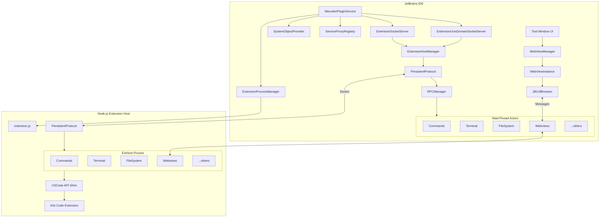

---

## Initialization Sequence

### Complete Startup Flow

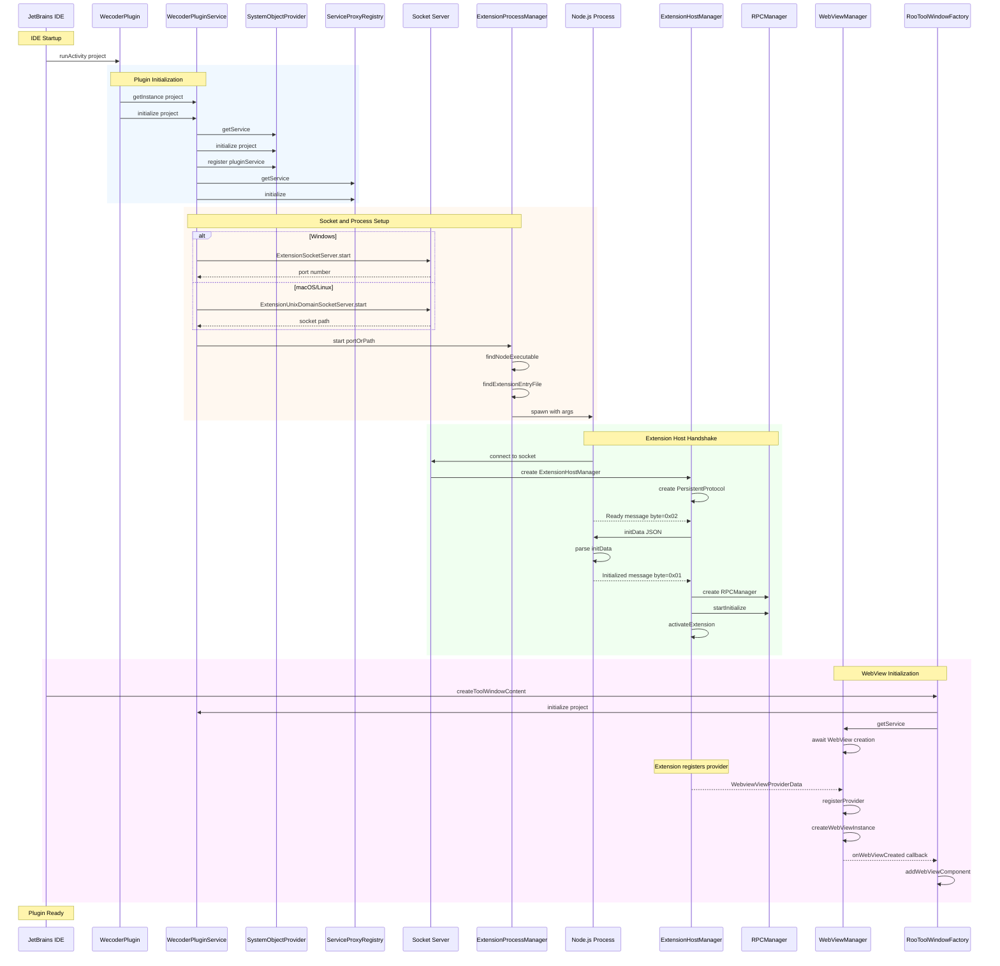

---

## IPC Protocol Flow

### Binary Message Framing

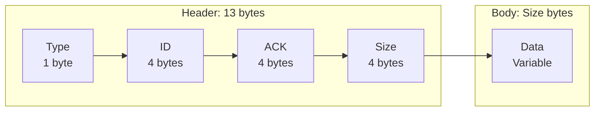

### Message Exchange

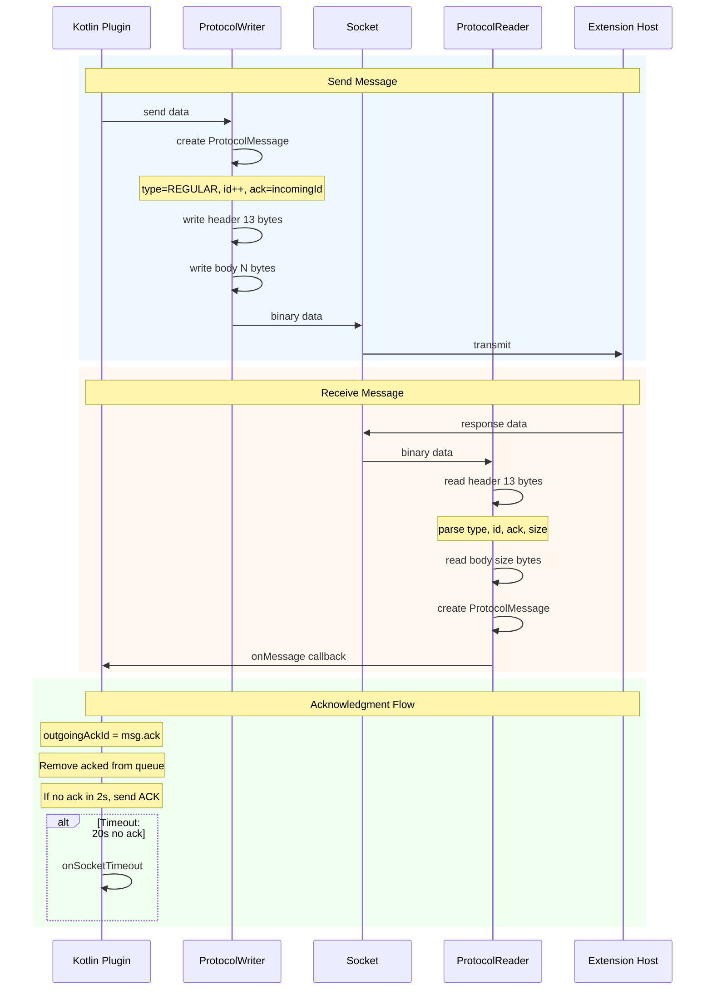

### Protocol Message Types

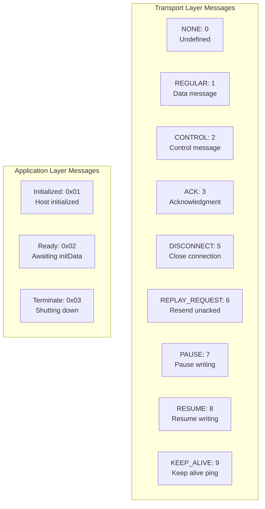

---

## RPC Proxy Architecture

### Proxy System Overview

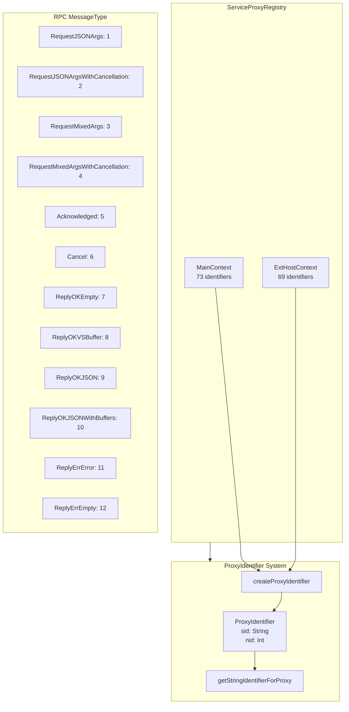

### RPC Call Flow

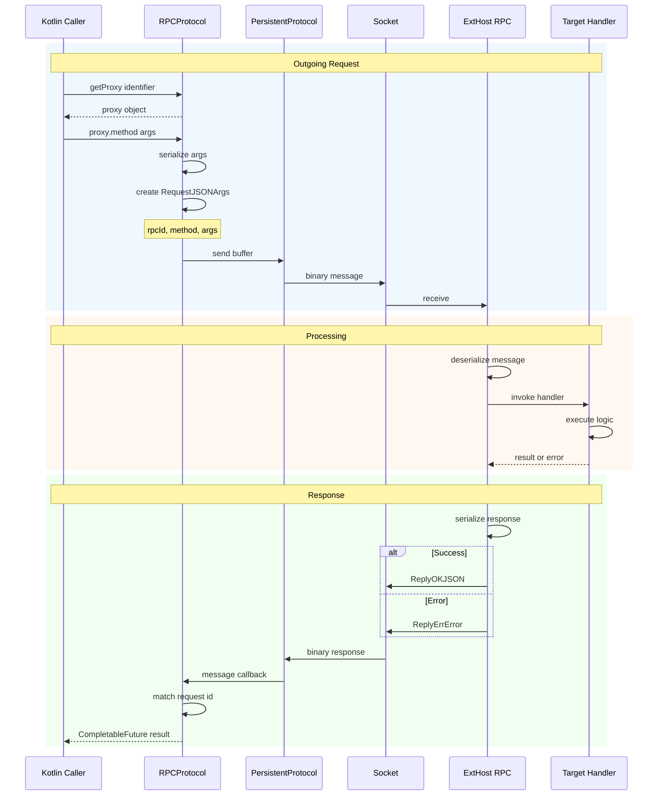

### MainThread Actors

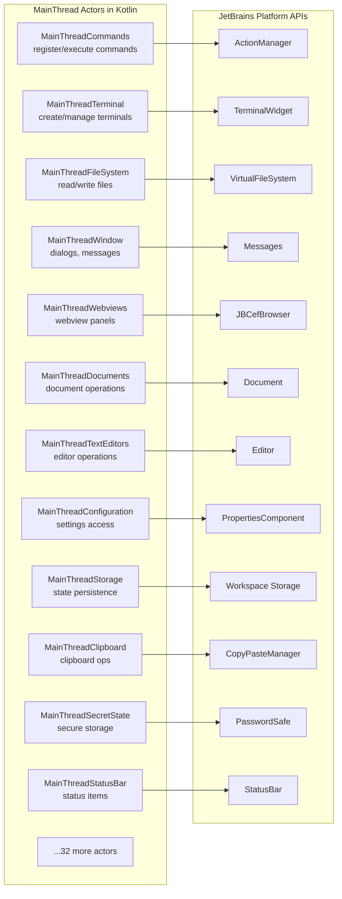

---

## WebView Message Flow

### Complete WebView Communication

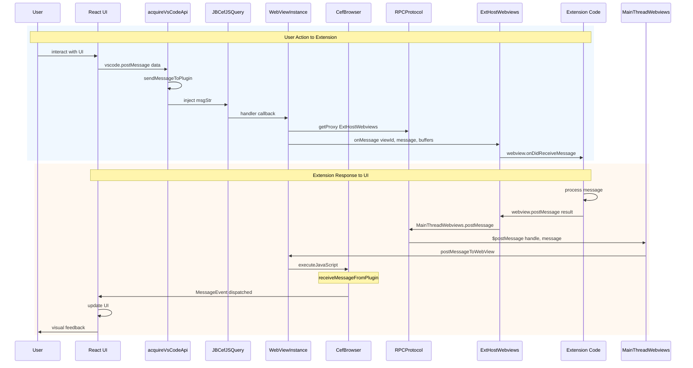

### WebView Component Hierarchy

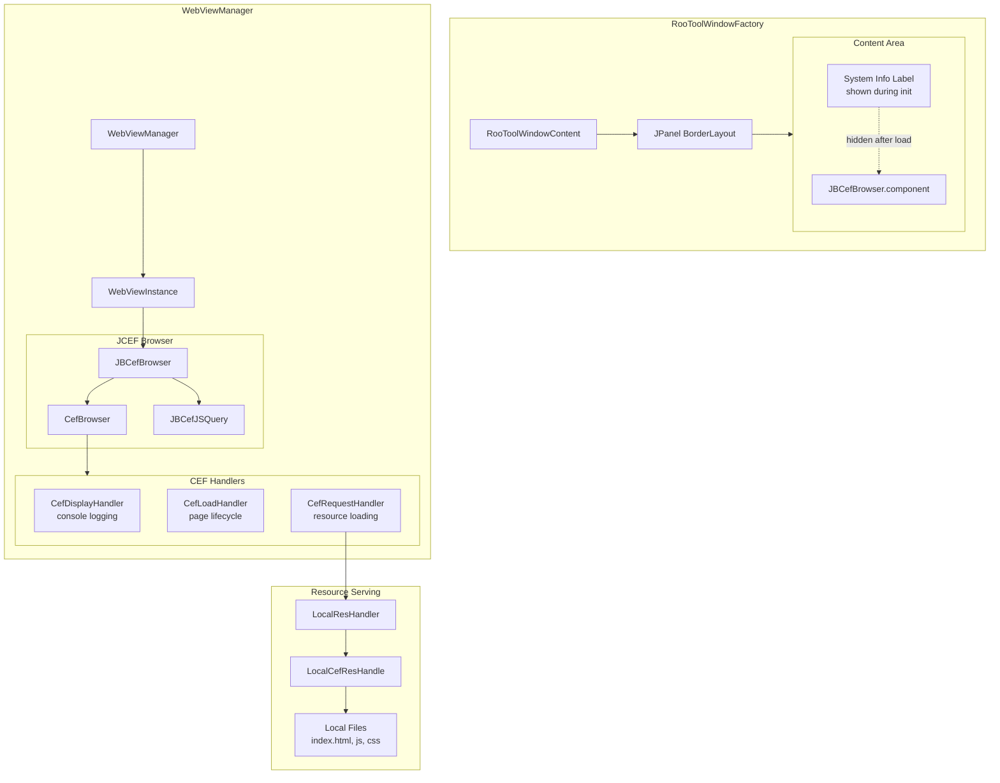

---

## Complete System Diagram

### Full Architecture

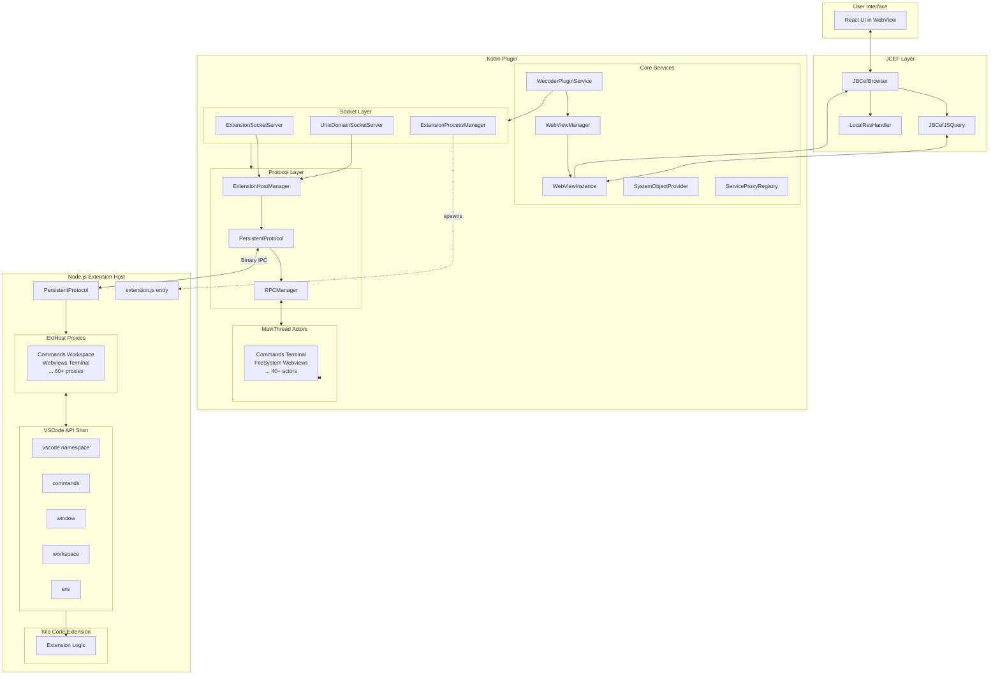

---

## Component Reference

### File Locations

| Component                                                                                                                                     | File Path                               |
| --------------------------------------------------------------------------------------------------------------------------------------------- | --------------------------------------- |
| [`WecoderPlugin`](../../jetbrains/plugin/src/main/kotlin/ai/kilocode/jetbrains/plugin/WecoderPlugin.kt#L47)                                   | plugin/WecoderPlugin.kt                 |
| [`WecoderPluginService`](../../jetbrains/plugin/src/main/kotlin/ai/kilocode/jetbrains/plugin/WecoderPlugin.kt#L188)                           | plugin/WecoderPlugin.kt                 |
| [`SystemObjectProvider`](../../jetbrains/plugin/src/main/kotlin/ai/kilocode/jetbrains/plugin/SystemObjectProvider.kt#L20)                     | plugin/SystemObjectProvider.kt          |
| [`ExtensionSocketServer`](../../jetbrains/plugin/src/main/kotlin/ai/kilocode/jetbrains/core/ExtensionSocketServer.kt#L26)                     | core/ExtensionSocketServer.kt           |
| [`ExtensionUnixDomainSocketServer`](../../jetbrains/plugin/src/main/kotlin/ai/kilocode/jetbrains/core/ExtensionUnixDomainSocketServer.kt#L20) | core/ExtensionUnixDomainSocketServer.kt |
| [`ExtensionProcessManager`](../../jetbrains/plugin/src/main/kotlin/ai/kilocode/jetbrains/core/ExtensionProcessManager.kt#L28)                 | core/ExtensionProcessManager.kt         |
| [`ExtensionHostManager`](../../jetbrains/plugin/src/main/kotlin/ai/kilocode/jetbrains/core/ExtensionHostManager.kt#L35)                       | core/ExtensionHostManager.kt            |
| [`PersistentProtocol`](../../jetbrains/plugin/src/main/kotlin/ai/kilocode/jetbrains/ipc/PersistentProtocol.kt#L19)                            | ipc/PersistentProtocol.kt               |
| [`ProtocolReader`](../../jetbrains/plugin/src/main/kotlin/ai/kilocode/jetbrains/ipc/ProtocolReader.kt#L15)                                    | ipc/ProtocolReader.kt                   |
| [`ProtocolMessageType`](../../jetbrains/plugin/src/main/kotlin/ai/kilocode/jetbrains/ipc/ProtocolMessageType.kt#L11)                          | ipc/ProtocolMessageType.kt              |
| [`ProtocolConstants`](../../jetbrains/plugin/src/main/kotlin/ai/kilocode/jetbrains/ipc/ProtocolConstants.kt#L11)                              | ipc/ProtocolConstants.kt                |
| [`ServiceProxyRegistry`](../../jetbrains/plugin/src/main/kotlin/ai/kilocode/jetbrains/core/ServiceProxyRegistry.kt#L60)                       | core/ServiceProxyRegistry.kt            |
| [`ProxyIdentifier`](../../jetbrains/plugin/src/main/kotlin/ai/kilocode/jetbrains/ipc/proxy/ProxyIdentifier.kt#L11)                            | ipc/proxy/ProxyIdentifier.kt            |
| [`MessageType`](../../jetbrains/plugin/src/main/kotlin/ai/kilocode/jetbrains/ipc/proxy/MessageType.kt#L11)                                    | ipc/proxy/MessageType.kt                |
| [`WebViewManager`](../../jetbrains/plugin/src/main/kotlin/ai/kilocode/jetbrains/webview/WebViewManager.kt#L68)                                | webview/WebViewManager.kt               |
| [`WebViewInstance`](../../jetbrains/plugin/src/main/kotlin/ai/kilocode/jetbrains/webview/WebViewManager.kt#L507)                              | webview/WebViewManager.kt               |
| [`LocalResHandler`](../../jetbrains/plugin/src/main/kotlin/ai/kilocode/jetbrains/webview/LocalResHandler.kt#L20)                              | webview/LocalResHandler.kt              |
| [`RooToolWindowFactory`](../../jetbrains/plugin/src/main/kotlin/ai/kilocode/jetbrains/ui/RooToolWindowFactory.kt#L37)                         | ui/RooToolWindowFactory.kt              |
| [`ExtensionHostMessageType`](../../jetbrains/plugin/src/main/kotlin/ai/kilocode/jetbrains/core/ExtensionHostMessageType.kt#L11)               | core/ExtensionHostMessageType.kt        |

### Related Documentation

| Document                                               | Description                  |
| ------------------------------------------------------ | ---------------------------- |
| [README](./README.md)                                  | Main overview and index      |
| [Plugin Initialization](./01-plugin-initialization.md) | Startup and service creation |
| [Extension Host IPC](./02-extension-host-ipc.md)       | Binary protocol details      |
| [VSCode API Bridging](./03-vscode-api-bridging.md)     | Proxy system architecture    |
| [WebView Communication](./04-webview-communication.md) | UI messaging flow            |
