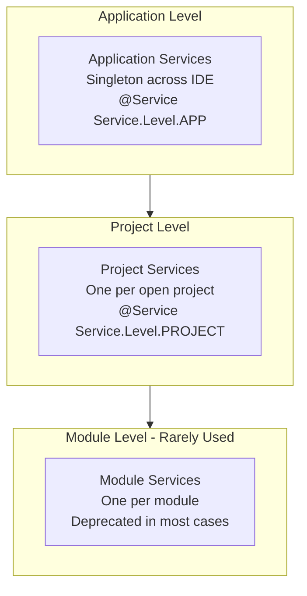
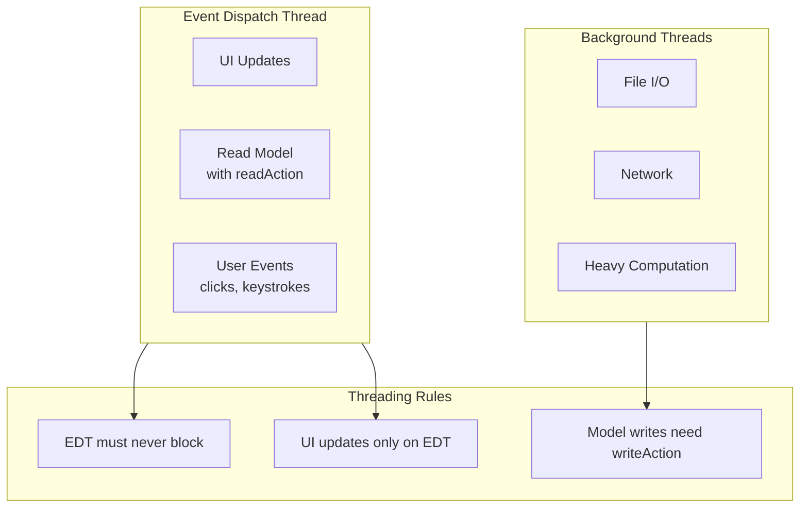
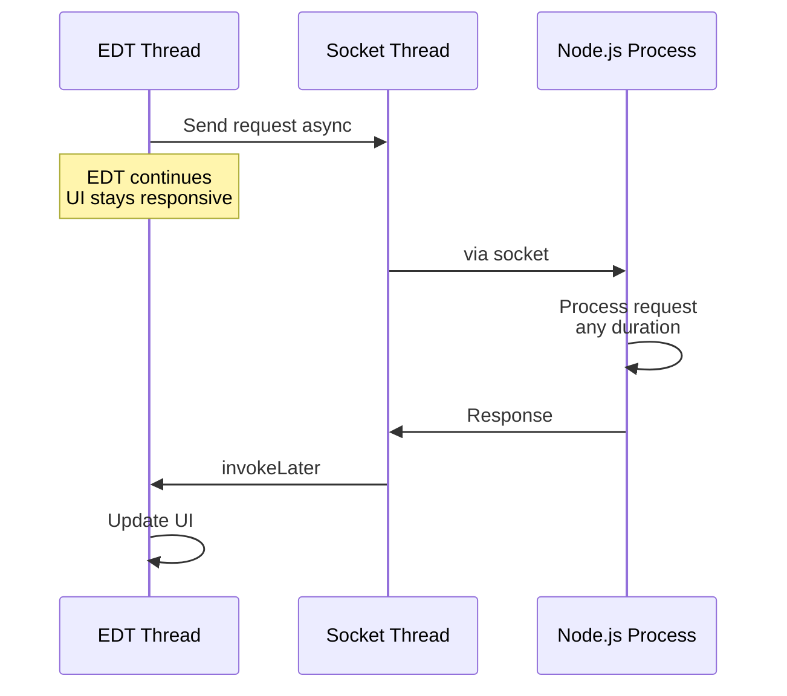
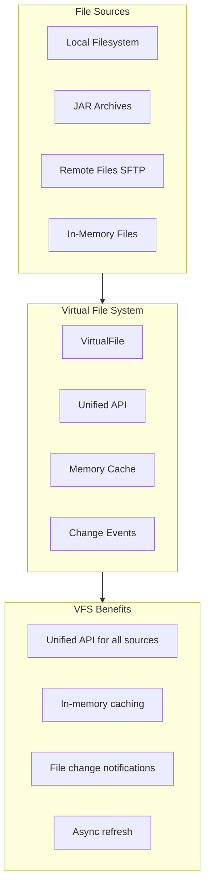
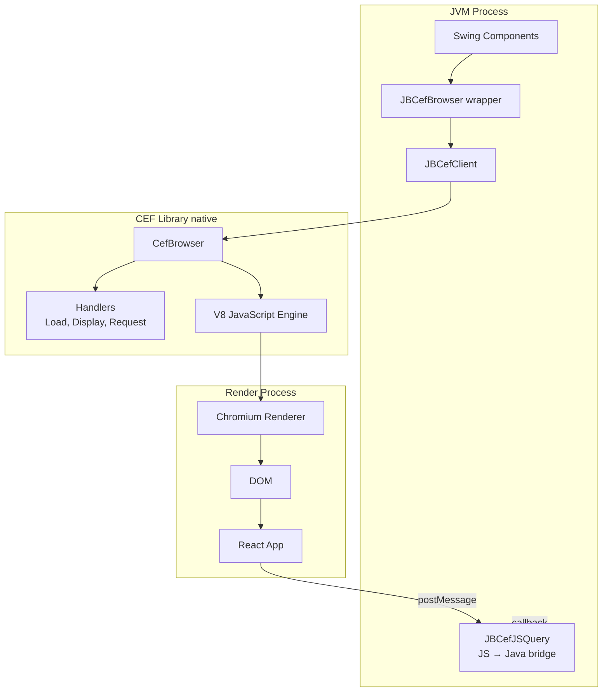
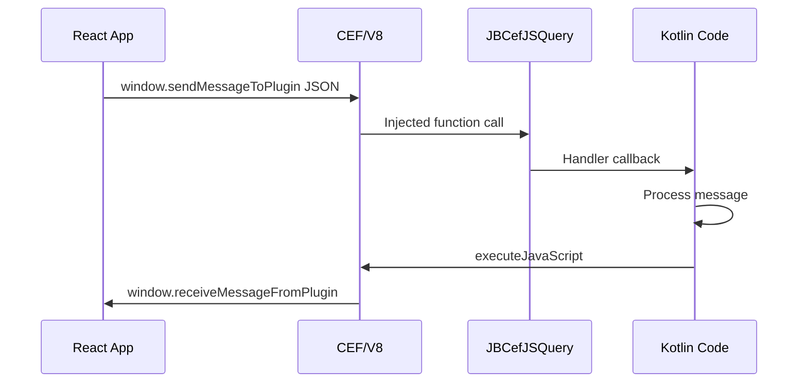
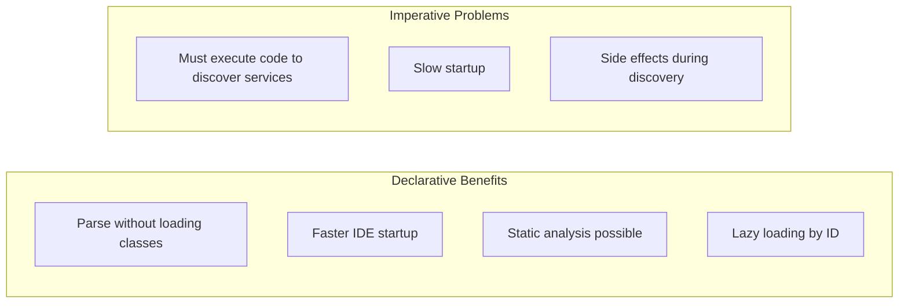
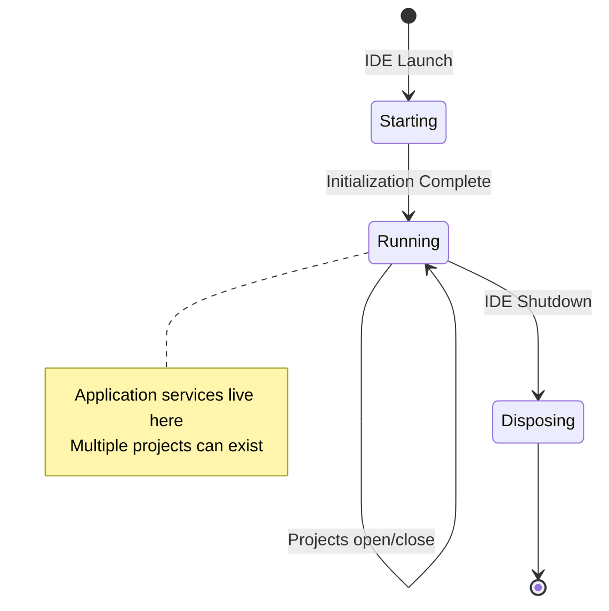
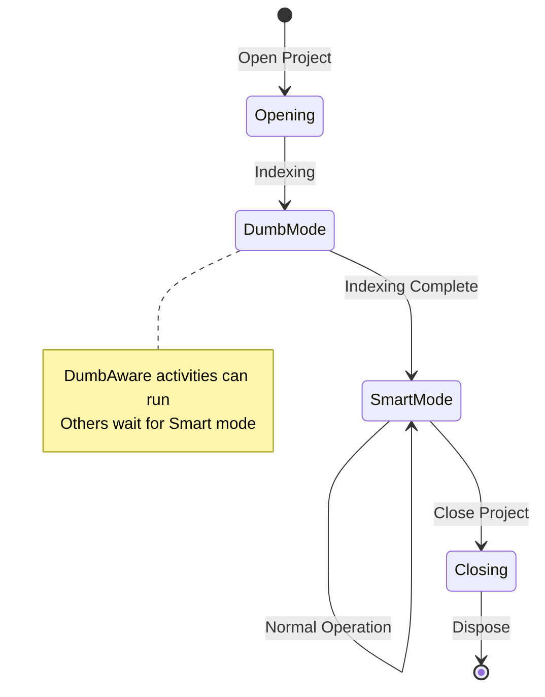

# IntelliJ Platform Foundations Deep Dive

This document explains the fundamental concepts of the IntelliJ Platform that are essential for understanding the Kilo Code JetBrains plugin architecture. Understanding these concepts clarifies why certain architectural decisions were made.

## Table of Contents

- [Service-Based Architecture](#service-based-architecture)
- [Threading Model: EDT and Beyond](#threading-model-edt-and-beyond)
- [Virtual File System VFS](#virtual-file-system-vfs)
- [JCEF: Java Chromium Embedded Framework](#jcef-java-chromium-embedded-framework)
- [Plugin.xml Declarative Configuration](#pluginxml-declarative-configuration)
- [Project and Application Lifecycle](#project-and-application-lifecycle)
- [Why This Matters for Kilo Code](#why-this-matters-for-kilo-code)

---

## Service-Based Architecture

The IntelliJ Platform has evolved from a component-based model to a service-based architecture. Understanding services is fundamental to understanding how plugins organize their code.

### Service Levels

IntelliJ services exist at three distinct levels, each with different lifecycles and scopes:



| Level           | Scope          | Lifecycle              | Example                       |
| --------------- | -------------- | ---------------------- | ----------------------------- |
| **Application** | Entire IDE     | IDE startup → shutdown | Settings, global state        |
| **Project**     | Single project | Project open → close   | File watchers, project config |
| **Module**      | Single module  | Module load → unload   | Module-specific tools         |

### Why Services Replace Components

The older component model (pre-2019) had issues:

- **Eager initialization**: Components loaded immediately, slowing startup
- **Harder dependency management**: Implicit ordering
- **No lazy loading**: Wasted memory for unused features

Services solve these:

- **Lazy loading**: Created on first `getService()` call
- **Explicit dependencies**: Constructor injection
- **Clear lifecycle**: Tied to their scope (app/project)

### Kilo Code Service Declaration

In Kilo Code, services are declared in [`plugin.xml.template`](../../jetbrains/plugin/src/main/resources/META-INF/plugin.xml.template):

```xml
<!-- Application-level service: One instance for entire IDE -->
<applicationService
    serviceImplementation="ai.kilocode.jetbrains.commit.CommitMessageService"/>

<!-- Project-level services: One instance per open project -->
<projectService
    serviceImplementation="ai.kilocode.jetbrains.plugin.WecoderPluginService"/>
<projectService
    serviceImplementation="ai.kilocode.jetbrains.webview.WebViewManager"/>
<projectService
    serviceImplementation="ai.kilocode.jetbrains.plugin.SystemObjectProvider"/>
```

### Service Registration Pattern in Code

```kotlin
// Declaration with annotation
@Service(Service.Level.PROJECT)
class WecoderPluginService(private var currentProject: Project) : Disposable {
    // Service implementation
}

// Retrieval pattern
val service = project.getService(WecoderPluginService::class.java)

// Alternative: companion object with getInstance
class WecoderPluginService(private var currentProject: Project) : Disposable {
    companion object {
        fun getInstance(project: Project): WecoderPluginService {
            return project.getService(WecoderPluginService::class.java)
        }
    }
}
```

**Source:** [`WecoderPluginService`](../../jetbrains/plugin/src/main/kotlin/ai/kilocode/jetbrains/plugin/WecoderPlugin.kt#L188)

### Disposable Pattern

Services implement `Disposable` for cleanup:

```kotlin
@Service(Service.Level.PROJECT)
class WebViewManager(var project: Project) : Disposable {

    override fun dispose() {
        // Clean up resources when project closes
        disposeLatestWebView()
        themeManager?.dispose()
    }
}
```

**Why this matters for Kilo Code**: Each open project gets its own:

- Socket connection to extension host
- WebView instance
- Plugin state

---

## Threading Model: EDT and Beyond

The IntelliJ threading model is one of the most critical concepts. Misunderstanding it causes bugs, freezes, and crashes.

### Event Dispatch Thread (EDT)

The EDT is Swing's single UI thread. Rules are strict:



### EDT Rules

| Rule                            | Consequence of Violation                   |
| ------------------------------- | ------------------------------------------ |
| EDT must not block              | IDE freezes; 10s watchdog kills operations |
| UI changes only on EDT          | Crashes, rendering corruption              |
| Read actions for model access   | Data races, corruption                     |
| Write actions for model changes | Data races, corruption                     |

### Read/Write Actions

Model access (PSI tree, documents, VFS) requires explicit locking:

```kotlin
// Reading from model - MUST use readAction
ApplicationManager.getApplication().runReadAction {
    val document = FileDocumentManager.getInstance().getDocument(virtualFile)
    // Safe to read document content
}

// Writing to model - MUST use writeAction on EDT
ApplicationManager.getApplication().invokeAndWait {
    WriteAction.run<Throwable> {
        document.setText("new content")
    }
}
```

### Background Thread Patterns

For long-running operations:

```kotlin
// Pattern 1: ProgressManager for user-visible tasks
ProgressManager.getInstance().run(object : Task.Backgroundable(project, "Loading...") {
    override fun run(indicator: ProgressIndicator) {
        // Runs in background thread
        indicator.fraction = 0.5
    }

    override fun onSuccess() {
        // Runs on EDT after completion
    }
})

// Pattern 2: Coroutines (modern approach)
coroutineScope.launch(Dispatchers.IO) {
    // Background work
    val result = performNetworkCall()

    withContext(Dispatchers.EDT) {
        // UI update on EDT
        updateUI(result)
    }
}

// Pattern 3: ApplicationManager for simple async
ApplicationManager.getApplication().executeOnPooledThread {
    // Background work

    ApplicationManager.getApplication().invokeLater {
        // Back to EDT for UI updates
    }
}
```

### Why External Processes Bypass EDT Constraints

**Critical insight**: The Kilo Code architecture runs extension logic in a _separate Node.js process_, which means:

1. **No EDT blocking risk**: Even if extension code hangs, the IDE UI stays responsive
2. **No locking needed**: The external process has its own memory space
3. **Async by default**: Socket communication is naturally asynchronous

This is a key reason for the separate-process architecture:



### 2025.1+ Threading Changes

JetBrains is evolving the threading model:

- **Coroutine-first**: Moving from callbacks to structured concurrency
- **Read/Write indicators**: Better tooling for detecting violations
- **Async APIs**: More APIs returning `CompletableFuture` or suspending functions

Kilo Code is well-positioned for this because socket communication is already async.

---

## Virtual File System (VFS)

The VFS is IntelliJ's abstraction over file systems. Plugins MUST use VFS APIs, not `java.io.File` directly.

### Why VFS Exists



### VFS Key Concepts

| Concept       | Description                                                       |
| ------------- | ----------------------------------------------------------------- |
| `VirtualFile` | Represents a file or directory; may not exist on disk             |
| Async Refresh | VFS caches state; explicit refresh needed to see external changes |
| Events        | `VirtualFileListener` notifies of changes                         |
| Document      | Editable in-memory representation of text files                   |

### VFS Usage Patterns

```kotlin
// Finding a file
val virtualFile = LocalFileSystem.getInstance()
    .findFileByPath("/path/to/file.txt")

// Reading content
val content = virtualFile?.contentsToByteArray()

// Refreshing after external changes
virtualFile?.refresh(/* async */ true, /* recursive */ false)

// Getting document for editors
val document = FileDocumentManager.getInstance().getDocument(virtualFile)

// Listening for changes
VirtualFileManager.getInstance().addVirtualFileListener(object : VirtualFileListener {
    override fun contentsChanged(event: VirtualFileEvent) {
        // Handle file modification
    }
})
```

### Why This Matters for Kilo Code

The [`MainThreadFileSystem`](../../jetbrains/plugin/src/main/kotlin/ai/kilocode/jetbrains/actors/MainThreadFileSystemShape.kt) actor translates VSCode file operations to VFS:

```kotlin
// VSCode API call: vscode.workspace.fs.readFile(uri)
// Translates to:
fun readFile(uri: URI): ByteArray {
    val virtualFile = LocalFileSystem.getInstance().findFileByPath(uri.path)
    return virtualFile?.contentsToByteArray() ?: throw FileNotFoundException()
}
```

---

## JCEF: Java Chromium Embedded Framework

JCEF embeds a Chromium browser in Swing applications. This is how Kilo Code renders the React UI.

### JCEF Architecture



### Heavyweight vs Lightweight Components

JCEF browsers are **heavyweight** Swing components:

- Have a native OS window
- Don't play well with lightweight popups
- Require off-screen rendering in some contexts

```kotlin
// Off-screen rendering for tool windows
val browser = JBCefBrowser.createBuilder()
    .setOffScreenRendering(true)  // Required for tool windows
    .build()
```

**Source:** [`WebViewInstance`](../../jetbrains/plugin/src/main/kotlin/ai/kilocode/jetbrains/webview/WebViewManager.kt#L519)

### Message-Based Communication

JCEF enforces **no direct Java ↔ JavaScript calls**. Communication is message-based:



### JBCefJSQuery: The Bridge

`JBCefJSQuery` creates a bridge function callable from JavaScript:

```kotlin
// Create the query handler
val jsQuery = JBCefJSQuery.create(browser)

// Add a handler for messages from JavaScript
jsQuery.addHandler { message ->
    println("Received from JS: $message")
    null  // Return value (not commonly used)
}

// Get the injection code for JavaScript
val injectCode = jsQuery.inject("msgStr")
// Returns something like: window.cefQuery_12345_67890({request: msgStr})
```

### Resource Management and Disposal

JCEF has significant native resources. Proper disposal is critical:

```kotlin
class WebViewInstance : Disposable {
    val browser = JBCefBrowser.createBuilder().build()
    var jsQuery: JBCefJSQuery? = null

    override fun dispose() {
        // Order matters!
        jsQuery?.dispose()
        jsQuery = null

        browser.dispose()
    }
}
```

**Failure to dispose** causes:

- Native memory leaks
- Zombie Chromium processes
- Resource exhaustion

---

## Plugin.xml Declarative Configuration

IntelliJ strongly favors **declarative over imperative** configuration. The `plugin.xml` file describes what a plugin provides without running code.

### Why Declarative?



### Key Configuration Elements

```xml
<idea-plugin>
    <!-- Basic metadata -->
    <id>ai.kilocode.jetbrains.plugin</id>
    <name>Kilo Code</name>
    <vendor>Kilo Code</vendor>

    <!-- Dependencies -->
    <depends>com.intellij.modules.platform</depends>

    <!-- Extension Points -->
    <extensions defaultExtensionNs="com.intellij">

        <!-- Services: registered by class -->
        <projectService
            serviceImplementation="ai.kilocode.jetbrains.plugin.WecoderPluginService"/>

        <!-- Startup activity: runs after project opens -->
        <postStartupActivity
            implementation="ai.kilocode.jetbrains.plugin.WecoderPlugin"/>

        <!-- Tool window: UI panel -->
        <toolWindow
            factoryClass="ai.kilocode.jetbrains.ui.RooToolWindowFactory"
            id="Kilo Code"
            anchor="right"
            secondary="true"
            icon="/icons/kilo-dark.svg"/>

        <!-- Actions: menu items, toolbar buttons -->
        <action
            id="KiloCode.OpenSettings"
            class="ai.kilocode.jetbrains.actions.OpenSettingsAction"
            text="Kilo Code Settings"/>
    </extensions>
</idea-plugin>
```

### Extension Points

Extension points let plugins extend other plugins or the IDE:

| Extension Point       | Purpose                                |
| --------------------- | -------------------------------------- |
| `projectService`      | Register a project-scoped service      |
| `applicationService`  | Register an application-scoped service |
| `postStartupActivity` | Run code after project opens           |
| `toolWindow`          | Add a tool window panel                |
| `action`              | Add a menu item or toolbar button      |
| `notificationGroup`   | Register notification category         |

### Dynamic Plugin Loading

Modern IntelliJ supports unloading/reloading plugins without IDE restart:

```xml
<idea-plugin>
    <!-- Indicate plugin can be dynamically loaded -->
    <extensions defaultExtensionNs="com.intellij">
        <!-- Components must support dispose() -->
    </extensions>
</idea-plugin>
```

**Requirement**: All services must properly implement `Disposable`.

---

## Project and Application Lifecycle

Understanding lifecycle is crucial for proper resource management.

### Application Lifecycle



### Project Lifecycle



### Startup Activities

```kotlin
// Runs after project opens, even during indexing
class WecoderPlugin : StartupActivity.DumbAware {
    override fun runActivity(project: Project) {
        // Safe to run during indexing
        // Don't access PSI or indices here
    }
}

// Alternative: runs only after indexing completes
class SmartStartup : StartupActivity {
    override fun runActivity(project: Project) {
        // Can safely access indices and PSI
    }
}
```

**Source:** [`WecoderPlugin`](../../jetbrains/plugin/src/main/kotlin/ai/kilocode/jetbrains/plugin/WecoderPlugin.kt#L47)

---

## Why This Matters for Kilo Code

Understanding these IntelliJ Platform foundations explains Kilo Code's architecture:

### Service Architecture → Per-Project Isolation

```
Each project gets its own:
├── WecoderPluginService (plugin lifecycle)
├── WebViewManager (UI)
├── SystemObjectProvider (object registry)
├── ServiceProxyRegistry (RPC proxies)
└── Socket connection to Node.js
```

### EDT Threading → External Process

The EDT cannot block, and heavy operations freeze the UI. By running extension logic in a **separate Node.js process**:

- Long AI responses don't freeze IDE
- Network operations don't block UI
- Crashes in extension don't crash IDE

### VFS → File Operation Bridging

VSCode's `vscode.workspace.fs` maps to IntelliJ's VFS:

- Same abstractions (virtual files, async refresh)
- Event systems are similar
- Kilo Code translates between them

### JCEF → Same React UI

JCEF embeds Chromium, the same engine VSCode uses:

- React components render identically
- Same CSS works
- `postMessage` pattern works the same way

### Declarative Config → Plugin.xml

Like VSCode's `package.json`, `plugin.xml` declares capabilities:

- Tool windows
- Services
- Actions
- All without running code

---

## Related Documentation

- [00-architecture-overview.md](./00-architecture-overview.md) - High-level architecture
- [07-vscode-extension-host-foundations.md](./07-vscode-extension-host-foundations.md) - VSCode side comparison
- [04-webview-communication.md](./04-webview-communication.md) - JCEF in practice
- [01-plugin-initialization.md](./01-plugin-initialization.md) - Service initialization details

## External References

- [IntelliJ Platform SDK: Services](https://plugins.jetbrains.com/docs/intellij/plugin-services.html)
- [IntelliJ Platform SDK: Threading](https://plugins.jetbrains.com/docs/intellij/threading-model.html)
- [IntelliJ Platform SDK: Virtual File System](https://plugins.jetbrains.com/docs/intellij/virtual-file-system.html)
- [IntelliJ Platform SDK: JCEF](https://plugins.jetbrains.com/docs/intellij/jcef.html)
