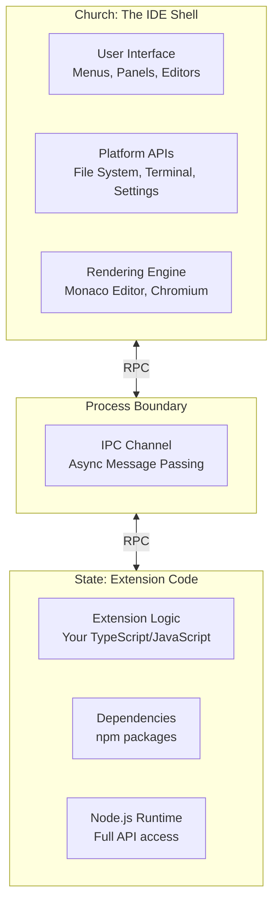
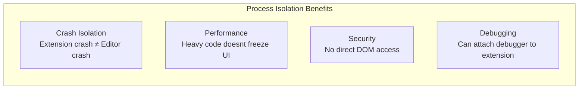
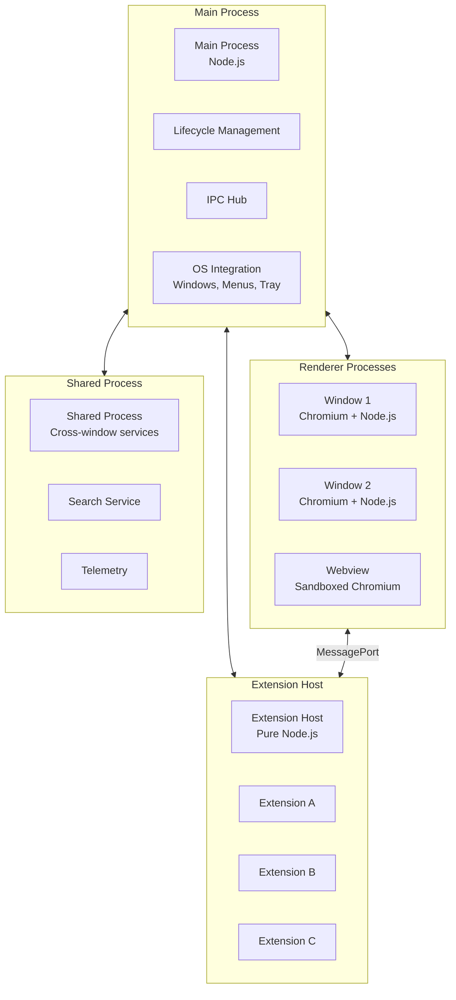
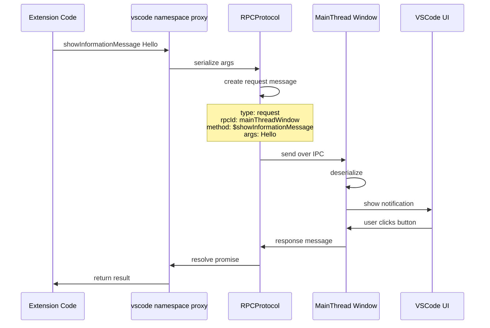
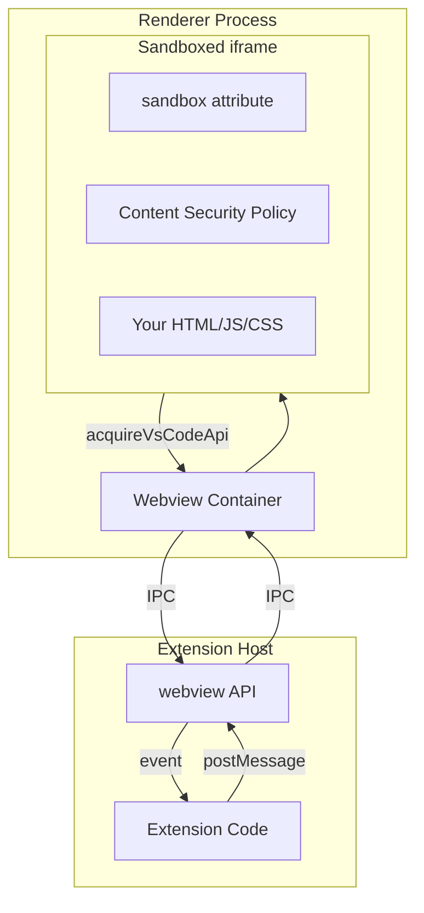
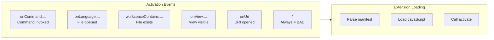
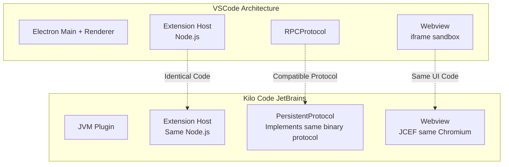

# VSCode Extension Host Architecture Deep Dive

This document explains the architecture of VSCode's Extension Host—the process model that runs VSCode extensions. Understanding this architecture is essential because the Kilo Code JetBrains plugin **replicates this exact model** to achieve code reuse.

## Table of Contents

- [The Church and State Separation](#the-church-and-state-separation)
- [Electron Multi-Process Model](#electron-multi-process-model)
- [RPC Protocol and Message Passing](#rpc-protocol-and-message-passing)
- [Webview Security Model](#webview-security-model)
- [Contribution Points and Lazy Loading](#contribution-points-and-lazy-loading)
- [How Kilo Code Replicates This Model](#how-kilo-code-replicates-this-model)

---

## The Church and State Separation

VSCode's most important architectural pattern is what the team calls "Church and State" separation. This pattern is **why cross-platform port to JetBrains is possible**.

### The Core Principle



### Why This Separation Exists

VSCode initially ran extensions in the same process as the UI. This caused major problems:

| Problem               | Consequence                                     |
| --------------------- | ----------------------------------------------- |
| **Extension crashes** | Crashed the entire editor                       |
| **Slow extensions**   | Froze the UI; typing lagged                     |
| **Memory leaks**      | Editor memory grew unbounded                    |
| **Security**          | Extensions had DOM access; could impersonate UI |

The solution: Run **all** extension code in a separate Node.js process called the "Extension Host."

### Benefits of Process Isolation



1. **Crash Isolation**: If your extension throws an unhandled exception, only the extension host restarts—not the whole editor.

2. **Performance Isolation**: If your extension runs a complex algorithm, the editor stays responsive. UI rendering is in a different process.

3. **Security Isolation**: Extensions cannot directly manipulate the DOM or impersonate VSCode UI elements.

4. **Independent Threading**: The extension host has its own event loop. It can block without affecting the editor's event loop.

### The Price: Everything is Async

Because extensions run in a separate process, all communication is async:

```typescript
// This looks synchronous but is actually an RPC call
const doc = await vscode.workspace.openTextDocument(uri)

// You never get direct references to UI objects
// You get handles/proxies that communicate via RPC
const terminal = vscode.window.createTerminal("name")
terminal.sendText("echo hello") // RPC call
```

**Every VSCode API call** either:

- Returns a `Thenable` (Promise)
- Sends a fire-and-forget message
- Returns a proxy that makes RPC calls internally

---

## Electron Multi-Process Model

VSCode is built on Electron, which provides a multi-process architecture.

### Process Types



### Process Responsibilities

| Process            | Role                            | Node.js Access   | DOM Access |
| ------------------ | ------------------------------- | ---------------- | ---------- |
| **Main**           | OS window management, lifecycle | Full             | None       |
| **Renderer**       | UI rendering, Monaco editor     | Limited          | Full       |
| **Extension Host** | Run all extension code          | Full             | None       |
| **Shared**         | Cross-window services           | Full             | None       |
| **Webview**        | Extension UIs                   | None (sandboxed) | Limited    |

### Communication Between Processes

All processes communicate via message passing:

```typescript
// Main process → Renderer (in Electron)
mainWindow.webContents.send("message-channel", data)

// Renderer → Main
ipcRenderer.send("message-channel", data)

// Extension Host ↔ Renderer uses VSCode's RPCProtocol
// Not raw Electron IPC
```

---

## RPC Protocol and Message Passing

VSCode's custom RPC protocol enables type-safe communication across processes.

### How API Calls Become RPC

When you call a VSCode API:

```typescript
// In your extension:
vscode.window.showInformationMessage("Hello!")
```

This actually triggers:



### Message Types

VSCode's RPC protocol defines message types:

| Type           | Purpose                    | Flow                |
| -------------- | -------------------------- | ------------------- |
| `RequestJSON`  | Call method with JSON args | Both directions     |
| `RequestMixed` | Call with JSON + binary    | Both directions     |
| `Cancel`       | Cancel pending request     | Both directions     |
| `ReplyOK`      | Successful response        | Response to request |
| `ReplyErr`     | Error response             | Response to request |

### Type Converters

Complex types can't just be JSON.stringify'd. VSCode has type converters:

```typescript
// In VSCode source: src/vs/workbench/api/common/extHostTypeConverters.ts

// Converts URI objects for transmission
export namespace URI {
    export function from(value: vscode.Uri): UriComponents {
        return { scheme: value.scheme, path: value.path, ... };
    }
    export function to(value: UriComponents): vscode.Uri {
        return vscode.Uri.from(value);
    }
}

// Converts Position objects
export namespace Position {
    export function from(value: vscode.Position): IPosition {
        return { lineNumber: value.line + 1, column: value.character + 1 };
    }
    export function to(value: IPosition): vscode.Position {
        return new vscode.Position(value.lineNumber - 1, value.column - 1);
    }
}
```

### The Async Boundary Rule

**Everything crossing the process boundary is async.** There are no exceptions.

```typescript
// WRONG mental model (doesn't work):
const content = document.getText() // Looks sync, but document is a proxy

// CORRECT mental model:
// document is a local snapshot, but operations that need fresh data are async
const text = document.getText() // Fast, uses cached snapshot
const doc = await vscode.workspace.openTextDocument(uri) // Async, IPC involved
```

---

## Webview Security Model

Webviews in VSCode are heavily sandboxed. Understanding this security model explains the Kilo Code WebView design.

### Webview Architecture



### Security Layers

#### 1. iframe Sandbox

Webviews run in an iframe with strict sandbox:

```html
<iframe
    sandbox="allow-scripts allow-same-origin"
    <!-- NO allow-top-navigation -->
    <!-- NO allow-forms -->
    <!-- NO allow-popups -->
>
```

#### 2. Content Security Policy (CSP)

Scripts can only run from approved sources:

```html
<meta
	http-equiv="Content-Security-Policy"
	content="
        default-src 'none';
        script-src ${webview.cspSource} 'nonce-${nonce}';
        style-src ${webview.cspSource} 'unsafe-inline';
        img-src ${webview.cspSource} data:;
    " />
```

#### 3. vscode-resource:// Protocol

Local resources use a special protocol:

```html
<!-- Old approach (deprecated) -->
<script src="${webview.asWebviewUri(vscode.Uri.file(...))"></script>

<!-- Results in something like: -->
<script src="https://file+.vscode-resource.vscode-cdn.net/path/to/file.js"></script>
```

#### 4. Nonce-Based Script Loading

Only scripts with the correct nonce execute:

```html
<script nonce="${nonce}">
	// This runs
</script>

<script>
	// This is blocked by CSP
</script>
```

### The acquireVsCodeApi() Function

Webviews communicate with extensions via a special API:

```typescript
// In webview JavaScript
const vscode = acquireVsCodeApi()

// Send message to extension
vscode.postMessage({ type: "ready" })

// Receive messages from extension
window.addEventListener("message", (event) => {
	const message = event.data
	console.log("Received:", message)
})

// State persistence (survives webview hiding)
vscode.setState({ count: 5 })
const state = vscode.getState() // { count: 5 }
```

This API:

- **Can only be called once** per webview lifecycle
- **Cannot access VSCode DOM** (it's in a different process)
- **Cannot call VSCode APIs directly** (must go through postMessage)

---

## Contribution Points and Lazy Loading

VSCode achieves fast startup through declarative manifests and lazy loading.

### package.json as Manifest

Extensions declare capabilities in `package.json`:

```json
{
	"name": "my-extension",
	"activationEvents": ["onCommand:myExtension.start", "onLanguage:javascript", "workspaceContains:**/*.myconfig"],
	"contributes": {
		"commands": [
			{
				"command": "myExtension.start",
				"title": "Start My Extension"
			}
		],
		"views": {
			"explorer": [
				{
					"id": "myView",
					"name": "My View"
				}
			]
		},
		"configuration": {
			"title": "My Extension",
			"properties": {
				"myExtension.enable": {
					"type": "boolean",
					"default": true
				}
			}
		}
	}
}
```

### Activation Events: Lazy Loading

Extensions are NOT loaded at startup. They activate only when needed:



| Activation Event              | When Extension Loads             |
| ----------------------------- | -------------------------------- |
| `onCommand:id`                | When command is invoked          |
| `onLanguage:lang`             | When file of language opens      |
| `workspaceContains:** /*.ext` | When workspace has matching file |
| `onView:viewId`               | When view becomes visible        |
| `onStartupFinished`           | After VSCode fully starts        |
| `*`                           | Immediately (discouraged!)       |

### Contribution Points

Contribution points let extensions add UI without loading code:

| Contribution    | Purpose                         |
| --------------- | ------------------------------- |
| `commands`      | Register command IDs and titles |
| `menus`         | Add items to menus              |
| `views`         | Add view containers and views   |
| `viewsWelcome`  | Add welcome content to views    |
| `configuration` | Add settings                    |
| `languages`     | Register language support       |
| `themes`        | Add color/icon themes           |
| `snippets`      | Add code snippets               |

This is **declarative**: VSCode reads the JSON and creates UI elements without executing extension code.

---

## How Kilo Code Replicates This Model

The Kilo Code JetBrains plugin achieves cross-platform support by implementing VSCode's Extension Host model.

### Architectural Mapping



### Component Mapping

| VSCode Component      | Kilo Code Equivalent       | Implementation                                                                                                                |
| --------------------- | -------------------------- | ----------------------------------------------------------------------------------------------------------------------------- |
| Main + Renderer       | JVM Plugin                 | [`WecoderPluginService`](../../jetbrains/plugin/src/main/kotlin/ai/kilocode/jetbrains/plugin/WecoderPlugin.kt#L188)           |
| Extension Host        | Same Node.js process       | [`ExtensionProcessManager`](../../jetbrains/plugin/src/main/kotlin/ai/kilocode/jetbrains/core/ExtensionProcessManager.kt#L28) |
| RPCProtocol           | Compatible binary protocol | [`PersistentProtocol`](../../jetbrains/plugin/src/main/kotlin/ai/kilocode/jetbrains/ipc/PersistentProtocol.kt#L19)            |
| Webview iframe        | JCEF browser               | [`WebViewInstance`](../../jetbrains/plugin/src/main/kotlin/ai/kilocode/jetbrains/webview/WebViewManager.kt#L507)              |
| `acquireVsCodeApi()`  | Injected mock              | See [WebView Communication](./04-webview-communication.md)                                                                    |
| MainThread\* services | Kotlin actors              | [`ServiceProxyRegistry`](../../jetbrains/plugin/src/main/kotlin/ai/kilocode/jetbrains/core/ServiceProxyRegistry.kt#L60)       |
| ExtHost\* proxies     | Java dynamic proxies       | [`RPCProtocol.getProxy()`](../../jetbrains/plugin/src/main/kotlin/ai/kilocode/jetbrains/ipc/proxy/RPCProtocol.kt)             |

### Why This Works

The key insight is that VSCode's architecture already enforces the separation we need:

1. **Extension code is isolated** → Can run it anywhere that has Node.js
2. **All communication is async** → Can use sockets instead of Electron IPC
3. **Webviews are sandboxed** → Can use any Chromium instance (JCEF)
4. **API is message-based** → Can implement receivers in any language

### What Kilo Code Actually Runs

```
JetBrains IDE Process
├── WecoderPluginService (Kotlin)
├── Socket connection
├── PersistentProtocol (binary framing)
├── RPCManager (RPC dispatch)
├── MainThread* actors (implement VSCode APIs)
└── WebViewManager (JCEF)

Node.js Extension Host Process  ← IDENTICAL TO VSCODE
├── extension.js (VSCode bootstrap)
├── vscode module (API shim)
├── Kilo Code extension code
├── AI logic, tool execution
└── RPC back to plugin
```

---

## Summary

VSCode's Extension Host architecture provides:

1. **Process isolation** for stability and security
2. **Async RPC protocol** for cross-process communication
3. **Webview sandboxing** for secure extension UI
4. **Declarative manifest** for fast startup

Kilo Code replicates this architecture in JetBrains by:

1. **Spawning the same Node.js extension host**
2. **Implementing the same binary RPC protocol**
3. **Embedding JCEF for the same Chromium rendering**
4. **Mocking `acquireVsCodeApi()` for the same webview API**

The result: **~90% code reuse** between VSCode and JetBrains platforms.

---

## Related Documentation

- [00-architecture-overview.md](./00-architecture-overview.md) - High-level architecture
- [06-intellij-platform-foundations.md](./06-intellij-platform-foundations.md) - JetBrains side comparison
- [02-extension-host-ipc.md](./02-extension-host-ipc.md) - Protocol implementation details
- [03-vscode-api-bridging.md](./03-vscode-api-bridging.md) - API translation

## External References

- [VSCode Extension Architecture](https://code.visualstudio.com/api/advanced-topics/extension-host)
- [VSCode Source: Extension Host](https://github.com/microsoft/vscode/tree/main/src/vs/workbench/services/extensions)
- [VSCode Source: RPC Protocol](https://github.com/microsoft/vscode/blob/main/src/vs/workbench/services/extensions/common/rpcProtocol.ts)
- [VSCode Webview API](https://code.visualstudio.com/api/extension-guides/webview)
