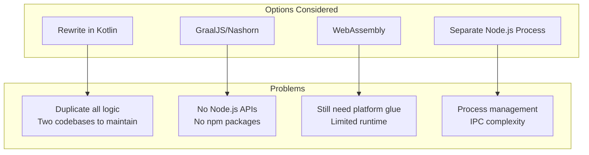
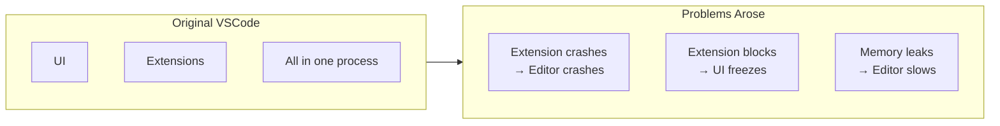
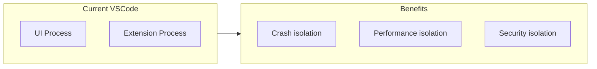
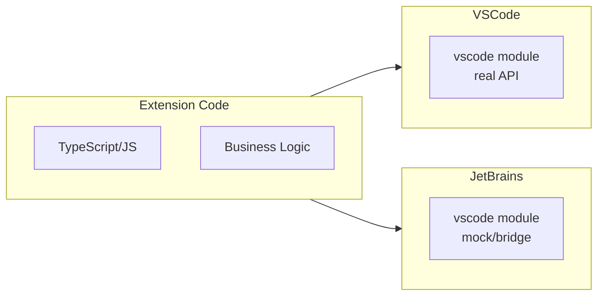
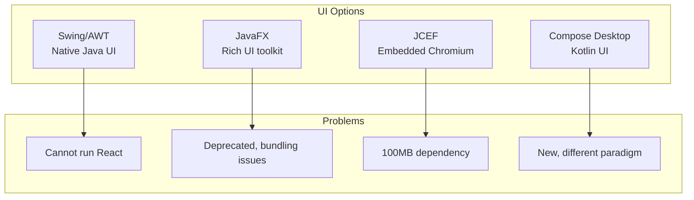

# Design Rationale: Why This Architecture

This document explains the **reasoning behind every major architectural decision** in the Kilo Code JetBrains plugin. Understanding the "why" is essential for maintaining and extending the system.

## Table of Contents

- [Why Run a Node.js Process?](#why-run-a-nodejs-process)
- [Why Socket Communication?](#why-socket-communication)
- [Why the Church and State Model?](#why-the-church-and-state-model)
- [Why the RPC Proxy Pattern?](#why-the-rpc-proxy-pattern)
- [Why Mock VSCode API Instead of Rewriting?](#why-mock-vscode-api-instead-of-rewriting)
- [Why JCEF for Webviews?](#why-jcef-for-webviews)
- [Why Binary Protocol?](#why-binary-protocol)
- [Alternatives Considered](#alternatives-considered)

---

## Why Run a Node.js Process?

### The Problem

Kilo Code is written in TypeScript and depends on:

- Node.js runtime APIs (`fs`, `path`, `child_process`, `crypto`, etc.)
- npm packages (AI SDKs, utilities, etc.)
- The VSCode extension API patterns

JetBrains plugins run in the JVM. We need to run JavaScript/TypeScript code somehow.

### Options Evaluated



### Why Not Embedded JavaScript?

**GraalJS (GraalVM's JavaScript engine):**

- ✗ No Node.js built-in modules (`fs`, `path`, etc.)
- ✗ No npm package support
- ✗ Different event loop model
- ✗ Performance overhead for JVM interop
- ✗ Memory management complexity

**Nashorn (deprecated JDK JavaScript engine):**

- ✗ ES5 only (no modern JavaScript)
- ✗ Removed in JDK 15
- ✗ All the same limitations as GraalJS

### Why Separate Process Wins

| Factor           | Embedded JS      | Separate Node.js |
| ---------------- | ---------------- | ---------------- |
| Node.js APIs     | ✗ None           | ✓ Full           |
| npm packages     | ✗ None           | ✓ Full           |
| Event loop       | ✗ Different      | ✓ Native         |
| Memory isolation | ✗ Shared         | ✓ Separate       |
| Crash isolation  | ✗ Crashes JVM    | ✓ Isolated       |
| Code changes     | ✗ Major rewrites | ✓ None           |

**Decision**: Run the extension code in a real Node.js process, exactly as VSCode does.

### Implementation

The [`ExtensionProcessManager`](../../jetbrains/plugin/src/main/kotlin/ai/kilocode/jetbrains/core/ExtensionProcessManager.kt#L28) spawns Node.js:

```kotlin
val commandArgs = mutableListOf(
    nodePath,
    "--experimental-global-webcrypto",
    "--no-deprecation",
    extensionPath,
    "--vscode-socket-port=${port}",
    "--vscode-socket-host=${host}"
)

process = ProcessBuilder(commandArgs).start()
```

---

## Why Socket Communication?

### The Problem

With the extension running in a separate process, we need IPC (Inter-Process Communication).

### Options Evaluated

| Option                  | Pros                     | Cons                                  |
| ----------------------- | ------------------------ | ------------------------------------- |
| **Stdin/Stdout**        | Simple, portable         | Line-oriented, conflicts with logging |
| **Named Pipes**         | Fast on Windows          | Platform-specific naming              |
| **Unix Domain Sockets** | Fast on Unix, file-based | Not available on older Windows        |
| **TCP Sockets**         | Cross-platform           | Needs port management                 |
| **Shared Memory**       | Fastest                  | Complex, platform-specific            |

### Why Sockets Win

1. **Cross-platform**: Works on Windows, macOS, Linux
2. **Bidirectional**: Full-duplex communication
3. **Well-understood**: Standard networking model
4. **Compatible with VSCode**: VSCode uses similar transport
5. **Async-friendly**: Non-blocking I/O

### Platform-Specific Optimization

The plugin uses Unix Domain Sockets where available (faster, no network stack):

```kotlin
val server: ISocketServer = if (SystemInfo.isWindows) {
    ExtensionSocketServer()      // TCP socket
} else {
    ExtensionUnixDomainSocketServer() // Unix Domain Socket
}
```

**Source:** [`WecoderPluginService.initialize()`](../../jetbrains/plugin/src/main/kotlin/ai/kilocode/jetbrains/plugin/WecoderPlugin.kt#L267)

### Why Not Stdin/Stdout?

- Extension code uses `console.log` which writes to stdout
- Error messages go to stderr
- Mixing data protocol with logging output causes corruption
- Stream-based; harder to implement message boundaries

---

## Why the Church and State Model?

### The Problem

How should we divide responsibilities between the Kotlin plugin and the Node.js extension?

### The VSCode Lesson

VSCode learned this the hard way. Originally extensions ran in-process:



The solution was **process isolation**:



### Church and State Defined

| Church (IDE/UI)             | State (Extension Logic)     |
| --------------------------- | --------------------------- |
| Renders UI                  | Contains business logic     |
| Manages windows             | Manages AI conversations    |
| Provides services           | Uses services via RPC       |
| Can crash → user loses work | Can crash → just restart it |
| Must stay responsive        | Can do heavy computation    |

### Why This Model for Kilo Code

1. **Proven**: VSCode proved it works at scale
2. **Matches existing code**: Our extension is already written for this model
3. **IDE stability**: JetBrains users expect plugin issues to not crash their IDE
4. **Threading simplicity**: No EDT concerns in extension code

### Implementation

The boundary is clear in the codebase:

```
jetbrains/plugin/   ← Church (Kotlin, runs in JVM)
├── actors/          ← Implements services
├── core/            ← Protocol management
├── webview/         ← UI hosting
└── ipc/             ← Communication layer

runtime/            ← State (TypeScript, runs in Node.js)
├── extension.js    ← Entry point
└── [extension code]
```

---

## Why the RPC Proxy Pattern?

### The Problem

Extension code calls VSCode APIs:

```typescript
vscode.window.showInformationMessage("Hello!")
```

How do we make this work when `vscode` is actually in a different process?

### The Pattern

**RPC Proxy**: Create local objects that look like the real API but forward calls across the process boundary.

```mermaid
sequenceDiagram
    participant Ext as Extension Code
    participant Proxy as vscode.window proxy
    participant RPC as RPC Protocol
    participant Actor as MainThreadWindow
    participant IDE as JetBrains API

    Ext->>Proxy: showInformationMessage Hello
    Proxy->>RPC: serialize call
    RPC->>Actor: invoke method
    Actor->>IDE: Messages.showInfoMessage
    IDE-->>Actor: result
    Actor-->>RPC: response
    RPC-->>Proxy: deserialize
    Proxy-->>Ext: return value
```

### Why Not Direct API Calls?

**Cannot pass objects by reference** across processes:

- A `Document` object in Node.js can't be used in the JVM
- JetBrains `VirtualFile` can't cross the socket
- Need handles/IDs instead of direct references

**Serialization boundaries require:**

- Convert objects to JSON/binary
- Convert back on the other side
- Async all the way down

### Implementation Details

In the Kotlin plugin, proxies are created using Java dynamic proxies:

```kotlin
fun <T> getProxy(identifier: ProxyIdentifier<T>): T {
    return Proxy.newProxyInstance(
        identifier.javaClass.classLoader,
        arrayOf(identifier.type),
        RPCInvocationHandler(identifier)
    ) as T
}

class RPCInvocationHandler(val identifier: ProxyIdentifier<*>) : InvocationHandler {
    override fun invoke(proxy: Any, method: Method, args: Array<Any?>?): Any? {
        // Serialize method name and arguments
        // Send over socket
        // Wait for response
        // Deserialize and return
    }
}
```

### Type Safety

Both sides know the expected types:

```kotlin
// Kotlin side
interface MainThreadWindowShape {
    fun showInformationMessage(message: String): CompletableFuture<String?>
}

// TypeScript side
interface MainThread.Window {
    $showInformationMessage(message: string): Promise<string | undefined>;
}
```

---

## Why Mock VSCode API Instead of Rewriting?

### The Problem

The extension code calls `vscode.*` APIs everywhere:

```typescript
import * as vscode from 'vscode';

vscode.commands.registerCommand(...);
vscode.window.createWebviewPanel(...);
vscode.workspace.openTextDocument(...);
```

Should we rewrite all this code for JetBrains?

### Options Evaluated

| Option                 | Code Reuse | Maintenance   | Risk   |
| ---------------------- | ---------- | ------------- | ------ |
| **Full rewrite**       | 0%         | Two codebases | High   |
| **Adapter layer**      | ~50%       | Significant   | Medium |
| **Mock vscode module** | ~90%       | Minimal       | Low    |

### Why Mocking Wins

**Single source of truth**: The VSCode extension is the canonical implementation.



The same code runs on both platforms. Differences are contained in the API implementation.

### What Gets Mocked

The `vscode` module is shimmed in the extension host:

```typescript
// In extension bootstrap
const vscode = {
	commands: new ExtHostCommands(rpc),
	window: new ExtHostWindow(rpc),
	workspace: new ExtHostWorkspace(rpc),
	// ... etc
}

global.require = (id) => {
	if (id === "vscode") return vscode
	return originalRequire(id)
}
```

Each namespace (`commands`, `window`, etc.) is an object that makes RPC calls to Kotlin actors.

### Benefits Achieved

1. **~90% code reuse**: Extension logic unchanged
2. **Test once**: Core logic tested on VSCode, works on JetBrains
3. **No feature drift**: New features automatically available
4. **Lower maintenance**: One codebase to update

---

## Why JCEF for Webviews?

### The Problem

Kilo Code has a React-based UI. How do we render it in JetBrains?

### Options Evaluated



### Why JCEF Wins

1. **Same engine as VSCode**: Chrome/Chromium
2. **Same React code runs**: Zero UI rewrite
3. **Same postMessage pattern**: Communication model matches
4. **Modern web features**: CSS Grid, Flexbox, etc. just work
5. **Hot reload friendly**: Standard web development workflow

### Trade-offs Accepted

| Downside     | Mitigation                               |
| ------------ | ---------------------------------------- |
| ~100MB size  | JetBrains bundles JCEF anyway            |
| Memory usage | Chromium is memory-hungry but manageable |
| Complexity   | Standard web debugging tools work        |

### Implementation

```kotlin
// Create browser with off-screen rendering
val browser = JBCefBrowser.createBuilder()
    .setOffScreenRendering(true)
    .build()

// Load the React app
browser.loadURL("http://localhost:${port}/index.html")

// Communication via injected API
val jsQuery = JBCefJSQuery.create(browser)
jsQuery.addHandler { message ->
    // Handle messages from React
}
```

**Source:** [`WebViewInstance`](../../jetbrains/plugin/src/main/kotlin/ai/kilocode/jetbrains/webview/WebViewManager.kt#L507)

---

## Why Binary Protocol?

### The Problem

We need to send messages between Kotlin and Node.js. What format?

### Options Evaluated

| Format               | Pros                   | Cons                    |
| -------------------- | ---------------------- | ----------------------- |
| **JSON**             | Human-readable, simple | Verbose, no binary data |
| **Protocol Buffers** | Efficient, typed       | Schema management       |
| **MessagePack**      | Compact JSON           | Another dependency      |
| **VSCode Protocol**  | Compatible, proven     | Complex implementation  |

### Why VSCode's Binary Protocol

1. **Compatibility**: Extension host already speaks this protocol
2. **Binary support**: Can send buffers (files, images)
3. **Flow control**: Pause/resume for backpressure
4. **Acknowledgments**: Reliable delivery confirmation
5. **Keep-alive**: Connection health monitoring

### Protocol Structure

13-byte header + variable body:

```
┌─────────┬──────────┬──────────┬──────────┐
│  Type   │    ID    │   ACK    │  Size    │
│ 1 byte  │ 4 bytes  │ 4 bytes  │ 4 bytes  │
└─────────┴──────────┴──────────┴──────────┘
```

**Source:** [`PersistentProtocol`](../../jetbrains/plugin/src/main/kotlin/ai/kilocode/jetbrains/ipc/PersistentProtocol.kt#L19), [`ProtocolConstants`](../../jetbrains/plugin/src/main/kotlin/ai/kilocode/jetbrains/ipc/ProtocolConstants.kt#L11)

### Benefits Over JSON-Only

```typescript
// JSON: Cannot efficiently send binary
{ "type": "file", "content": "base64encodedData..." } // 33% larger

// Binary protocol: Direct buffer support
[header][raw file bytes] // No encoding overhead
```

---

## Alternatives Considered

### Alternative 1: Full Kotlin Rewrite

**Concept**: Rewrite all extension logic in Kotlin.

**Why rejected:**

- Duplicate 50,000+ lines of code
- Two codebases to maintain forever
- Features always out of sync
- Team expertise primarily TypeScript

### Alternative 2: Transpile TypeScript to Kotlin

**Concept**: Use a compiler to convert TypeScript to Kotlin.

**Why rejected:**

- No production-quality transpiler exists
- Would lose npm ecosystem
- Runtime behavior differences
- Generated code unmaintainable

### Alternative 3: GraalVM Polyglot

**Concept**: Use GraalVM to run JavaScript in JVM.

**Why rejected:**

- No Node.js APIs (fs, child_process, etc.)
- npm packages don't work
- Performance overhead
- Complex memory management

### Alternative 4: WebAssembly Runtime

**Concept**: Compile TypeScript to WebAssembly, run in JVM.

**Why rejected:**

- Wasm doesn't have Node.js APIs
- Would need to implement file system, networking
- Debugging extremely difficult
- Still need IPC for UI

### Alternative 5: Shared Core with Platform Shells

**Concept**: Extract platform-agnostic code, write platform shells.

**Why rejected:**

- Our code is deeply coupled to VSCode APIs
- Extraction would be massive refactor
- "Shell" would be 50% of functionality
- VSCode types throughout codebase

### The Winning Approach

**Replicate VSCode's architecture**:

- Same extension host process
- Compatible protocol
- Bridge APIs to JetBrains

This was chosen because:

- Minimal changes to existing code
- Proven architecture (VSCode uses it)
- Clear boundary for new code (Kotlin plugin)
- Team can focus on JetBrains expertise

---

## Summary of Key Decisions

| Decision            | Rationale                  | Trade-off Accepted            |
| ------------------- | -------------------------- | ----------------------------- |
| **Node.js process** | Full runtime compatibility | Process management complexity |
| **Socket IPC**      | Cross-platform, async      | Network abstraction overhead  |
| **Church/State**    | Proven, matches existing   | Two processes to manage       |
| **RPC proxies**     | Type-safe bridging         | Serialization cost            |
| **Mock vscode API** | Maximum code reuse         | Must maintain compatibility   |
| **JCEF webviews**   | Same UI code runs          | ~100MB dependency             |
| **Binary protocol** | VSCode compatible          | Implementation complexity     |

Each decision was driven by the goal of **maximum code reuse with minimum maintenance burden**.

---

## Related Documentation

- [00-architecture-overview.md](./00-architecture-overview.md) - High-level architecture
- [09-design-constraints-analysis.md](./09-design-constraints-analysis.md) - Constraint analysis
- [06-intellij-platform-foundations.md](./06-intellij-platform-foundations.md) - JetBrains platform details
- [07-vscode-extension-host-foundations.md](./07-vscode-extension-host-foundations.md) - VSCode architecture details
