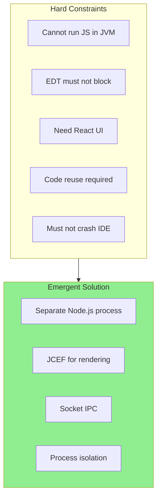
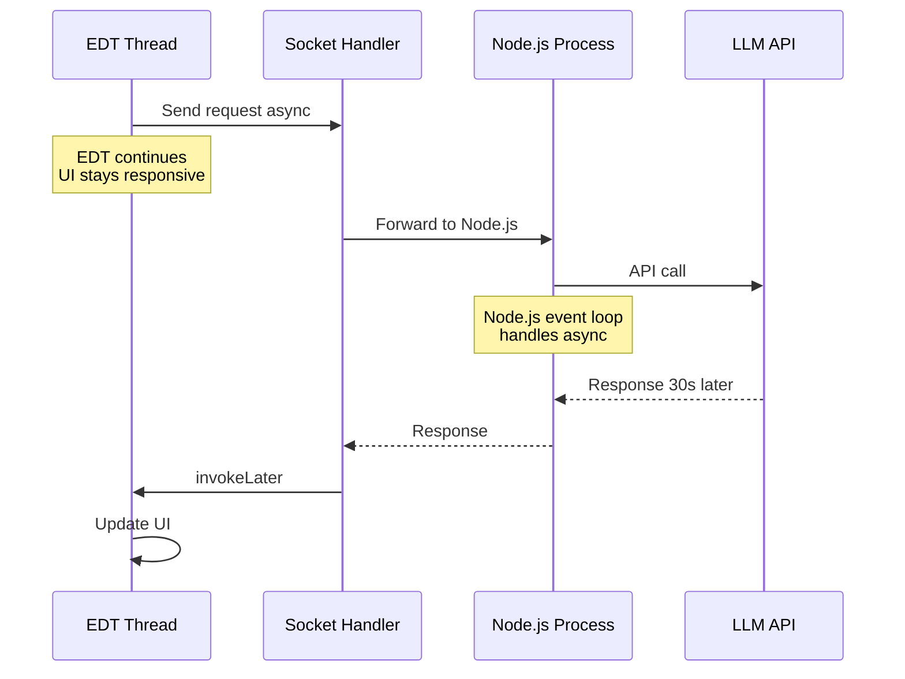
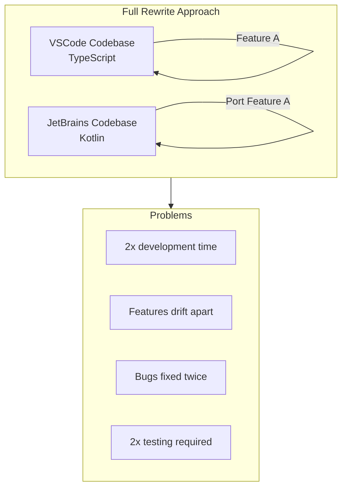
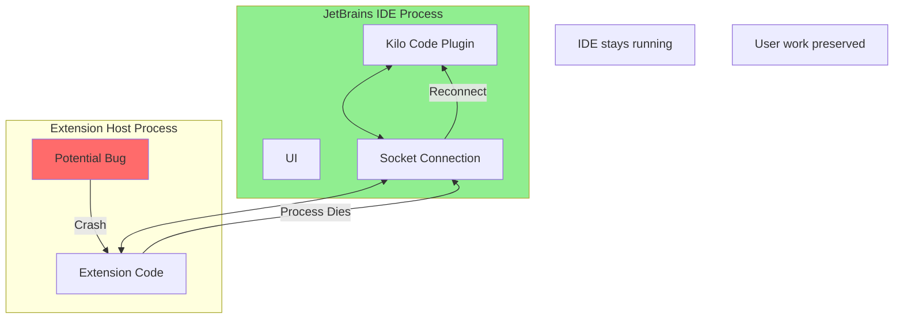
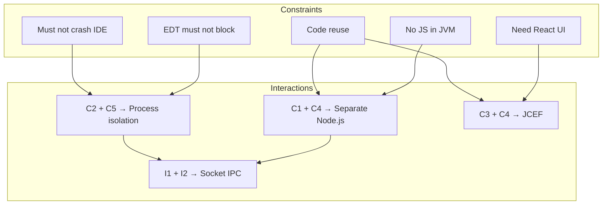
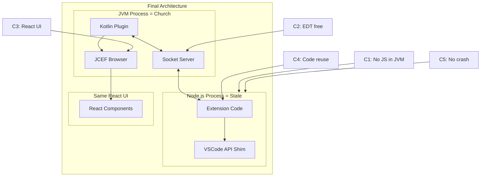

# Design Constraints Analysis: Constraint-Driven Design

This document analyzes the **hard constraints** that shaped the Kilo Code JetBrains plugin architecture. Understanding constraints is essential because they explain why certain approaches were necessary—not just preferable—and why alternatives were impossible—not just suboptimal.

## Table of Contents

- [What is Constraint-Driven Design?](#what-is-constraint-driven-design)
- [Constraint 1: Cannot Embed JavaScript in JVM Effectively](#constraint-1-cannot-embed-javascript-in-jvm-effectively)
- [Constraint 2: IntelliJ EDT Threading Model](#constraint-2-intellij-edt-threading-model)
- [Constraint 3: Need Modern Web UI](#constraint-3-need-modern-web-ui)
- [Constraint 4: Code Reuse Requirement](#constraint-4-code-reuse-requirement)
- [Constraint 5: Security and Stability](#constraint-5-security-and-stability)
- [Constraint 6: Platform Compatibility](#constraint-6-platform-compatibility)
- [Constraint Interactions](#constraint-interactions)
- [Emergent Architecture](#emergent-architecture)

---

## What is Constraint-Driven Design?

Constraints are not problems to work around—they are **forces that shape good solutions**.



The Kilo Code JetBrains architecture **emerged from constraints**. Once you understand the constraints, the architecture becomes the obvious (perhaps only) solution.

---

## Constraint 1: Cannot Embed JavaScript in JVM Effectively

### The Constraint

Kilo Code is written in TypeScript/JavaScript and depends on:

- Node.js runtime APIs (`fs`, `path`, `child_process`, `net`, `crypto`)
- npm packages (hundreds of dependencies)
- Event loop semantics
- Async/await patterns with Node.js event loop

**The JVM cannot provide these.**

### Why Embedding Fails

#### GraalJS Limitations

```javascript
// This code runs in Node.js:
import fs from "fs"
import { execSync } from "child_process"
import crypto from "crypto"

const content = fs.readFileSync("file.txt") // ❌ No fs module in GraalJS
const output = execSync("git status") // ❌ No child_process
const hash = crypto.randomUUID() // ❌ No crypto
```

GraalJS provides **ECMAScript**, not **Node.js**:

| Feature         | Node.js | GraalJS   |
| --------------- | ------- | --------- |
| Language        | ES2022  | ES2022 ✓  |
| `fs` module     | ✓       | ❌        |
| `path` module   | ✓       | ❌        |
| `child_process` | ✓       | ❌        |
| `crypto`        | ✓       | ❌        |
| `net` / `http`  | ✓       | ❌        |
| npm packages    | ✓       | ❌ (most) |
| Event loop      | ✓       | Different |
| `require()`     | ✓       | Different |

#### npm Ecosystem Dependency

Kilo Code depends on npm packages:

```json
{
	"dependencies": {
		"@anthropic-ai/sdk": "^0.x.x",
		"openai": "^4.x.x",
		"tree-sitter": "^0.x.x",
		"diff": "^5.x.x"
		// ... many more
	}
}
```

These packages:

- Use Node.js APIs internally
- Have native bindings (tree-sitter)
- Expect Node.js module resolution
- Cannot run in GraalJS

### The Solution

**Run a real Node.js process.** No embedding. Full compatibility.

```kotlin
// ExtensionProcessManager.kt
val process = ProcessBuilder(listOf(
    nodePath,                    // Real Node.js
    "--experimental-global-webcrypto",
    extensionPath                // Our extension
)).start()
```

**Source:** [`ExtensionProcessManager.start()`](../../jetbrains/plugin/src/main/kotlin/ai/kilocode/jetbrains/core/ExtensionProcessManager.kt#L66)

---

## Constraint 2: IntelliJ EDT Threading Model

### The Constraint

IntelliJ uses Swing's Event Dispatch Thread (EDT) model:

1. **All UI operations** must happen on the EDT
2. **EDT must never block** (10-second watchdog kills operations)
3. **Model access** requires read/write actions
4. **Long operations** must run in background threads

### Why This is a Hard Constraint

```kotlin
// This FREEZES the IDE:
fun badCode() {
    // On EDT:
    val response = httpClient.get(url).execute()  // ❌ Blocks EDT
    textField.text = response.body                 // UI frozen until network completes
}

// This CRASHES:
fun alsoBadCode() {
    thread {
        textField.text = "Hello"  // ❌ UI update off EDT = crash
    }
}
```

### How Extension Code Would Block EDT

If we embedded the extension in the IDE process:

```typescript
// Extension code (simplified)
async function handleUserMessage(message: string) {
	// This could take 30+ seconds with a slow LLM
	const response = await anthropic.messages.create({
		model: "claude-3-opus",
		messages: [{ role: "user", content: message }],
	})

	return response.content
}
```

Even with async/await, if this runs on the JVM event dispatch:

- The JVM thread executing this would block
- If that's EDT, the entire IDE freezes
- Users can't type, scroll, or interact

### The Solution

**Separate process = separate event loop.**



The Node.js process has its own event loop. It can:

- Make network calls that take 30+ seconds
- Process large files
- Run AI inference

**None of this affects the IDE's EDT.**

---

## Constraint 3: Need Modern Web UI

### The Constraint

Kilo Code has a sophisticated React-based UI:

- React components with hooks
- Tailwind CSS styling
- Complex state management
- Markdown rendering
- Code syntax highlighting
- Animations and transitions

### Why Swing Cannot Work

Swing is a 25-year-old UI toolkit:

| Feature         | React/CSS          | Swing       |
| --------------- | ------------------ | ----------- |
| Flexbox layout  | ✓                  | ❌          |
| CSS Grid        | ✓                  | ❌          |
| Animations      | CSS transitions    | Manual      |
| Styling         | CSS/Tailwind       | Look & Feel |
| Components      | Functional + hooks | Class-based |
| Hot reload      | ✓                  | ❌          |
| Developer tools | Chrome DevTools    | Limited     |

Rewriting the UI in Swing would:

- Take months of development
- Look different from VSCode version
- Be harder to maintain
- Lack modern UI capabilities

### Why JavaFX Cannot Work

JavaFX might seem like an option, but:

- **Bundling issues**: Not included in JDK 11+
- **Deprecated**: JetBrains doesn't support it well
- **Still not React**: Would need complete rewrite
- **Different paradigm**: FXML vs JSX

### The Solution

**JCEF embeds Chromium**, giving us:

- Same rendering engine as VSCode
- Same React code runs unmodified
- Same CSS works
- Chrome DevTools for debugging

```kotlin
// Create browser with Chromium
val browser = JBCefBrowser.createBuilder()
    .setOffScreenRendering(true)
    .build()

// Load React app
browser.loadURL("http://localhost:${port}/index.html")
```

**Source:** [`WebViewInstance`](../../jetbrains/plugin/src/main/kotlin/ai/kilocode/jetbrains/webview/WebViewManager.kt#L519)

---

## Constraint 4: Code Reuse Requirement

### The Constraint

The business requirement: **support both VSCode and JetBrains with shared code.**

This is a constraint because:

- Limited engineering resources
- Features must ship on both platforms simultaneously
- Cannot afford separate codebases

### Why Full Rewrite Fails



### The Code Reuse Math

| Approach      | Shared Code   | Platform-Specific | Total Effort |
| ------------- | ------------- | ----------------- | ------------ |
| Full rewrite  | 0%            | 100% × 2 = 200%   | 200%         |
| Partial share | 50% + 50% × 2 | = 150%            | 150%         |
| Mock API      | 90% + 10% × 2 | = 110%            | 110%         |

The architecture achieves **~90% code reuse**:

```
Shared (90%):
├── Extension logic
├── AI conversation management
├── Tool execution
├── React components
└── State management

Platform-specific (10%):
├── VSCode: Extension host connection
└── JetBrains: Kotlin plugin + socket bridge
```

### The Solution

**Mock the VSCode API** in the JetBrains environment:

```typescript
// Extension code calls this:
vscode.commands.registerCommand("kilocode.start", callback)

// In VSCode: Native API
// In JetBrains: RPC to Kotlin actor that uses ActionManager
```

The extension doesn't know—and doesn't care—which platform it's on.

---

## Constraint 5: Security and Stability

### The Constraint

JetBrains IDEs are professional tools. Users expect:

- **Stability**: Plugin issues should not crash the IDE
- **Predictability**: Plugin should not freeze UI
- **Security**: Plugin should not have excessive privileges

### Why In-Process Fails

If extension code ran in the IDE process:

```kotlin
// A bug in extension code:
fun processFile(content: String) {
    // Infinite loop
    while (true) {
        content = content.replace("a", "aa")
    }
}
```

This would:

- Freeze EDT (if on EDT)
- Consume all memory (if in background)
- Eventually crash the JVM
- User loses unsaved work

### VSCode's Lesson

VSCode learned this early. From VSCode engineering:

> "We learned that extensions need to be isolated. When we ran them in-process, a single bad extension could take down the whole editor. Process isolation was essential for stability."

### The Solution

**Process isolation provides crash boundaries:**



If the extension host crashes:

1. Socket connection drops
2. Plugin detects disconnection
3. Plugin can restart extension host
4. **IDE never crashes**

---

## Constraint 6: Platform Compatibility

### The Constraint

Must support:

- **Windows**: 10, 11 (x64)
- **macOS**: Intel and Apple Silicon
- **Linux**: Various distributions (x64)

With:

- **JetBrains IDEs**: IntelliJ, WebStorm, PyCharm, etc.
- **IDE versions**: Multiple concurrent versions
- **Different Node.js versions**: In users' environments

### Why Platform-Specific Code is Limited

```kotlin
// Platform detection for socket type
val server: ISocketServer = if (SystemInfo.isWindows) {
    ExtensionSocketServer()           // TCP socket (Windows)
} else {
    ExtensionUnixDomainSocketServer() // UDS (macOS/Linux)
}

// Platform-specific Node.js binary location
val platformSuffix = when {
    SystemInfo.isWindows -> "windows-x64"
    SystemInfo.isMac -> when (System.getProperty("os.arch")) {
        "x86_64" -> "darwin-x64"
        "aarch64" -> "darwin-arm64"
        else -> ""
    }
    SystemInfo.isLinux -> "linux-x64"
    else -> ""
}
```

**Source:** [`initPlatformFiles()`](../../jetbrains/plugin/src/main/kotlin/ai/kilocode/jetbrains/plugin/WecoderPlugin.kt#L352)

### The Solution

Architecture minimizes platform-specific code:

| Component         | Platform-Specific | Why                     |
| ----------------- | ----------------- | ----------------------- |
| Socket transport  | Yes               | Windows vs Unix sockets |
| Node.js discovery | Yes               | PATH handling differs   |
| Binary protocol   | No                | Same bytes everywhere   |
| RPC logic         | No                | Business logic agnostic |
| React UI          | No                | Runs in Chromium        |

---

## Constraint Interactions

Constraints don't exist in isolation. Their interactions further narrow solutions:



### Key Interactions

1. **C1 + C4**: "Can't run JS in JVM" + "Need code reuse" → Must run JS somewhere else → **Separate Node.js process**

2. **C2 + C5**: "EDT must not block" + "Must not crash IDE" → Extension code must be isolated from EDT → **Process isolation**

3. **C3 + C4**: "Need React UI" + "Need code reuse" → Must render same React → **JCEF (Chromium)**

4. **Separate process + Process isolation**: Need communication → **Socket IPC**

---

## Emergent Architecture

Given the constraints, the architecture **emerges naturally**:



### The Only Viable Solution

Could we have built this differently? Examining alternatives:

| Alternative          | Blocks on Constraint  |
| -------------------- | --------------------- |
| Embedded JS          | C1: No Node.js APIs   |
| Full rewrite         | C4: 2x maintenance    |
| Swing UI             | C3: No React          |
| In-process extension | C2, C5: EDT + crashes |
| Single process       | C5: Crash isolation   |

**Every alternative violates at least one hard constraint.**

The current architecture is not just a good solution—it's arguably the **only solution** that satisfies all constraints.

---

## Summary

The constraints that shaped this architecture:

| Constraint        | Impact                   | Solution           |
| ----------------- | ------------------------ | ------------------ |
| 1. No JS in JVM   | Need external process    | Node.js subprocess |
| 2. EDT threading  | Extension must not block | Process isolation  |
| 3. Modern web UI  | Need Chromium            | JCEF               |
| 4. Code reuse     | Minimize platform code   | Mock VSCode API    |
| 5. Stability      | Crash isolation          | Separate process   |
| 6. Cross-platform | Minimize platform code   | Socket IPC         |

The architecture is **constraint-driven**: once constraints are understood, the design becomes inevitable.

---

## Related Documentation

- [08-why-this-architecture.md](./08-why-this-architecture.md) - Design rationale and alternatives
- [06-intellij-platform-foundations.md](./06-intellij-platform-foundations.md) - IntelliJ platform constraints
- [07-vscode-extension-host-foundations.md](./07-vscode-extension-host-foundations.md) - VSCode architecture that inspired this
- [00-architecture-overview.md](./00-architecture-overview.md) - High-level overview
