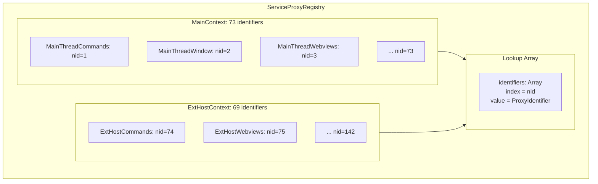
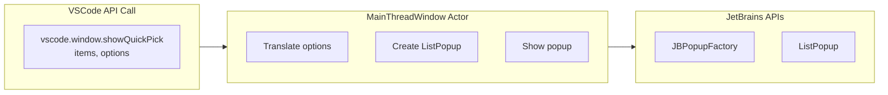
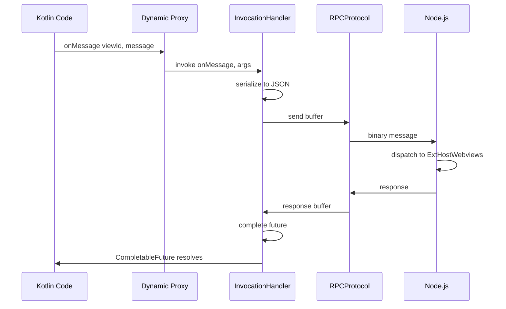
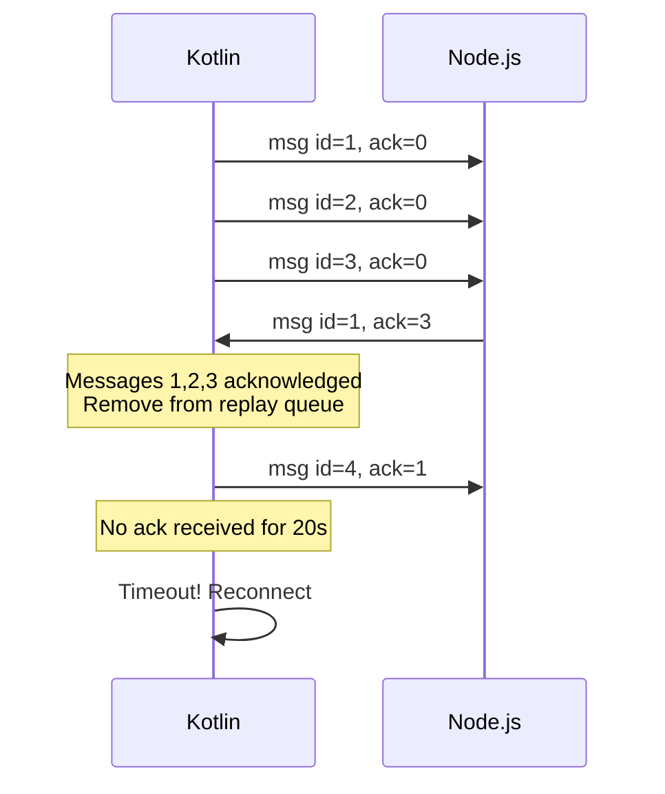
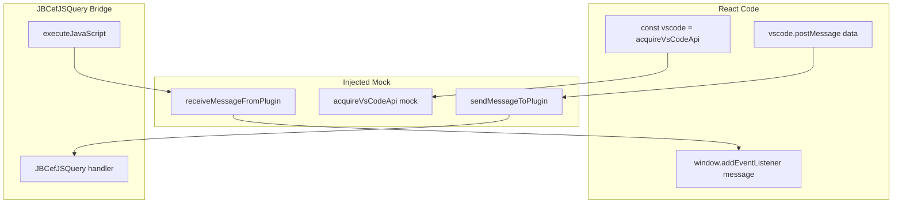
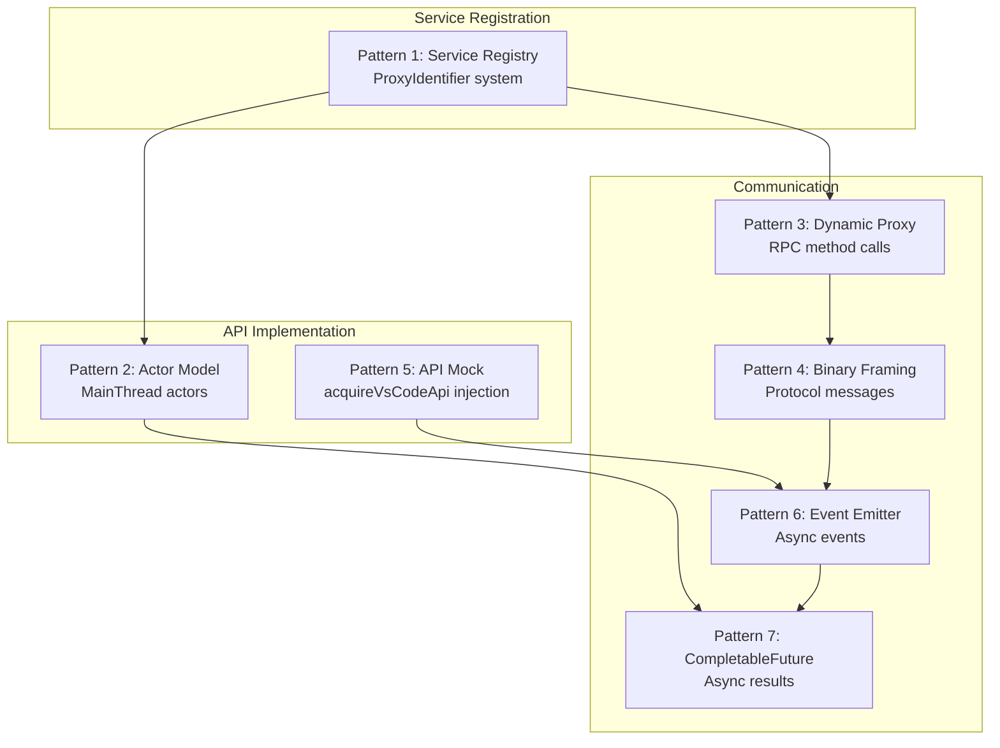

# Key Implementation Patterns

This document describes the specific **implementation patterns** used in the Kilo Code JetBrains plugin. These patterns are recurring solutions to common problems in the architecture.

## Table of Contents

- [Pattern 1: Service Registry](#pattern-1-service-registry)
- [Pattern 2: Actor Model for API Implementation](#pattern-2-actor-model-for-api-implementation)
- [Pattern 3: Dynamic Proxy for RPC Calls](#pattern-3-dynamic-proxy-for-rpc-calls)
- [Pattern 4: Binary Protocol Framing](#pattern-4-binary-protocol-framing)
- [Pattern 5: VSCode API Mock Injection](#pattern-5-vscode-api-mock-injection)
- [Pattern 6: Event Emitter Pattern](#pattern-6-event-emitter-pattern)
- [Pattern 7: CompletableFuture for Async RPC](#pattern-7-completablefuture-for-async-rpc)
- [Summary: Pattern Relationships](#summary-pattern-relationships)

---

## Pattern 1: Service Registry

### Problem

The RPC system needs to route messages to the correct handler. When a message arrives saying "call method X on service Y", how do we find service Y?

### Solution: ProxyIdentifier System

Each service has a unique identifier with both a string ID (for debugging) and a numeric ID (for efficient routing):

```kotlin
class ProxyIdentifier<T> private constructor(
    val sid: String,  // "MainThreadCommands" - human-readable
    val nid: Int      // 7 - compact for wire protocol
) {
    companion object {
        var count = 0

        internal fun <T> create(sid: String): ProxyIdentifier<T> {
            return ProxyIdentifier<T>(sid, ++count)  // Auto-increment
        }
    }
}
```

**Source:** [`ProxyIdentifier.kt`](../../jetbrains/plugin/src/main/kotlin/ai/kilocode/jetbrains/ipc/proxy/ProxyIdentifier.kt#L11)

### Registry Structure



### How Routing Works

```kotlin
// 1. Message arrives with rpcId = 3
val rpcId = message.getInt("rpcId")  // = 3

// 2. Look up the identifier
val identifier = identifiers[rpcId]  // = MainThreadWebviews

// 3. Get the actual handler
val handler = actorRegistry[identifier]

// 4. Dispatch the method call
handler.invoke(method, args)
```

### Registration

```kotlin
object MainContext {
    val MainThreadCommands = createProxyIdentifier<MainThreadCommandsShape>("MainThreadCommands")
    val MainThreadWindow = createProxyIdentifier<MainThreadWindowShape>("MainThreadWindow")
    val MainThreadWebviews = createProxyIdentifier<MainThreadWebviewsShape>("MainThreadWebviews")
    // ... 70 more
}

object ExtHostContext {
    val ExtHostCommands = createProxyIdentifier<ExtHostCommandsProxy>("ExtHostCommands")
    val ExtHostWebviews = createProxyIdentifier<ExtHostWebviewsProxy>("ExtHostWebviews")
    // ... 67 more
}
```

**Source:** [`ServiceProxyRegistry.kt`](../../jetbrains/plugin/src/main/kotlin/ai/kilocode/jetbrains/core/ServiceProxyRegistry.kt#L240)

---

## Pattern 2: Actor Model for API Implementation

### Problem

VSCode's API is organized into namespaces (`vscode.commands`, `vscode.window`, etc.). Each namespace has many methods. How do we organize the implementation?

### Solution: MainThread Actors

Each VSCode API namespace is implemented by a **MainThread Actor**—a Kotlin class implementing a "Shape" interface:

```kotlin
// Shape interface defines the contract
interface MainThreadWindowShape {
    fun showInformationMessage(message: String, options: Map<String, Any?>?): CompletableFuture<String?>
    fun showWarningMessage(message: String, options: Map<String, Any?>?): CompletableFuture<String?>
    fun showErrorMessage(message: String, options: Map<String, Any?>?): CompletableFuture<String?>
    fun showQuickPick(items: List<String>, options: Map<String, Any?>?): CompletableFuture<String?>
    fun showInputBox(options: Map<String, Any?>?): CompletableFuture<String?>
    // ... more methods
}

// Actor implements the shape using JetBrains APIs
class MainThreadWindow(private val project: Project) : MainThreadWindowShape {

    override fun showInformationMessage(
        message: String,
        options: Map<String, Any?>?
    ): CompletableFuture<String?> {
        val future = CompletableFuture<String?>()

        ApplicationManager.getApplication().invokeLater {
            Messages.showInfoMessage(project, message, "Kilo Code")
            future.complete(null)
        }

        return future
    }

    // ... implement other methods
}
```

### Actor Registration

Actors are registered with the RPC system:

```kotlin
class RPCManager(val protocol: PersistentProtocol) {
    private val actors = mutableMapOf<Int, Any>()

    fun registerActor(identifier: ProxyIdentifier<*>, actor: Any) {
        actors[identifier.nid] = actor
    }

    init {
        // Register all actors
        registerActor(MainContext.MainThreadWindow, MainThreadWindow(project))
        registerActor(MainContext.MainThreadCommands, MainThreadCommands(project))
        registerActor(MainContext.MainThreadWebviews, MainThreadWebviews(project))
        // ... 40+ more actors
    }
}
```

### Translation Layer

Each actor translates VSCode concepts to JetBrains equivalents:



### Complete Actor List

| Actor                   | VSCode Namespace                    | JetBrains Integration |
| ----------------------- | ----------------------------------- | --------------------- |
| MainThreadCommands      | `vscode.commands`                   | ActionManager         |
| MainThreadWindow        | `vscode.window`                     | Messages, Popups      |
| MainThreadWebviews      | Webview panels                      | JCEF                  |
| MainThreadFileSystem    | `vscode.workspace.fs`               | VirtualFileSystem     |
| MainThreadTerminal      | `vscode.window.createTerminal`      | TerminalView          |
| MainThreadDocuments     | `vscode.workspace` docs             | Document, Editor      |
| MainThreadConfiguration | `vscode.workspace.getConfiguration` | PropertiesComponent   |
| MainThreadStorage       | ExtensionContext.workspaceState     | File-based JSON       |
| MainThreadClipboard     | `vscode.env.clipboard`              | CopyPasteManager      |
| MainThreadSecretState   | `vscode.SecretStorage`              | PasswordSafe          |

---

## Pattern 3: Dynamic Proxy for RPC Calls

### Problem

The Kotlin plugin needs to call methods on the Node.js extension host. But those methods don't exist in Kotlin—they're in JavaScript.

### Solution: Java Dynamic Proxies

Create proxy objects that look like real interfaces but actually send RPC messages:

```kotlin
fun <T> getProxy(identifier: ProxyIdentifier<T>): T {
    @Suppress("UNCHECKED_CAST")
    return Proxy.newProxyInstance(
        identifier.javaClass.classLoader,
        arrayOf(identifier.interfaceClass),
        RPCInvocationHandler(identifier, this)
    ) as T
}
```

### Invocation Handler

```kotlin
class RPCInvocationHandler(
    private val identifier: ProxyIdentifier<*>,
    private val protocol: RPCProtocol
) : InvocationHandler {

    override fun invoke(proxy: Any, method: Method, args: Array<Any?>?): Any? {
        // 1. Create RPC message
        val message = mapOf(
            "type" to MessageType.RequestJSONArgs.value,
            "req" to requestId.incrementAndGet(),
            "rpcId" to identifier.nid,
            "method" to method.name,
            "args" to (args?.toList() ?: emptyList())
        )

        // 2. Serialize and send
        val buffer = gson.toJson(message).toByteArray()
        protocol.send(buffer)

        // 3. Return CompletableFuture that completes when response arrives
        val future = CompletableFuture<Any?>()
        pendingRequests[requestId.get()] = future
        return future
    }
}
```

### Usage Example

```kotlin
// Get proxy for ExtHostWebviews
val webviewsProxy = protocol.getProxy(ExtHostContext.ExtHostWebviews)

// Call method - actually sends RPC message
webviewsProxy.onMessage(viewId, message, buffers)
    .thenAccept { result ->
        // Handle response
    }
```

### Sequence Diagram



---

## Pattern 4: Binary Protocol Framing

### Problem

Sockets are streams of bytes. How do we know where one message ends and another begins?

### Solution: Length-Prefixed Binary Framing

Every message has a 13-byte header:

```
┌─────────────────────────────────────────────────────────┐
│                      13-byte Header                      │
├──────────┬───────────┬───────────┬─────────────────────┤
│   Type   │    ID     │    ACK    │        Size          │
│  1 byte  │  4 bytes  │  4 bytes  │      4 bytes         │
└──────────┴───────────┴───────────┴─────────────────────┘
│                      Body: Size bytes                    │
└─────────────────────────────────────────────────────────┘
```

### Protocol Constants

```kotlin
object ProtocolConstants {
    const val HEADER_LENGTH = 13
    const val ACKNOWLEDGE_TIME = 2000    // Send ack every 2s
    const val TIMEOUT_TIME = 20000       // Timeout after 20s without ack
    const val KEEP_ALIVE_SEND_TIME = 5000 // Send keep-alive every 5s
}
```

**Source:** [`ProtocolConstants.kt`](../../jetbrains/plugin/src/main/kotlin/ai/kilocode/jetbrains/ipc/ProtocolConstants.kt#L11)

### Writing Messages

```kotlin
class ProtocolWriter(private val output: OutputStream) {

    fun write(message: ProtocolMessage) {
        val header = ByteBuffer.allocate(HEADER_LENGTH)
            .put(message.type.value.toByte())           // Type: 1 byte
            .putInt(message.id)                         // ID: 4 bytes
            .putInt(message.ack)                        // ACK: 4 bytes
            .putInt(message.data.size)                  // Size: 4 bytes
            .array()

        synchronized(output) {
            output.write(header)
            output.write(message.data)
            output.flush()
        }
    }
}
```

### Reading Messages

```kotlin
class ProtocolReader(private val input: InputStream) {

    fun read(): ProtocolMessage? {
        // Read header
        val header = ByteArray(HEADER_LENGTH)
        if (input.read(header) != HEADER_LENGTH) return null

        val buffer = ByteBuffer.wrap(header)
        val type = ProtocolMessageType.fromByte(buffer.get())
        val id = buffer.getInt()
        val ack = buffer.getInt()
        val size = buffer.getInt()

        // Read body
        val body = ByteArray(size)
        var read = 0
        while (read < size) {
            val n = input.read(body, read, size - read)
            if (n < 0) return null
            read += n
        }

        return ProtocolMessage(type, id, ack, body)
    }
}
```

**Source:** [`ProtocolReader.kt`](../../jetbrains/plugin/src/main/kotlin/ai/kilocode/jetbrains/ipc/ProtocolReader.kt#L15)

### Message Types

```kotlin
enum class ProtocolMessageType(val value: Int) {
    NONE(0),
    REGULAR(1),          // Normal data message
    CONTROL(2),          // Control message
    ACK(3),              // Acknowledgment
    DISCONNECT(5),       // Disconnect signal
    REPLAY_REQUEST(6),   // Request message replay
    PAUSE(7),            // Pause sending
    RESUME(8),           // Resume sending
    KEEP_ALIVE(9);       // Connection health check
}
```

**Source:** [`ProtocolMessageType.kt`](../../jetbrains/plugin/src/main/kotlin/ai/kilocode/jetbrains/ipc/ProtocolMessageType.kt#L11)

### Flow Control

The protocol includes acknowledgment-based flow control:



---

## Pattern 5: VSCode API Mock Injection

### Problem

The React UI calls `acquireVsCodeApi()` expecting VSCode's API. In JetBrains, we need to provide a compatible substitute.

### Solution: JavaScript Injection

When loading the webview HTML, inject a mock implementation:

```kotlin
fun injectVSCodeApiMock(html: String, state: Map<String, Any?>): String {
    val encodedState = gson.toJson(state)

    val mockScript = """
        // Message bridge to Kotlin
        window.sendMessageToPlugin = function(message) {
            const msgStr = JSON.stringify(message);
            ${jsQuery.inject("msgStr")}  // JBCefJSQuery injection
        };

        // VSCode API mock
        globalThis.acquireVsCodeApi = (function() {
            let acquired = false;
            let state = JSON.parse('$encodedState');

            // Setup message receiver
            window.receiveMessageFromPlugin = (message) => {
                const event = new MessageEvent("message", { data: message });
                window.dispatchEvent(event);
            };

            return () => {
                if (acquired) {
                    throw new Error('An instance of the VS Code API has already been acquired');
                }
                acquired = true;

                return Object.freeze({
                    postMessage: (message, transfer) => {
                        window.sendMessageToPlugin(message);
                    },
                    setState: (newState) => {
                        state = newState;
                        window.sendMessageToPlugin({ type: 'setState', state: newState });
                        return newState;
                    },
                    getState: () => state
                });
            };
        })();
    """

    // Inject before first script tag
    return html.replace("<script", "$mockScript\n<script")
}
```

**Source:** [`WebViewManager.updateWebViewHtml()`](../../jetbrains/plugin/src/main/kotlin/ai/kilocode/jetbrains/webview/WebViewManager.kt#L314)

### Message Flow



### State Persistence

The mock maintains state that survives webview recreation:

```typescript
// In React component
const vscode = acquireVsCodeApi()

// Set state
vscode.setState({ scrollPosition: 100 })

// Later, even after webview is hidden and reshown
const state = vscode.getState()
console.log(state.scrollPosition) // 100
```

---

## Pattern 6: Event Emitter Pattern

### Problem

Many components need to notify others of events (connection state, messages, etc.). How do we decouple producers from consumers?

### Solution: Event Emitter

```kotlin
class Event<T> {
    private val listeners = mutableListOf<(T) -> Unit>()

    fun addListener(listener: (T) -> Unit): Disposable {
        listeners.add(listener)
        return Disposable { listeners.remove(listener) }
    }

    fun fire(value: T) {
        listeners.toList().forEach { it(value) }
    }
}

// Usage in PersistentProtocol
class PersistentProtocol {
    private val _onMessage = Event<ByteArray>()
    val onMessage: Event<ByteArray> get() = _onMessage

    private val _onDispose = Event<Unit>()
    val onDispose: Event<Unit> get() = _onDispose

    private fun receiveMessage(data: ByteArray) {
        _onMessage.fire(data)
    }

    fun dispose() {
        _onDispose.fire(Unit)
    }
}

// Consumer
protocol.onMessage.addListener { data ->
    processMessage(data)
}
```

### Disposable Pattern Integration

Events return `Disposable` for cleanup:

```kotlin
class MyService : Disposable {
    private val disposables = mutableListOf<Disposable>()

    fun initialize(protocol: PersistentProtocol) {
        disposables += protocol.onMessage.addListener { data ->
            handleMessage(data)
        }

        disposables += protocol.onDispose.addListener {
            cleanup()
        }
    }

    override fun dispose() {
        disposables.forEach { it.dispose() }
        disposables.clear()
    }
}
```

---

## Pattern 7: CompletableFuture for Async RPC

### Problem

RPC calls are inherently async—we send a request and wait for a response. How do we expose this to callers?

### Solution: CompletableFuture

Every RPC method returns `CompletableFuture<T>`:

```kotlin
interface MainThreadWindowShape {
    fun showQuickPick(
        items: List<String>,
        options: Map<String, Any?>?
    ): CompletableFuture<String?>
}

class MainThreadWindow : MainThreadWindowShape {
    override fun showQuickPick(
        items: List<String>,
        options: Map<String, Any?>?
    ): CompletableFuture<String?> {
        val future = CompletableFuture<String?>()

        ApplicationManager.getApplication().invokeLater {
            val popup = JBPopupFactory.getInstance()
                .createListPopup(object : BaseListPopupStep<String>("Select", items) {
                    override fun onChosen(selectedValue: String, finalChoice: Boolean): PopupStep<*>? {
                        future.complete(selectedValue)
                        return FINAL_CHOICE
                    }
                })

            popup.showInBestPositionFor(editor)
        }

        return future
    }
}
```

### Response Handling

When responses arrive, complete the matching future:

```kotlin
class RPCManager {
    private val pendingRequests = ConcurrentHashMap<Int, CompletableFuture<Any?>>()

    fun handleResponse(requestId: Int, result: Any?, error: String?) {
        val future = pendingRequests.remove(requestId)

        if (error != null) {
            future?.completeExceptionally(RPCException(error))
        } else {
            future?.complete(result)
        }
    }
}
```

### Timeout Handling

```kotlin
fun <T> CompletableFuture<T>.withTimeout(duration: Duration): CompletableFuture<T> {
    val timeout = CompletableFuture<T>()

    Executors.newScheduledThreadPool(1).schedule({
        timeout.completeExceptionally(TimeoutException())
    }, duration.toMillis(), TimeUnit.MILLISECONDS)

    return this.applyToEither(timeout) { it }
}

// Usage
webviewsProxy.onMessage(viewId, message)
    .withTimeout(Duration.ofSeconds(30))
    .thenAccept { result -> ... }
    .exceptionally { error -> ... }
```

---

## Summary: Pattern Relationships



### Pattern Usage by Component

| Component            | Patterns Used                              |
| -------------------- | ------------------------------------------ |
| ServiceProxyRegistry | Pattern 1                                  |
| MainThread Actors    | Pattern 2, Pattern 7                       |
| RPCProtocol          | Pattern 3, Pattern 4, Pattern 6, Pattern 7 |
| WebViewManager       | Pattern 5, Pattern 6                       |
| PersistentProtocol   | Pattern 4, Pattern 6                       |

---

## Related Documentation

- [02-extension-host-ipc.md](./02-extension-host-ipc.md) - Protocol implementation details
- [03-vscode-api-bridging.md](./03-vscode-api-bridging.md) - Proxy system details
- [04-webview-communication.md](./04-webview-communication.md) - WebView patterns
- [08-why-this-architecture.md](./08-why-this-architecture.md) - Why these patterns were chosen
