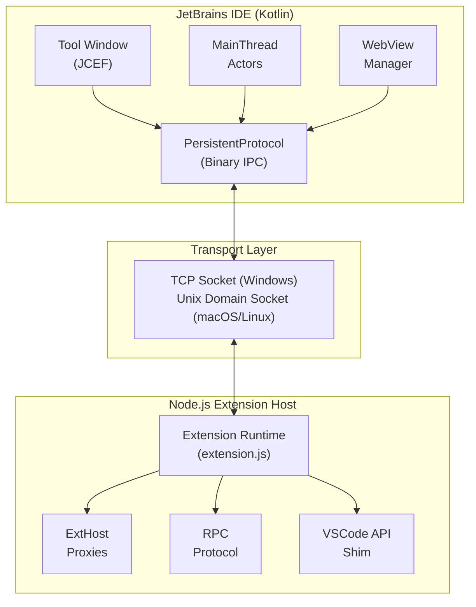

# JetBrains Plugin Architecture Documentation

This documentation provides a comprehensive overview of the Kilo Code JetBrains plugin architecture. The plugin bridges VSCode extension functionality into JetBrains IDEs by implementing a Node.js extension host with IPC communication and a JCEF-based WebView UI.

## Architecture Overview

The JetBrains plugin consists of four main architectural layers:

## Documentation Structure

### 🎯 Start Here

| Document                                                     | Description                                                                                          |
| ------------------------------------------------------------ | ---------------------------------------------------------------------------------------------------- |
| [00-architecture-overview.md](./00-architecture-overview.md) | **The Big Picture** - Start here to understand the cross-platform architecture and design philosophy |

### 📚 Foundation Knowledge

Before diving into implementation details, understand the underlying platforms:

| Document                                                                             | Description                                                                 |
| ------------------------------------------------------------------------------------ | --------------------------------------------------------------------------- |
| [06-intellij-platform-foundations.md](./06-intellij-platform-foundations.md)         | IntelliJ Platform deep dive: services, EDT threading, VFS, JCEF, plugin.xml |
| [07-vscode-extension-host-foundations.md](./07-vscode-extension-host-foundations.md) | VSCode Extension Host architecture: processes, RPC, webview security        |

### 🤔 Design Rationale

Understand _why_ the architecture is the way it is:

| Document                                                                 | Description                                                                           |
| ------------------------------------------------------------------------ | ------------------------------------------------------------------------------------- |
| [08-why-this-architecture.md](./08-why-this-architecture.md)             | Design rationale: Why Node.js process? Why sockets? Why JCEF? Alternatives considered |
| [09-design-constraints-analysis.md](./09-design-constraints-analysis.md) | Constraint-driven design: How platform constraints shaped every decision              |

### 🔧 Implementation Details

Detailed implementation documentation:

| Document                                                         | Description                                                                  |
| ---------------------------------------------------------------- | ---------------------------------------------------------------------------- |
| [01-plugin-initialization.md](./01-plugin-initialization.md)     | Plugin entry point, startup activity, and service initialization             |
| [02-extension-host-ipc.md](./02-extension-host-ipc.md)           | Node.js extension host spawning and IPC protocol                             |
| [03-vscode-api-bridging.md](./03-vscode-api-bridging.md)         | VSCode API bridging via MainThread/ExtHost proxies                           |
| [04-webview-communication.md](./04-webview-communication.md)     | WebView rendering and JavaScript-Kotlin communication                        |
| [05-architecture-diagrams.md](./05-architecture-diagrams.md)     | Comprehensive architecture diagrams                                          |
| [10-implementation-patterns.md](./10-implementation-patterns.md) | Key implementation patterns: Service Registry, Actors, Dynamic Proxies, etc. |

## Reading Order

### For New Developers

1. **[00-architecture-overview.md](./00-architecture-overview.md)** - Understand the big picture
2. **[08-why-this-architecture.md](./08-why-this-architecture.md)** - Understand _why_ decisions were made
3. **[06-intellij-platform-foundations.md](./06-intellij-platform-foundations.md)** - Learn IntelliJ Platform basics
4. **[01-plugin-initialization.md](./01-plugin-initialization.md)** - Follow the code from startup

### For VSCode Developers

1. **[07-vscode-extension-host-foundations.md](./07-vscode-extension-host-foundations.md)** - Compare to what you know
2. **[00-architecture-overview.md](./00-architecture-overview.md)** - See how it maps to JetBrains
3. **[03-vscode-api-bridging.md](./03-vscode-api-bridging.md)** - Understand the translation layer

### For Understanding Specific Areas

| Area                    | Documents                                                                                                                              |
| ----------------------- | -------------------------------------------------------------------------------------------------------------------------------------- |
| **Startup & Lifecycle** | [01-plugin-initialization.md](./01-plugin-initialization.md)                                                                           |
| **IPC & Messaging**     | [02-extension-host-ipc.md](./02-extension-host-ipc.md), [10-implementation-patterns.md](./10-implementation-patterns.md)               |
| **API Translation**     | [03-vscode-api-bridging.md](./03-vscode-api-bridging.md), [10-implementation-patterns.md](./10-implementation-patterns.md)             |
| **WebView/UI**          | [04-webview-communication.md](./04-webview-communication.md)                                                                           |
| **Threading**           | [06-intellij-platform-foundations.md](./06-intellij-platform-foundations.md)                                                           |
| **Design Decisions**    | [08-why-this-architecture.md](./08-why-this-architecture.md), [09-design-constraints-analysis.md](./09-design-constraints-analysis.md) |

## Key Components

### Plugin Entry Point

The plugin initializes via [`WecoderPlugin`](../../jetbrains/plugin/src/main/kotlin/ai/kilocode/jetbrains/plugin/WecoderPlugin.kt#L47) registered as a `postStartupActivity` in [`plugin.xml.template`](../../jetbrains/plugin/src/main/resources/META-INF/plugin.xml.template#L46).

### Core Services

| Service                                                                                                                   | Description                            | Scope   |
| ------------------------------------------------------------------------------------------------------------------------- | -------------------------------------- | ------- |
| [`WecoderPluginService`](../../jetbrains/plugin/src/main/kotlin/ai/kilocode/jetbrains/plugin/WecoderPlugin.kt#L188)       | Main plugin service managing lifecycle | Project |
| [`SystemObjectProvider`](../../jetbrains/plugin/src/main/kotlin/ai/kilocode/jetbrains/plugin/SystemObjectProvider.kt#L20) | Project-scoped object registry         | Project |
| [`WebViewManager`](../../jetbrains/plugin/src/main/kotlin/ai/kilocode/jetbrains/webview/WebViewManager.kt#L68)            | WebView instance management            | Project |
| [`ServiceProxyRegistry`](../../jetbrains/plugin/src/main/kotlin/ai/kilocode/jetbrains/core/ServiceProxyRegistry.kt#L60)   | RPC proxy registration                 | Project |

### Communication Layer

| Component                                                                                                                                     | Role                                |
| --------------------------------------------------------------------------------------------------------------------------------------------- | ----------------------------------- |
| [`ExtensionSocketServer`](../../jetbrains/plugin/src/main/kotlin/ai/kilocode/jetbrains/core/ExtensionSocketServer.kt#L26)                     | TCP socket server for Windows       |
| [`ExtensionUnixDomainSocketServer`](../../jetbrains/plugin/src/main/kotlin/ai/kilocode/jetbrains/core/ExtensionUnixDomainSocketServer.kt#L20) | UDS server for macOS/Linux          |
| [`PersistentProtocol`](../../jetbrains/plugin/src/main/kotlin/ai/kilocode/jetbrains/ipc/PersistentProtocol.kt#L19)                            | Binary framing protocol             |
| [`ExtensionHostManager`](../../jetbrains/plugin/src/main/kotlin/ai/kilocode/jetbrains/core/ExtensionHostManager.kt#L35)                       | Extension host lifecycle management |

### WebView Layer

| Component                                                                                                             | Role                    |
| --------------------------------------------------------------------------------------------------------------------- | ----------------------- |
| [`WebViewInstance`](../../jetbrains/plugin/src/main/kotlin/ai/kilocode/jetbrains/webview/WebViewManager.kt#L507)      | JCEF browser wrapper    |
| [`LocalResHandler`](../../jetbrains/plugin/src/main/kotlin/ai/kilocode/jetbrains/webview/LocalResHandler.kt#L20)      | Local resource serving  |
| [`RooToolWindowFactory`](../../jetbrains/plugin/src/main/kotlin/ai/kilocode/jetbrains/ui/RooToolWindowFactory.kt#L37) | Tool window integration |

## Data Flow Summary

1. **Initialization Flow**: IDE startup → `WecoderPlugin.runActivity()` → `WecoderPluginService.initialize()` → Socket server start → Node.js process spawn

2. **IPC Flow**: Extension Host ↔ PersistentProtocol ↔ Socket ↔ Kotlin MainThread Actors

3. **WebView Flow**: React UI ↔ `acquireVsCodeApi()` mock ↔ `JBCefJSQuery` ↔ RPC → Extension Host

## Technology Stack

| Layer           | Technology                         |
| --------------- | ---------------------------------- |
| IDE Integration | Kotlin, IntelliJ Platform SDK      |
| WebView         | JCEF (Chromium Embedded Framework) |
| Extension Host  | Node.js                            |
| IPC             | TCP Sockets / Unix Domain Sockets  |
| UI              | React (same as VSCode extension)   |

## Quick Start for Developers

1. **Understanding the Big Picture**: Start with [00-architecture-overview.md](./00-architecture-overview.md)

2. **Understanding Plugin Lifecycle**: Continue to [01-plugin-initialization.md](./01-plugin-initialization.md)

3. **IPC Protocol Details**: See [02-extension-host-ipc.md](./02-extension-host-ipc.md) for the binary protocol

4. **API Translation**: [03-vscode-api-bridging.md](./03-vscode-api-bridging.md) explains how VSCode APIs map to JetBrains

5. **UI Communication**: [04-webview-communication.md](./04-webview-communication.md) covers the WebView bridge

6. **Visual Overview**: [05-architecture-diagrams.md](./05-architecture-diagrams.md) provides comprehensive diagrams

## Key Insights

The architecture is based on a **fundamental insight**:

> VSCode already runs extensions in a separate process with well-defined RPC boundaries. The Kilo Code JetBrains plugin replicates this architecture, running the **same Node.js code** in a subprocess while implementing the host-side APIs in Kotlin.

This enables:

- **~90% code reuse** between VSCode and JetBrains
- **Same React UI** running in JCEF
- **Crash isolation** (extension crashes don't crash IDE)
- **Threading safety** (Node.js has its own event loop)

## Related Resources

- [JetBrains Plugin Development Guide](https://plugins.jetbrains.com/docs/intellij/welcome.html)
- [JCEF Documentation](https://plugins.jetbrains.com/docs/intellij/jcef.html)
- [VSCode Extension API](https://code.visualstudio.com/api)
- [VSCode Extension Host Architecture](https://code.visualstudio.com/api/advanced-topics/extension-host)
