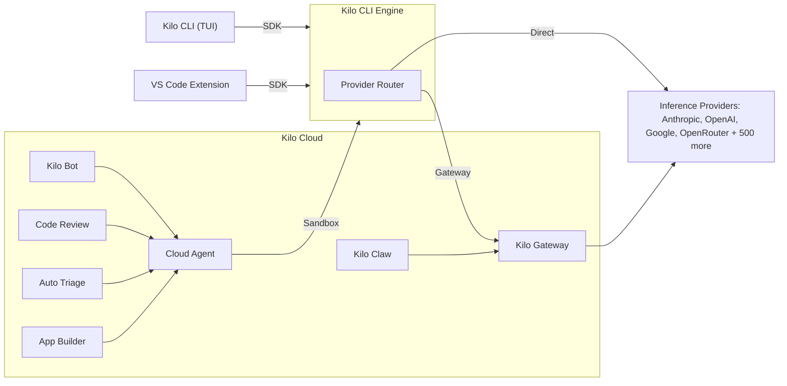

# Architecture Overview

This document provides a high-level overview of the Kilo platform architecture to help contributors understand how the different components fit together.

## System Architecture

Kilo is an AI coding platform built around a central CLI engine that powers every client surface — the terminal, VS Code, and the cloud. The architecture follows a layered approach where all clients communicate with the CLI over HTTP + SSE, and the CLI connects to AI providers either directly or through Kilo Cloud.



## Kilo CLI — The Foundation

The CLI (`packages/opencode/`) is the core engine that all products are built on. It contains the AI agent runtime, tool execution, session management, provider integrations, and an HTTP server. Each client spawns or connects to a `kilo serve` process and communicates via HTTP + SSE using the `@kilocode/sdk`.

The CLI can run in several modes:

- **`kilo`** — Interactive TUI for terminal-based coding
- **`kilo run`** — Headless single-prompt execution
- **`kilo serve`** — HTTP server mode for client integrations
- **`kilo web`** — Browser-based UI

Key subsystems inside the CLI:

| Subsystem       | Purpose                                                                  |
| --------------- | ------------------------------------------------------------------------ |
| Agent Runtime   | Orchestrates AI conversations, tool calls, and multi-step task execution |
| Tools Service   | Built-in tools for file editing, shell execution, search, and more       |
| MCP Servers     | Model Context Protocol support for extending with external tools         |
| LSP Client      | Language Server Protocol integration for code intelligence               |
| Session Manager | Persistent session state, conversation history, and checkpoints          |
| Provider Router | Connects to 500+ AI models via direct APIs or Kilo Gateway               |
| HTTP Server     | REST API + SSE streaming for client communication                        |
| Config System   | Project and global configuration, modes, and permissions                 |

## Client Layer

All clients are thin wrappers over the CLI engine.

### VS Code Extension

The VS Code extension (`packages/kilo-vscode/`) bundles the CLI binary and spawns `kilo serve` as a child process. It includes:

- **Sidebar Chat** — Primary coding assistant interface
- **Agent Manager** — Multi-session orchestration panel with git worktree isolation for running parallel tasks

### TUI

The built-in terminal UI ships with the CLI itself — a SolidJS interface rendered in the terminal via OpenTUI.

## Kilo Cloud

Kilo Cloud is the hosted platform layer that provides authentication, provider routing, and autonomous agent services. The cloud infrastructure lives in a separate repository.

### Kilo Gateway

The gateway (`packages/kilo-gateway/` in this repo, plus API routes in the cloud) handles:

- **Authentication** — Device flow auth, token management, and account linking
- **Provider Routing** — Routes AI requests through Kilo's managed API keys or the user's own keys
- **Model Catalog** — Serves the available model list and provider configuration
- **Usage & Billing** — Tracks token consumption and manages credits

### Cloud Agent

A Cloudflare Worker within Kilo Cloud that runs the Kilo CLI in isolated sandbox environments. It powers cloud-based AI coding tasks triggered via the web dashboard, webhooks, or automation workflows. It provides a secure API for:

- Creating and managing coding sessions with full GitHub/GitLab integration
- Running AI tasks in Docker containers with the CLI pre-installed
- Streaming results back via WebSocket

### Kilo Bot

The GitHub/GitLab bot that responds to issue comments and PR mentions. It dispatches work to the Cloud Agent, enabling users to trigger AI coding tasks directly from their repositories.

### Kilo Claw

A multi-tenant compute platform running on Fly.io, orchestrated by a Cloudflare Worker. Each user gets a dedicated persistent machine running an OpenClaw gateway, coordinated via Durable Objects for state management and self-healing reconciliation.

### Code Review

An automated code review service that subscribes to GitHub webhooks, dispatches reviews through the Cloud Agent, and posts feedback directly on pull requests. Supports per-organization concurrency limits and automatic queuing.

### Auto Triage

An automated issue triage service that classifies GitHub issues (bug, feature, question), detects duplicates via vector similarity search, and optionally creates fix PRs for high-confidence actionable issues.

### App Builder

A service that builds and deploys user applications via the Cloud Agent. Users can generate full applications from prompts, with the App Builder orchestrating the Cloud Agent to scaffold, iterate, and deploy the result.

### Supporting Services

| Service              | Purpose                                                                              |
| -------------------- | ------------------------------------------------------------------------------------ |
| Webhook Agent Ingest | Named webhook endpoints that capture HTTP requests and queue delivery to Cloud Agent |
| AI Attribution       | Tracks line-level AI-generated code attribution when users accept or reject edits    |
| Session Ingest       | Ingests and stores CLI session data for analytics                                    |
| Observability        | Telemetry pipelines for monitoring cloud services                                    |

## Key Concepts

### Modes

Modes are configurable presets that customize the agent's behavior:

- Define which tools are available
- Set custom system prompts
- Configure file restrictions
- Examples: Code, Architect, Debug, Ask

### Model Context Protocol (MCP)

MCP enables extending the agent with external tools:

- Servers provide additional capabilities
- Standardized protocol for tool communication
- Configured via `mcp.json`

### Checkpoints

Git-based state management for safe exploration:

- Creates commits to track changes
- Enables rolling back to previous states
- Shadow repository for isolation

### Worktrees

Git worktree isolation for parallel task execution:

- Each agent session can operate in its own worktree
- Prevents conflicts between concurrent tasks
- Used by the Agent Manager in VS Code for multi-session workflows

## Development Patterns

### Client-Server Communication

All clients communicate with the CLI via its HTTP + SSE API. The `@kilocode/sdk` package provides a TypeScript client:

```typescript
import { KiloClient } from "@kilocode/sdk"

const client = new KiloClient({ baseUrl: "http://localhost:3000" })
const session = await client.session.create({ ... })
```

### Namespace Module Pattern

The CLI uses a namespace module pattern for organizing related functionality:

```typescript
export namespace Session {
  export const create = fn(CreateSchema, async (input) => {
    // ...
  })

  export const list = fn(ListSchema, async (input) => {
    // ...
  })
}
```

### Tool Implementation

Tools follow a consistent pattern with Zod schema validation:

```typescript
export const ReadTool = Tool.define({
  name: "read",
  description: "Read a file",
  parameters: z.object({
    path: z.string(),
  }),
  async execute(params) {
    // ...
  },
})
```

## Build System

The project uses:

- **Bun** — Package management (monorepo workspaces) and runtime
- **Turborepo** — Monorepo task orchestration
- **esbuild** — Bundling for the CLI and VS Code extension
- **TypeScript** — Type checking via `tsgo` across all packages
- **Vitest / Bun test** — Test runner

## Repositories

| Repository                                                | Contents                                                                                                              |
| --------------------------------------------------------- | --------------------------------------------------------------------------------------------------------------------- |
| [Kilo-Org/kilocode](https://github.com/Kilo-Org/kilocode) | CLI engine, VS Code extension, SDK, gateway client, telemetry, docs, UI components                                    |
| Cloud (private)                                           | Web dashboard, Cloud Agent, Kilo Bot, Kilo Claw, code review, auto triage, billing, and supporting Cloudflare Workers |

## Further Reading

- [Development Environment](/docs/contributing/development-environment) — Setup guide
- [Architecture Features](/docs/contributing/architecture/features) — Detailed feature specs
- [Ecosystem](/docs/contributing/ecosystem) — Related projects and integrations
