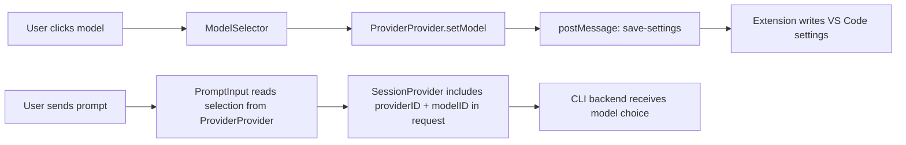
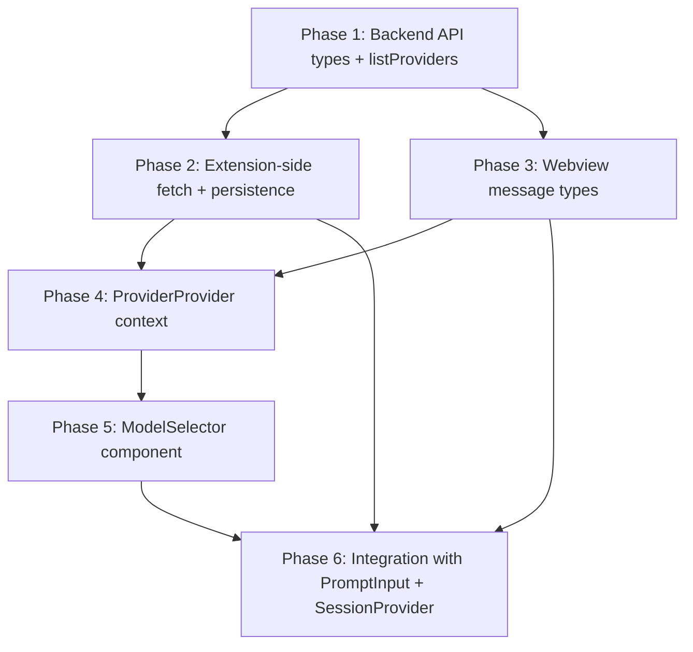

# Model Selector Implementation Plan

## 1. PR #131 Conclusions

### Overall Pattern

PR #131 implements model selection using a **three-layer architecture**:

1. **ProviderProvider context** — a Solid.js context that holds the full provider catalog, connected providers, default models, and the current selection. This is the single source of truth for model data in the webview.
2. **ModelSelector component** — a dropdown UI rendered inside `PromptInput`, showing grouped/searchable models with keyboard navigation.
3. **Persistence via extension** — selection is sent to the extension host via `postMessage`, which writes `kilo.model.providerID` and `kilo.model.modelID` to VS Code global settings.

### How Model Data Is Fetched and Structured

The webview does **not** call the CLI backend directly. Instead:

- The **extension side** calls a provider listing API that returns three things:
  - `all` — every provider definition with its model catalog
  - `connected` — IDs of providers the user has configured credentials for
  - `default` — a map of `providerID → default modelID`
- This data is sent to the webview via `postMessage`
- The **ProviderProvider context** processes it into a flat list of models, each enriched with `providerID`, `providerName`, `latest` flag, and `free` flag
- Popular providers are sorted first; models within each provider maintain catalog order

### How Selection State Flows



1. **User picks model** → `ModelSelector` calls the Provider context setter
2. **Provider context setter** → persists via `saveModel` message to extension → extension writes settings
3. **User sends prompt** → `PromptInput` reads `providerID` + `modelID` from Provider context → `SessionProvider` includes them in the prompt request body
4. **Backend** streams events back (message/part updates, session status) as usual

### Initialization Logic

When provider data arrives in the webview:

1. Check saved settings for `providerID` + `modelID`
2. If the saved provider is connected AND the saved model exists in its catalog → use it
3. Otherwise → fall back to the first connected provider's default model

This prevents stale selections from breaking the UI when a provider is disconnected.

### Key UI/UX Decisions

- **Trigger button**: shows current model name, or "Select model" when nothing is selected, disabled when no providers are connected
- **Dropdown position**: appears above the footer/prompt area
- **Search**: fuzzy search via `fuzzysort` library, filtering across all model names and provider names
- **Grouping**: models grouped by provider, with provider name as group header
- **Keyboard navigation**: arrow keys, Home/End, Ctrl-n/Ctrl-p, Enter to select, Escape to close
- **Model enrichment**: each model shows `latest` and `free` badges when applicable
- **useFilteredList hook**: reusable hook encapsulating fuzzy search + grouping + keyboard nav logic

### Persistence Strategy

The persistence follows the established webview ↔ extension communication pattern:

1. Webview sends `save-settings` message with `{ providerID, modelID }` to extension
2. Extension writes to VS Code **global** settings (`kilo.model.providerID`, `kilo.model.modelID`)
3. On webview init, extension reads settings and includes them in the initial data sent to webview
4. The ProviderProvider context uses these saved values during initialization (with fallback logic)

---

## 2. Implementation Plan for This Codebase

### Phase 1: Backend API — Provider/Model Listing

**Goal**: Add the ability to fetch provider and model data from the CLI backend.

#### 1a. Add provider types to [`types.ts`](src/services/cli-backend/types.ts)

Add interfaces for the provider listing API response:

```typescript
interface ProviderDefinition {
  id: string
  name: string
  models: ModelDefinition[]
}

interface ModelDefinition {
  id: string
  name: string
  latest?: boolean
  cost?: { input: number; output: number }
}

interface ProviderListResponse {
  all: ProviderDefinition[]
  connected: string[]
  default: Record<string, string> // providerID → default modelID
}
```

> **Note**: The exact shape depends on what the CLI backend's `/provider` endpoint returns. Verify against the actual API.

#### 1b. Add `listProviders()` method to [`HttpClient`](src/services/cli-backend/http-client.ts)

```typescript
async listProviders(directory: string): Promise<ProviderListResponse> {
  return this.request<ProviderListResponse>("GET", "/provider", undefined, { directory })
}
```

**Files to create/modify**:
- Modify: [`src/services/cli-backend/types.ts`](src/services/cli-backend/types.ts) — add provider types
- Modify: [`src/services/cli-backend/http-client.ts`](src/services/cli-backend/http-client.ts) — add `listProviders` method
- Modify: [`src/services/cli-backend/index.ts`](src/services/cli-backend/index.ts) — export new types

**Dependencies**: None. This is the foundation.

---

### Phase 2: Extension-Side — Fetch Providers and Forward to Webview

**Goal**: [`KiloProvider`](src/KiloProvider.ts) fetches provider data on connection and forwards it to the webview. It also handles saving/restoring model selection from VS Code settings.

#### 2a. Fetch providers after connection and send to webview

In [`KiloProvider.initializeConnection()`](src/KiloProvider.ts:75), after the SSE connection is established and the `ready` message is sent, fetch provider data and post it to the webview:

```typescript
// After posting "ready" message:
const providers = await this.httpClient.listProviders(workspaceDir)
const saved = this.getSavedModelSelection()
this.postMessage({
  type: "providersLoaded",
  providers: providers.all,
  connected: providers.connected,
  defaults: providers.default,
  savedSelection: saved,
})
```

#### 2b. Handle `save-model` message from webview

Add a new case to the [`onDidReceiveMessage`](src/KiloProvider.ts:45) switch:

```typescript
case "saveModel":
  this.saveModelSelection(message.providerID, message.modelID)
  break
```

#### 2c. Settings helpers

Add private methods to read/write VS Code global settings:

```typescript
private getSavedModelSelection(): { providerID?: string; modelID?: string } {
  const config = vscode.workspace.getConfiguration("kilo.model")
  return {
    providerID: config.get<string>("providerID"),
    modelID: config.get<string>("modelID"),
  }
}

private async saveModelSelection(providerID: string, modelID: string): Promise<void> {
  const config = vscode.workspace.getConfiguration("kilo.model")
  await config.update("providerID", providerID, vscode.ConfigurationTarget.Global)
  await config.update("modelID", modelID, vscode.ConfigurationTarget.Global)
}
```

#### 2d. Register configuration contribution in [`package.json`](package.json)

Add under `contributes.configuration`:

```json
"configuration": {
  "title": "Kilo Code",
  "properties": {
    "kilo.model.providerID": {
      "type": "string",
      "default": "",
      "description": "Selected provider ID for model"
    },
    "kilo.model.modelID": {
      "type": "string",
      "default": "",
      "description": "Selected model ID"
    }
  }
}
```

#### 2e. Pass model in `sendMessage` to backend

Modify [`handleSendMessage()`](src/KiloProvider.ts:248) to accept and forward `providerID` + `modelID`:

```typescript
private async handleSendMessage(
  text: string,
  sessionID?: string,
  providerID?: string,
  modelID?: string,
): Promise<void> {
  // ... existing session creation logic ...
  await this.httpClient.sendMessage(
    targetSessionID,
    [{ type: "text", text }],
    workspaceDir,
    providerID,
    modelID,
  )
}
```

Also update [`HttpClient.sendMessage()`](src/services/cli-backend/http-client.ts:93) to include `providerID` and `modelID` in the request body.

**Files to create/modify**:
- Modify: [`src/KiloProvider.ts`](src/KiloProvider.ts) — fetch providers, handle save-model, settings helpers, pass model to sendMessage
- Modify: [`src/services/cli-backend/http-client.ts`](src/services/cli-backend/http-client.ts) — update `sendMessage` to include model params
- Modify: [`package.json`](package.json) — add configuration contribution

**Dependencies**: Phase 1 (provider types and API method).

---

### Phase 3: Webview Message Types

**Goal**: Define the new message types for provider data flowing extension → webview and model selection flowing webview → extension.

#### 3a. Add to [`messages.ts`](webview-ui/src/types/messages.ts)

Extension → webview:

```typescript
interface ProvidersLoadedMessage {
  type: "providersLoaded"
  providers: ProviderDefinition[]
  connected: string[]
  defaults: Record<string, string>
  savedSelection?: { providerID?: string; modelID?: string }
}
```

Webview → extension:

```typescript
interface SaveModelRequest {
  type: "saveModel"
  providerID: string
  modelID: string
}
```

Update the `SendMessageRequest` to include optional model fields:

```typescript
interface SendMessageRequest {
  type: "sendMessage"
  text: string
  sessionID?: string
  providerID?: string
  modelID?: string
}
```

Add `ProvidersLoadedMessage` to `ExtensionMessage` union, `SaveModelRequest` to `WebviewMessage` union.

**Files to modify**:
- Modify: [`webview-ui/src/types/messages.ts`](webview-ui/src/types/messages.ts)

**Dependencies**: Phase 1 (provider types — or duplicate/simplify for webview).

---

### Phase 4: ProviderProvider Context

**Goal**: Create a new Solid.js context that manages provider catalog data and model selection state.

#### 4a. Create [`webview-ui/src/context/provider.tsx`](webview-ui/src/context/provider.tsx)

Following the pattern established by [`ServerProvider`](webview-ui/src/context/server.tsx) and [`SessionProvider`](webview-ui/src/context/session.tsx):

```typescript
interface ProviderContextValue {
  // All providers with their models
  providers: Accessor<ProviderDefinition[]>

  // Connected provider IDs
  connected: Accessor<string[]>

  // Flat list of all models enriched with provider info
  models: Accessor<EnrichedModel[]>

  // Current selection
  selectedProviderID: Accessor<string | undefined>
  selectedModelID: Accessor<string | undefined>
  selectedModelName: Accessor<string>

  // Whether any providers are connected
  hasConnected: Accessor<boolean>

  // Set selection and persist
  setModel: (providerID: string, modelID: string) => void
}
```

Key behaviors:
- Listen for `providersLoaded` message from extension via [`useVSCode().onMessage()`](webview-ui/src/context/vscode.tsx:62)
- Build a flat, enriched model list (`providerID`, `providerName`, `modelName`, `latest`, `free` flags)
- Apply initialization logic: use saved selection if valid, otherwise fall back to default
- On `setModel`, update local state and send `saveModel` message to extension

#### 4b. Wire into [`App.tsx`](webview-ui/src/App.tsx) provider hierarchy

Add `ProviderProvider` between `ServerProvider` and `SessionProvider`:

```tsx
<VSCodeProvider>
  <ServerProvider>
    <ProviderProvider>
      <SessionProvider>
        <AppContent />
      </SessionProvider>
    </ProviderProvider>
  </ServerProvider>
</VSCodeProvider>
```

**Files to create/modify**:
- Create: `webview-ui/src/context/provider.tsx`
- Modify: [`webview-ui/src/App.tsx`](webview-ui/src/App.tsx) — add ProviderProvider to context hierarchy

**Dependencies**: Phase 3 (message types).

---

### Phase 5: ModelSelector Component

**Goal**: Build the dropdown UI component.

#### 5a. Create [`webview-ui/src/components/chat/ModelSelector.tsx`](webview-ui/src/components/chat/ModelSelector.tsx)

The component:
- Reads from `useProvider()` context
- Renders a trigger button showing the current model name
- On click, opens a dropdown with:
  - A search input at the top
  - A scrollable list of models grouped by provider
  - Each model row shows model name + optional badges (latest, free)
- Keyboard navigation: arrow keys move highlight, Enter selects, Escape closes
- Click outside closes the dropdown

Structure:

```tsx
const ModelSelector: Component = () => {
  const provider = useProvider()
  const [open, setOpen] = createSignal(false)
  const [search, setSearch] = createSignal("")
  const [highlighted, setHighlighted] = createSignal(0)

  // Filtered + grouped models based on search
  const filtered = createMemo(() => {
    // fuzzy filter provider.models() by search()
    // group by providerID
  })

  return (
    <div class="model-selector">
      <button class="model-selector-trigger" onClick={() => setOpen(!open())} disabled={!provider.hasConnected()}>
        {provider.selectedModelName() || "Select model"}
      </button>
      <Show when={open()}>
        <div class="model-selector-dropdown">
          <input class="model-selector-search" ... />
          <div class="model-selector-list">
            <For each={filtered()}>
              {group => (
                <>
                  <div class="model-selector-group-header">{group.providerName}</div>
                  <For each={group.models}>
                    {model => <div class="model-selector-item" ...>{model.name}</div>}
                  </For>
                </>
              )}
            </For>
          </div>
        </div>
      </Show>
    </div>
  )
}
```

#### 5b. Add CSS styles to [`chat.css`](webview-ui/src/styles/chat.css)

Add a new `Model Selector` section following the existing pattern of using VS Code CSS variables:

- `.model-selector` — relative positioning container
- `.model-selector-trigger` — styled like existing buttons but with text
- `.model-selector-dropdown` — absolute positioned above the trigger, with border and shadow
- `.model-selector-search` — styled like `.prompt-input` but smaller
- `.model-selector-list` — scrollable, max-height
- `.model-selector-group-header` — styled like `.message-role` (small, uppercase, dimmed)
- `.model-selector-item` — hover and active states using VS Code list variables
- `.model-selector-item-active` — highlighted state

#### 5c. Optional: `useFilteredList` hook

If the filtering + keyboard nav logic is complex enough, extract into `webview-ui/src/hooks/useFilteredList.ts`. For an MVP, this can live inline in the component.

**Note on fuzzy search**: PR #131 uses `fuzzysort`. For our MVP, simple `includes()` substring matching is sufficient. We can add `fuzzysort` later if needed (would require adding it to [`package.json`](package.json) dependencies).

**Files to create/modify**:
- Create: `webview-ui/src/components/chat/ModelSelector.tsx`
- Modify: [`webview-ui/src/styles/chat.css`](webview-ui/src/styles/chat.css) — add model selector styles
- Optional create: `webview-ui/src/hooks/useFilteredList.ts`

**Dependencies**: Phase 4 (ProviderProvider context).

---

### Phase 6: Integration with PromptInput

**Goal**: Wire the ModelSelector into the prompt area and pass model selection when sending messages.

#### 6a. Add ModelSelector to [`PromptInput`](webview-ui/src/components/chat/PromptInput.tsx)

Import [`useProvider()`](webview-ui/src/context/provider.tsx) and the `ModelSelector` component.

Place the selector above the textarea:

```tsx
return (
  <div class="prompt-input-container">
    <ModelSelector />
    <div class="prompt-input-wrapper">
      <textarea ... />
      <div class="prompt-input-actions">...</div>
    </div>
    <div class="prompt-input-hint">...</div>
  </div>
)
```

#### 6b. Include model in [`sendMessage`](webview-ui/src/components/chat/PromptInput.tsx:42)

Update the `handleSend` function to pass model selection:

```typescript
const handleSend = () => {
  const message = text().trim()
  if (!message || isBusy() || isDisabled()) return

  session.sendMessage(message, provider.selectedProviderID(), provider.selectedModelID())
  // ...
}
```

This requires updating the [`SessionProvider.sendMessage()`](webview-ui/src/context/session.tsx:252) signature to accept optional `providerID` and `modelID`, and including them in the [`postMessage`](webview-ui/src/context/session.tsx:259) call.

**Files to modify**:
- Modify: [`webview-ui/src/components/chat/PromptInput.tsx`](webview-ui/src/components/chat/PromptInput.tsx) — add ModelSelector, pass model to sendMessage
- Modify: [`webview-ui/src/context/session.tsx`](webview-ui/src/context/session.tsx) — update sendMessage to accept and forward model params
- Modify: [`webview-ui/src/components/chat/index.ts`](webview-ui/src/components/chat/index.ts) — export ModelSelector if needed

**Dependencies**: Phase 5 (ModelSelector component), Phase 4 (ProviderProvider context).

---

### Phase Summary and Dependency Graph



### Files Changed Summary

| File | Action | Phase |
|------|--------|-------|
| [`src/services/cli-backend/types.ts`](src/services/cli-backend/types.ts) | Modify | 1 |
| [`src/services/cli-backend/http-client.ts`](src/services/cli-backend/http-client.ts) | Modify | 1, 2 |
| [`src/services/cli-backend/index.ts`](src/services/cli-backend/index.ts) | Modify | 1 |
| [`src/KiloProvider.ts`](src/KiloProvider.ts) | Modify | 2 |
| [`package.json`](package.json) | Modify | 2 |
| [`webview-ui/src/types/messages.ts`](webview-ui/src/types/messages.ts) | Modify | 3 |
| `webview-ui/src/context/provider.tsx` | **Create** | 4 |
| [`webview-ui/src/App.tsx`](webview-ui/src/App.tsx) | Modify | 4 |
| `webview-ui/src/components/chat/ModelSelector.tsx` | **Create** | 5 |
| [`webview-ui/src/styles/chat.css`](webview-ui/src/styles/chat.css) | Modify | 5 |
| [`webview-ui/src/components/chat/PromptInput.tsx`](webview-ui/src/components/chat/PromptInput.tsx) | Modify | 6 |
| [`webview-ui/src/context/session.tsx`](webview-ui/src/context/session.tsx) | Modify | 6 |

### Open Questions

1. **Provider listing endpoint** — What is the exact CLI backend endpoint path? Assumed `/provider` but needs verification against the actual API.
2. **Send message model format** — How does the CLI backend expect `providerID`/`modelID` in the message request? As top-level body fields, or nested under a `model` key?
3. **Fuzzy search** — Should we add `fuzzysort` as a dependency now, or start with simple substring matching?
4. **Provider SSE events** — Does the CLI backend emit SSE events when providers change (e.g., a new provider is connected)? If so, we should handle re-fetching provider data.
