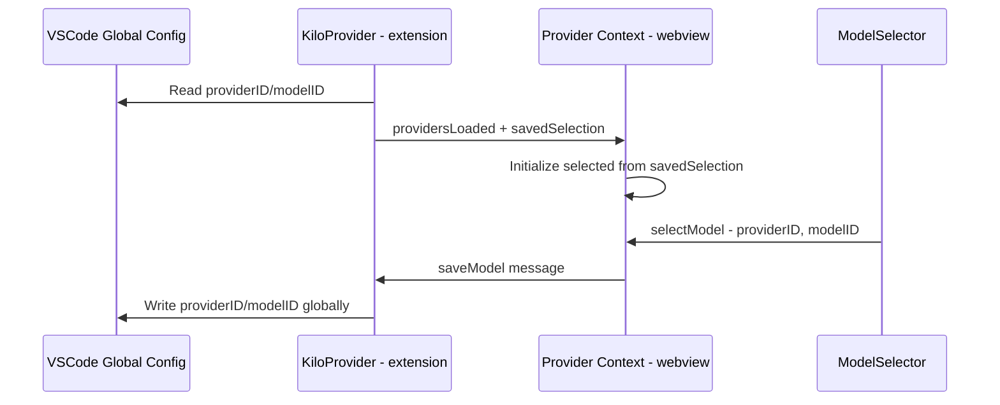
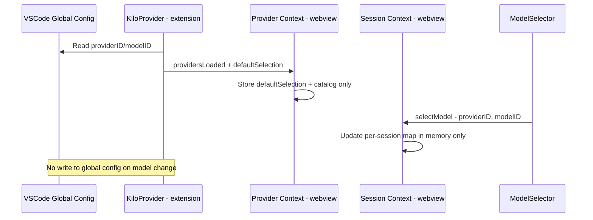

# Per-Session Model Selection Plan

## Overview

Model/provider selection is currently **global** — changing the model in the UI writes to VSCode settings and affects all future sessions. This plan makes model selection **per-session**, stored in-memory in the webview, with the global config serving only as the default for new sessions.

## Architecture

### Current Flow



### New Flow



### Key Design Decisions

1. **Provider context becomes catalog-only** — it stores providers, models, connected list, defaults, and the global `defaultSelection`. It no longer tracks the active selection.

2. **Session context owns per-session model selection** — since `SessionProvider` is nested inside `ProviderProvider`, it can access the provider catalog via [`useProvider()`](webview-ui/src/context/provider.tsx:116). It maintains a map of `sessionID → ModelSelection` plus a `pendingSelection` signal for pre-session state.

3. **No new context needed** — the existing context nesting `ProviderProvider > SessionProvider` in [`App.tsx`](webview-ui/src/App.tsx:109) allows Session to access Provider data.

4. **Default is `kilo/auto`** — both the global config defaults and the fallback in the webview change from empty strings to `providerID: "kilo"`, `modelID: "auto"`.

---

## File-by-File Changes

### 1. [`package.json`](package.json:99) — Change config defaults

**What:** Update the default values for the two configuration settings.

**Before:**
```json
"kilo-code.new.model.providerID": {
  "type": "string",
  "default": "",
  "description": "Selected model provider ID"
},
"kilo-code.new.model.modelID": {
  "type": "string",
  "default": "",
  "description": "Selected model ID"
}
```

**After:**
```json
"kilo-code.new.model.providerID": {
  "type": "string",
  "default": "kilo",
  "description": "Default model provider ID for new sessions"
},
"kilo-code.new.model.modelID": {
  "type": "string",
  "default": "auto",
  "description": "Default model ID for new sessions"
}
```

---

### 2. [`src/KiloProvider.ts`](src/KiloProvider.ts) — Remove saveModel, rename savedSelection

#### 2a. Remove the `saveModel` case from the message handler (line 65–67)

Delete the case:
```ts
case "saveModel":
  await this.handleSaveModel(message.providerID, message.modelID)
  break
```

#### 2b. Remove [`handleSaveModel()`](src/KiloProvider.ts:301) method entirely (lines 301–310)

This method wrote to global VSCode config on every model change. No longer needed.

#### 2c. Update [`fetchAndSendProviders()`](src/KiloProvider.ts:260) — rename `savedSelection` to `defaultSelection`

The extension still reads the global config and sends it to the webview, but now it's framed as "the default for new sessions" rather than "the previously saved selection."

**Change in `fetchAndSendProviders()`:**
```ts
// Before
const providerID = config.get<string>("providerID", "")
const modelID = config.get<string>("modelID", "")
// ...
savedSelection: providerID || modelID ? { providerID, modelID } : undefined,

// After
const providerID = config.get<string>("providerID", "kilo")
const modelID = config.get<string>("modelID", "auto")
// ...
defaultSelection: { providerID, modelID },
```

Note: always sends `defaultSelection` — no `undefined` case needed since we always have a default.

---

### 3. [`webview-ui/src/types/messages.ts`](webview-ui/src/types/messages.ts) — Update message types

#### 3a. Update [`ProvidersLoadedMessage`](webview-ui/src/types/messages.ts:202) — rename field

```ts
// Before
export interface ProvidersLoadedMessage {
  type: "providersLoaded"
  providers: Record<string, Provider>
  connected: string[]
  defaults: Record<string, string>
  savedSelection?: Partial<ModelSelection>
}

// After
export interface ProvidersLoadedMessage {
  type: "providersLoaded"
  providers: Record<string, Provider>
  connected: string[]
  defaults: Record<string, string>
  defaultSelection: ModelSelection
}
```

#### 3b. Remove [`SaveModelMessage`](webview-ui/src/types/messages.ts:262)

Delete the interface:
```ts
export interface SaveModelMessage {
  type: "saveModel"
  providerID: string
  modelID: string
}
```

#### 3c. Remove `SaveModelMessage` from [`WebviewMessage`](webview-ui/src/types/messages.ts:268) union

```ts
// Before
export type WebviewMessage =
  | SendMessageRequest
  | AbortRequest
  | PermissionResponseRequest
  | CreateSessionRequest
  | LoadMessagesRequest
  | LoadSessionsRequest
  | SaveModelMessage

// After
export type WebviewMessage =
  | SendMessageRequest
  | AbortRequest
  | PermissionResponseRequest
  | CreateSessionRequest
  | LoadMessagesRequest
  | LoadSessionsRequest
```

---

### 4. [`webview-ui/src/context/provider.tsx`](webview-ui/src/context/provider.tsx) — Become catalog-only

This is the biggest refactor. The Provider context stops managing selection and becomes a pure catalog of available providers/models.

#### 4a. Update the context value interface

```ts
// Before
interface ProviderContextValue {
  providers: Accessor<Record<string, Provider>>
  connected: Accessor<string[]>
  defaults: Accessor<Record<string, string>>
  selected: Accessor<ModelSelection | null>
  models: Accessor<EnrichedModel[]>
  selectedModel: Accessor<EnrichedModel | undefined>
  selectModel: (providerID: string, modelID: string) => void
}

// After
interface ProviderContextValue {
  providers: Accessor<Record<string, Provider>>
  connected: Accessor<string[]>
  defaults: Accessor<Record<string, string>>
  defaultSelection: Accessor<ModelSelection>
  models: Accessor<EnrichedModel[]>
  findModel: (selection: ModelSelection | null) => EnrichedModel | undefined
}
```

Changes:
- Remove `selected`, `selectedModel`, `selectModel`
- Add `defaultSelection` — the global config default for new sessions
- Add `findModel()` — a utility that looks up an `EnrichedModel` by `ModelSelection`, used by Session context and components

#### 4b. Update the signals and initialization

```ts
// Remove
const [selected, setSelected] = createSignal<ModelSelection | null>(null)

// Add
const KILO_AUTO: ModelSelection = { providerID: "kilo", modelID: "auto" }
const [defaultSelection, setDefaultSelection] = createSignal<ModelSelection>(KILO_AUTO)
```

#### 4c. Update the `onMount` message handler

```ts
// Before: set selected from savedSelection + fallback logic
// After: just store defaultSelection from message

onMount(() => {
  const unsubscribe = vscode.onMessage((message: ExtensionMessage) => {
    if (message.type !== "providersLoaded") {
      return
    }
    setProviders(message.providers)
    setConnected(message.connected)
    setDefaults(message.defaults)
    setDefaultSelection(message.defaultSelection)
  })
  onCleanup(unsubscribe)
})
```

#### 4d. Replace `selectedModel` memo with `findModel` function

```ts
function findModel(selection: ModelSelection | null): EnrichedModel | undefined {
  if (!selection) {
    return undefined
  }
  return models().find(
    (m) => m.providerID === selection.providerID && m.id === selection.modelID
  )
}
```

#### 4e. Remove `selectModel` function entirely

The `selectModel` function that called `vscode.postMessage({ type: "saveModel" })` is deleted.

#### 4f. Update the context value object

```ts
const value: ProviderContextValue = {
  providers,
  connected,
  defaults,
  defaultSelection,
  models,
  findModel,
}
```

---

### 5. [`webview-ui/src/context/session.tsx`](webview-ui/src/context/session.tsx) — Add per-session model selection

#### 5a. Import Provider context

```ts
import { useProvider } from "./provider"
import type { ModelSelection } from "../types/messages"
```

#### 5b. Add model selection to the store

```ts
interface SessionStore {
  sessions: Record<string, SessionInfo>
  messages: Record<string, Message[]>
  parts: Record<string, Part[]>
  todos: Record<string, TodoItem[]>
  modelSelections: Record<string, ModelSelection>  // NEW: sessionID -> model
}
```

Initialize:
```ts
const [store, setStore] = createStore<SessionStore>({
  sessions: {},
  messages: {},
  parts: {},
  todos: {},
  modelSelections: {},
})
```

#### 5c. Add a pending selection signal for pre-session state

When no session exists yet (user hasn't sent first message), we still need to track their model choice.

```ts
const provider = useProvider()

// Pending model selection for before a session exists.
// Initialized to the global default once providers load.
const [pendingModelSelection, setPendingModelSelection] =
  createSignal<ModelSelection | null>(null)
```

We initialize `pendingModelSelection` from the provider's `defaultSelection` once providers load. Since Provider context sets `defaultSelection` from the `providersLoaded` message, we can use a reactive effect:

```ts
// Track when defaultSelection becomes available and initialize pending
createEffect(() => {
  const def = provider.defaultSelection()
  if (!pendingModelSelection()) {
    setPendingModelSelection(def)
  }
})
```

#### 5d. Add `selected()` computed accessor

```ts
const selected = createMemo<ModelSelection | null>(() => {
  const id = currentSessionID()
  if (id) {
    return store.modelSelections[id] ?? provider.defaultSelection()
  }
  return pendingModelSelection()
})
```

Logic:
- If a current session exists, return its per-session selection (or the global default if none set yet)
- If no session exists, return the pending selection

#### 5e. Add `selectModel()` function

```ts
function selectModel(providerID: string, modelID: string) {
  const selection: ModelSelection = { providerID, modelID }
  const id = currentSessionID()
  if (id) {
    setStore("modelSelections", id, selection)
  } else {
    setPendingModelSelection(selection)
  }
}
```

#### 5f. When a session is created, promote pending selection

In [`handleSessionCreated()`](webview-ui/src/context/session.tsx:137), when a new session is created and becomes current:

```ts
function handleSessionCreated(session: SessionInfo) {
  batch(() => {
    setStore("sessions", session.id, session)
    setStore("messages", session.id, [])

    // If there's a pending model selection, assign it to this new session
    const pending = pendingModelSelection()
    if (pending) {
      setStore("modelSelections", session.id, pending)
      setPendingModelSelection(null)
    }

    setCurrentSessionID(session.id)
  })
}
```

#### 5g. When switching sessions, reset pending selection

Pending selection only applies when no session is active. When the user creates a new session via the plus button:

In `createSession()`:
```ts
function createSession() {
  if (!server.isConnected()) {
    return
  }
  // Reset pending selection to default for the new session
  setPendingModelSelection(provider.defaultSelection())
  vscode.postMessage({ type: "createSession" })
}
```

#### 5h. Update `SessionContextValue` interface

Add the new fields:

```ts
interface SessionContextValue {
  // ... existing fields ...
  selected: Accessor<ModelSelection | null>
  selectModel: (providerID: string, modelID: string) => void
}
```

And add them to the value object:

```ts
const value: SessionContextValue = {
  // ... existing fields ...
  selected,
  selectModel,
}
```

---

### 6. [`webview-ui/src/components/chat/ModelSelector.tsx`](webview-ui/src/components/chat/ModelSelector.tsx) — Use Session for selection

#### 6a. Update imports and context usage

```ts
// Before
import { useProvider, EnrichedModel } from "../../context/provider"

// After
import { useProvider, EnrichedModel } from "../../context/provider"
import { useSession } from "../../context/session"
```

#### 6b. Update component initialization

```ts
// Before
const { connected, models, selectedModel, selectModel } = useProvider()

// After
const { connected, models, findModel } = useProvider()
const session = useSession()
const selectedModel = () => findModel(session.selected())
```

#### 6c. Update the `pick()` function

```ts
// Before
function pick(model: EnrichedModel) {
  selectModel(model.providerID, model.id)
  setOpen(false)
}

// After
function pick(model: EnrichedModel) {
  session.selectModel(model.providerID, model.id)
  setOpen(false)
}
```

#### 6d. Update `isSelected()` helper

The `isSelected()` function on line 151 already works against `selectedModel()` which is now a function we defined locally. No change needed there.

---

### 7. [`webview-ui/src/components/chat/PromptInput.tsx`](webview-ui/src/components/chat/PromptInput.tsx) — Get selection from Session

#### 7a. Remove provider import

```ts
// Before
import { useSession } from "../../context/session"
import { useServer } from "../../context/server"
import { useProvider } from "../../context/provider"

// After
import { useSession } from "../../context/session"
import { useServer } from "../../context/server"
```

#### 7b. Update `handleSend()` to use session's selection

```ts
// Before
const provider = useProvider()
// ...
const handleSend = () => {
  const sel = provider.selected()
  session.sendMessage(message, sel?.providerID, sel?.modelID)
}

// After (no provider needed)
const handleSend = () => {
  const sel = session.selected()
  session.sendMessage(message, sel?.providerID, sel?.modelID)
}
```

---

## Summary of Changes

| File | Action |
|------|--------|
| [`package.json`](package.json:99) | Change defaults from `""` to `"kilo"`/`"auto"`, update descriptions |
| [`src/KiloProvider.ts`](src/KiloProvider.ts) | Remove `saveModel` handler + method, rename `savedSelection` → `defaultSelection`, use `"kilo"`/`"auto"` fallbacks |
| [`webview-ui/src/types/messages.ts`](webview-ui/src/types/messages.ts) | Rename `savedSelection` → `defaultSelection` in `ProvidersLoadedMessage`, remove `SaveModelMessage` from union |
| [`webview-ui/src/context/provider.tsx`](webview-ui/src/context/provider.tsx) | Remove selection state. Add `defaultSelection` accessor and `findModel()` utility. Simplify to catalog-only. |
| [`webview-ui/src/context/session.tsx`](webview-ui/src/context/session.tsx) | Add `modelSelections` to store, `pendingModelSelection` signal, `selected()` computed, `selectModel()` action. Promote pending on session creation. |
| [`webview-ui/src/components/chat/ModelSelector.tsx`](webview-ui/src/components/chat/ModelSelector.tsx) | Use `useSession()` for `selectModel` and `selected`, use `findModel()` from provider for the enriched model lookup |
| [`webview-ui/src/components/chat/PromptInput.tsx`](webview-ui/src/components/chat/PromptInput.tsx) | Get selection from `session.selected()` instead of `provider.selected()`, remove `useProvider` import |

## Edge Cases

1. **No session yet** — covered by `pendingModelSelection` signal; user can change model before sending first message
2. **Switch to existing session with no stored selection** — `selected()` falls back to `provider.defaultSelection()`
3. **Plus button / new task** — resets `pendingModelSelection` to global default, session creation promotes it
4. **Providers not yet loaded** — `defaultSelection` starts as `{ providerID: "kilo", modelID: "auto" }` before the `providersLoaded` message arrives; this is a valid default
5. **Global config manually changed by user** — reflected next time `providersLoaded` fires or extension reloads; doesn't affect existing active sessions
