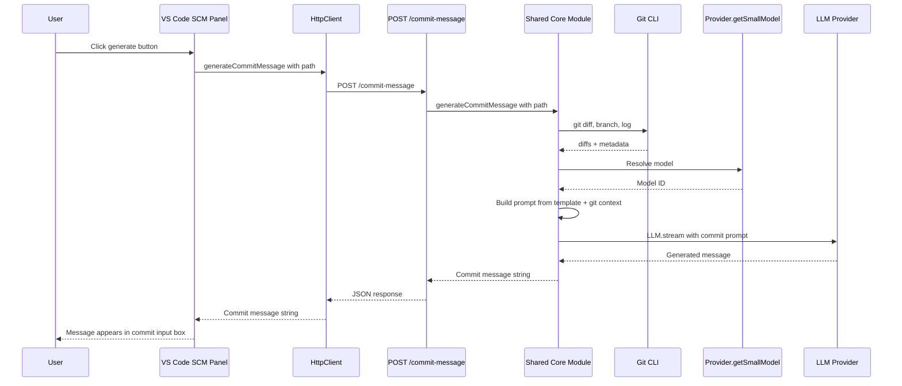
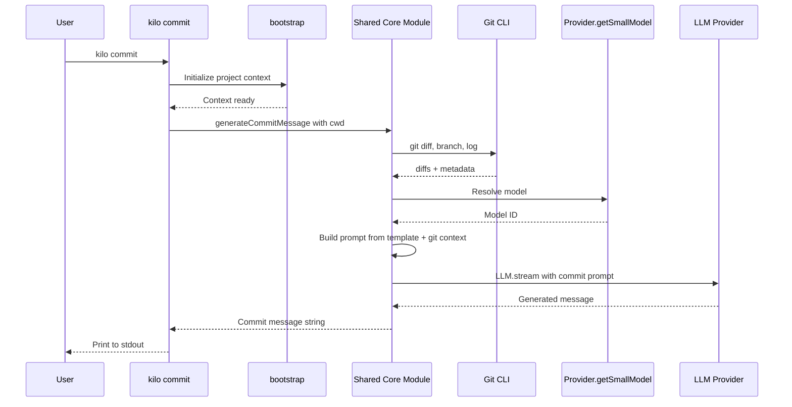
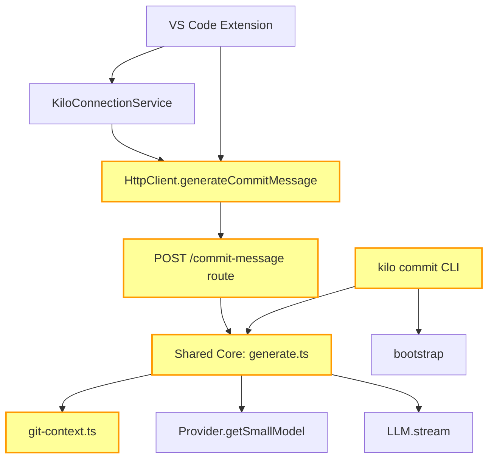

# Commit Message Generation — Implementation Plan

## 1. Overview

This plan adds **LLM-powered commit message generation** to the Kilo platform with three surfaces: a **CLI command** (`kilo commit`), an **HTTP route** (`POST /commit-message`), and a **VS Code SCM panel button**. All three delegate to a shared core module that handles git context gathering, prompt building, and LLM interaction.

### How this differs from the old implementation

The old extension (kilocode-5) called LLMs directly from the extension process using `buildApiHandler()` and provider-specific handlers. This architecture uses a **shared backend module** instead — the backend handles model selection, prompt building, and LLM communication. The extension is a thin HTTP client, and the CLI command calls the core directly.

| Aspect | Old extension | This architecture |
|--------|--------------|-------------------|
| LLM calls | Direct from extension → LLM provider | Shared core module in CLI backend |
| Auth | API keys stored in extension settings | OAuth/API key managed by CLI backend's `Auth` module |
| Model selection | User-configurable `commitMessageApiConfigId` | Automatic: `Provider.getSmallModel()` |
| Prompt location | In extension code | In shared core module |
| Surfaces | VS Code + JetBrains adapters | CLI command + HTTP route + VS Code |
| Git context | Gathered in extension | Gathered server-side in shared core |
| Prompt customization | Custom template override setting | Not in v1 |

---

## 2. Backend Investigation

Investigation of the CLI backend (`packages/opencode/`) revealed existing infrastructure that the commit message feature can reuse directly.

### What EXISTS in the backend

| Component | Location | Description |
|-----------|----------|-------------|
| `small_model` config | [`config.ts:1133`](../../packages/opencode/src/config/config.ts:1133) | Optional config field: `small_model: ModelId.describe("Small model to use for tasks like title generation").optional()` |
| `Provider.getSmallModel()` | [`provider.ts:1171`](../../packages/opencode/src/provider/provider.ts:1171) | Resolves small model with priority: user-configured → auto-detected → kilo fallback → undefined |
| Title generation | [`summary.ts:130`](../../packages/opencode/src/session/summary.ts:130) | Uses small_model + "title" agent — reference pattern |
| Agent prompts | `src/agent/prompt/` | Existing agents: ask, compaction, debug, explore, orchestrator, summary, title |
| Server routes | [`server.ts:227`](../../packages/opencode/src/server/server.ts:227) | Hono-based HTTP server with existing route patterns |
| `LLM.stream()` | Various | Streaming LLM infrastructure with auth already handled |
| CLI commands | [`src/cli/cmd/`](../../packages/opencode/src/cli/cmd/) | 18 commands using yargs + [`cmd()`](../../packages/opencode/src/cli/cmd/cmd.ts:5) helper |
| `bootstrap()` | [`bootstrap.ts:4`](../../packages/opencode/src/cli/bootstrap.ts:4) | Initializes project context so Provider/LLM APIs are available |

### What does NOT exist

- No commit message generation logic
- No generic chat completions endpoint
- No "commit" agent or prompt
- No `kilo commit` CLI command

### Implications

Because `Provider.getSmallModel()`, `LLM.stream()`, `bootstrap()`, and the agent prompt infrastructure already exist, the recommended approach is a **shared core module** that both the HTTP route and CLI command delegate to. The extension calls the HTTP route; the CLI command calls the core directly with no HTTP round-trip.

---

## 3. Architecture

### Three-Layer Design

```
+-----------------------------------------------------+
|                  Shared Core Module                  |
|  packages/opencode/src/commit-message/              |
|  - generate.ts     git context + LLM call           |
|  - git-context.ts  diff/branch/log gathering        |
|  - types.ts        CommitMessageRequest/Response     |
+----------+------------------+-----------+-----------+
           |                  |           |
    +------+------+   +------+------+   +-------------------+
    | CLI Command  |   | HTTP Route  |   | VS Code Extension |
    | kilo commit  |   | POST /commit|   | SCM panel button  |
    | cmd/commit.ts|   | -message    |   | calls HTTP route  |
    +-------------+   +-------------+   +-------------------+
```

**Key design decision:** Git context is gathered **server-side** in the shared core module. Both the CLI command and HTTP route run in the backend process with filesystem access. The VS Code extension does NOT gather git context — it sends the workspace path and the backend does the rest. This avoids duplicating git logic across surfaces.

### Request Flow — VS Code



### Request Flow — CLI



### Component Diagram



Yellow-highlighted components are new code that needs to be written.

### Design Rationale: Backend vs Gateway

Two approaches were considered:

| Aspect | Option A: Backend endpoint — RECOMMENDED | Option B: Gateway endpoint |
|--------|------------------------------------------|---------------------------|
| Endpoint | `POST /commit-message` in opencode server | `POST /kilo/chat` in kilo-gateway |
| Model selection | Backend uses `Provider.getSmallModel()` directly | Extension must read config and pass model |
| Prompt | Backend shared core module | Extension builds prompt locally |
| Auth | Handled by existing `LLM.stream()` | Separate gateway auth flow |
| Consistency | Same pattern as title generation | Different pattern from other features |
| CLI reuse | CLI command shares the same core logic | CLI would need its own implementation |

Option A is recommended because it enables a shared core used by both command-line and HTTP surfaces, reuses existing infrastructure, and minimizes extension-side complexity.

---

## 4. Implementation Phases

### Phase 1: Shared Core Module (packages/opencode)

**Scope:** Core logic for generating commit messages, shared by all surfaces.

**Files to create:**

| File | Purpose |
|------|---------|
| `src/commit-message/generate.ts` | Main `generateCommitMessage()` function — orchestrates git context, prompt building, LLM call |
| `src/commit-message/git-context.ts` | Git CLI operations: diff, branch, log, file status |
| `src/commit-message/types.ts` | `CommitMessageRequest` and `CommitMessageResponse` types |

**`generateCommitMessage()` function:**

```typescript
// src/commit-message/generate.ts

import { getGitContext } from "./git-context"
import type { CommitMessageRequest, CommitMessageResponse } from "./types"

export async function generateCommitMessage(
  request: CommitMessageRequest
): Promise<CommitMessageResponse> {
  // 1. Gather git context from the working directory
  const context = await getGitContext(request.path, request.selectedFiles)

  // 2. Resolve small model via Provider.getSmallModel()
  // 3. Build prompt: Conventional Commits template + git context
  // 4. Call LLM.stream() with the commit prompt
  // 5. Clean and return the commit message string

  return { message: cleanedMessage }
}
```

**`getGitContext()` function:**

```typescript
// src/commit-message/git-context.ts

export interface GitContext {
  stagedFiles: FileChange[]
  diffs: Map<string, string>
  branch: string
  recentCommits: string[]
}

export interface FileChange {
  status: "added" | "modified" | "deleted" | "renamed" | "untracked"
  path: string
}

export async function getGitContext(
  repoPath: string,
  selectedFiles?: string[]
): Promise<GitContext>
```

**Types:**

```typescript
// src/commit-message/types.ts

export interface CommitMessageRequest {
  path: string              // workspace/repo path
  selectedFiles?: string[]  // optional file subset
}

export interface CommitMessageResponse {
  message: string           // the generated commit message
}
```

### Phase 2: HTTP Route (packages/opencode)

**Scope:** `POST /commit-message` route that delegates to the shared core.

**Files to create/modify:**

| File | Change |
|------|--------|
| `src/server/routes/commit-message.ts` | New route handler — validates request, calls `generateCommitMessage()`, returns JSON |
| [`src/server/server.ts`](../../packages/opencode/src/server/server.ts) | Register `POST /commit-message` route |

**HTTP interface:**

Request:
```typescript
POST /commit-message
{
  path: string              // workspace/repo path
  selectedFiles?: string[]  // optional file subset
}
```

Response:
```typescript
{
  message: string           // the generated commit message
}
```

The route handler is thin — it validates the request body, calls [`generateCommitMessage()`](../../packages/opencode/src/commit-message/generate.ts), and returns the result as JSON.

### Phase 3: CLI Command (packages/opencode)

**Scope:** `kilo commit` command that delegates to the shared core.

**Files to create/modify:**

| File | Change |
|------|--------|
| `src/cli/cmd/commit.ts` | New CLI command using [`cmd()`](../../packages/opencode/src/cli/cmd/cmd.ts:5) helper |
| [`src/index.ts`](../../packages/opencode/src/index.ts:122) | Register `.command(CommitCommand)` |

**Command:** `kilo commit [--auto]`

| Flag | Default | Description |
|------|---------|-------------|
| `--auto` | `false` | Skip confirmation, auto-stage + commit with the generated message |
| (no flags) | — | Generate and print the commit message to stdout |

**Usage examples:**
```bash
# Generate and print to stdout
kilo commit

# Pipe to git commit
kilo commit | git commit -F -

# Auto-stage and commit
kilo commit --auto
```

**Implementation:**

```typescript
// src/cli/cmd/commit.ts

import { cmd } from "./cmd"
import { bootstrap } from "../bootstrap"
import { generateCommitMessage } from "../../commit-message/generate"

export const CommitCommand = cmd({
  command: "commit",
  describe: "Generate a commit message using AI",
  builder: (yargs) =>
    yargs.option("auto", {
      type: "boolean",
      describe: "Auto-stage and commit with the generated message",
      default: false,
    }),
  handler: async (args) => {
    await bootstrap(process.cwd(), async () => {
      const result = await generateCommitMessage({
        path: process.cwd(),
      })

      if (args.auto) {
        // Stage all changes + git commit -m <message>
        execSync("git add -A", { cwd: process.cwd() })
        execSync(`git commit -m ${shellEscape(result.message)}`, {
          cwd: process.cwd(),
          stdio: "inherit",
        })
      } else {
        // Print to stdout for piping
        process.stdout.write(result.message + "\n")
      }
    })
  },
})
```

**Registration in [`src/index.ts`](../../packages/opencode/src/index.ts:122):**
```typescript
import { CommitCommand } from "./cli/cmd/commit"
// ...
.command(CommitCommand)
```

### Phase 4: VS Code Extension (packages/kilo-vscode)

**Scope:** Extension-side changes to call the backend endpoint and display results.

#### 4a. HttpClient — `generateCommitMessage()` method

New method in [`src/services/cli-backend/http-client.ts`](src/services/cli-backend/http-client.ts):

```typescript
async generateCommitMessage(request: {
  path: string
  selectedFiles?: string[]
}): Promise<string>
```

- POST to `${this.baseUrl}/commit-message`
- Returns the commit message string from the JSON response
- No SSE parsing — simple request/response

#### 4b. Commit Message Service

New service at `src/services/commit-message/`:

| File | Purpose |
|------|---------|
| [`index.ts`](src/services/commit-message/index.ts) | `registerCommitMessageService()` entry point |
| [`CommitMessageService.ts`](src/services/commit-message/CommitMessageService.ts) | Orchestrates HTTP call → write to SCM input box |

**CommitMessageService responsibilities:**
1. Determine the workspace/repo path from VS Code's git extension
2. Optionally determine selected files from the SCM view
3. Call `connectionService.getHttpClient().generateCommitMessage({ path, selectedFiles })`
4. Clean response (strip code blocks, quotes if present)
5. Write result to `repository.inputBox.value`

Note: The extension does NOT gather git context — that's handled server-side by the shared core module. This keeps the extension simple.

#### 4c. VS Code Integration

**Changes to [`package.json`](package.json):**
```json
{
  "contributes": {
    "commands": [
      {
        "command": "kilo-code.new.generateCommitMessage",
        "title": "Generate Commit Message",
        "icon": "$(sparkle)",
        "category": "Kilo Code"
      }
    ],
    "menus": {
      "scm/title": [
        {
          "command": "kilo-code.new.generateCommitMessage",
          "group": "navigation",
          "when": "scmProvider == git"
        }
      ]
    }
  }
}
```

**Changes to [`src/extension.ts`](src/extension.ts):**
```typescript
import { registerCommitMessageService } from "./services/commit-message"

// In activate():
registerCommitMessageService(context, connectionService)
```

**Progress UI:**
```typescript
await vscode.window.withProgress(
  { location: vscode.ProgressLocation.SourceControl, title: "Generating commit message..." },
  async () => { /* generation logic */ }
)
```

### Phase 5: Testing

**Backend tests (PR A):**
- `packages/opencode/src/commit-message/__tests__/generate.spec.ts`
- `packages/opencode/src/commit-message/__tests__/git-context.spec.ts`
- `packages/opencode/src/cli/cmd/__tests__/commit.spec.ts`

**Extension tests (PR B):**
- `src/services/commit-message/__tests__/CommitMessageService.spec.ts`

---

## 5. File-by-File Changes

### New Files — Backend (PR A)

| File | Purpose |
|------|---------|
| `packages/opencode/src/commit-message/generate.ts` | Main `generateCommitMessage()` function — shared core |
| `packages/opencode/src/commit-message/git-context.ts` | Git CLI operations: diff, branch, log, file status, lock file exclusion |
| `packages/opencode/src/commit-message/types.ts` | `CommitMessageRequest`, `CommitMessageResponse`, `GitContext`, `FileChange` |
| `packages/opencode/src/server/routes/commit-message.ts` | HTTP route handler delegating to shared core |
| `packages/opencode/src/cli/cmd/commit.ts` | `kilo commit` CLI command delegating to shared core |

### Modified Files — Backend (PR A)

| File | Change |
|------|--------|
| [`packages/opencode/src/server/server.ts`](../../packages/opencode/src/server/server.ts) | Register `POST /commit-message` route |
| [`packages/opencode/src/index.ts`](../../packages/opencode/src/index.ts:122) | Register `.command(CommitCommand)` |

### New Files — Extension (PR B)

| File | Purpose |
|------|---------|
| `src/services/commit-message/index.ts` | `registerCommitMessageService()` entry point |
| `src/services/commit-message/CommitMessageService.ts` | Orchestrates HTTP call → write to SCM input box |
| `src/services/commit-message/__tests__/CommitMessageService.spec.ts` | Service tests |

### Modified Files — Extension (PR B)

| File | Change |
|------|--------|
| [`package.json`](package.json) | Add command + `scm/title` menu contribution |
| [`src/extension.ts`](src/extension.ts) | Import and call `registerCommitMessageService()` |
| [`src/services/cli-backend/http-client.ts`](src/services/cli-backend/http-client.ts) | Add `generateCommitMessage()` method |

---

## 6. Git Context Gathering (Server-Side)

The shared core module in [`git-context.ts`](../../packages/opencode/src/commit-message/git-context.ts) runs git CLI commands against the provided workspace path. This runs in the backend process (CLI or HTTP server), which has direct filesystem access.

### Git Commands

| Command | Purpose |
|---------|---------|
| `git rev-parse --show-toplevel` | Find repo root |
| `git diff --name-status --cached` | List staged file changes with status |
| `git status --porcelain` | Fallback: list all changes when nothing is staged |
| `git diff --cached -- <file>` | Per-file diff content (staged) |
| `git diff -- <file>` | Per-file diff content (unstaged fallback) |
| `git branch --show-current` | Current branch name |
| `git log --oneline -5` | Last 5 commit messages for context |

### File Processing Rules

1. **Lock file exclusion:** Files matching lock file patterns are excluded
2. **Binary files:** Replaced with placeholder `"Binary file <path> has been modified"`
3. **Untracked files:** Replaced with placeholder `"New untracked file: <path>"`
4. **Staged vs unstaged:** Prefers staged changes (`--cached`); falls back to all changes if nothing is staged
5. **Selected files:** If `selectedFiles` is provided, only those files are included in the diff
6. **Large diffs:** Truncate individual file diffs at ~4000 chars; include file name even if diff is cut

### Lock File Patterns

```typescript
const LOCK_FILE_PATTERNS = [
  "package-lock.json",
  "yarn.lock",
  "pnpm-lock.yaml",
  "Cargo.lock",
  "poetry.lock",
  "Pipfile.lock",
  "Gemfile.lock",
  "composer.lock",
  "go.sum",
  "bun.lockb",
  // ... ~50 more patterns
]
```

---

## 7. Prompt Engineering

The Conventional Commits prompt is embedded in the shared core module (either as an inline template in [`generate.ts`](../../packages/opencode/src/commit-message/generate.ts) or as a separate `prompt.txt` file alongside it), consistent with the pattern used by title generation in [`summary.ts`](../../packages/opencode/src/session/summary.ts:130).

### Commit Prompt Template

```
You are a commit message generator. Generate a concise commit message following the Conventional Commits specification.

Format: type(scope): description

Allowed types: feat, fix, docs, style, refactor, perf, test, build, ci, chore, revert

Rules:
- Keep the subject line under 72 characters
- Use imperative mood ("add feature" not "added feature")
- Do not end the subject with a period
- The scope is optional but encouraged when changes are focused
- For multiple unrelated changes, use the most significant change as the type
- Output ONLY the commit message, nothing else
```

The shared core combines this system prompt with the gathered git context to form the full LLM request.

---

## 8. Error Handling

### CLI errors

| Scenario | Handling |
|----------|---------|
| Not in a git repository | Print error to stderr, exit code 1 |
| No changes detected | Print message to stderr, exit code 0 |
| No provider configured | Print setup instructions to stderr, exit code 1 |
| LLM request fails | Print error to stderr, exit code 1 |

### HTTP route errors

| Scenario | Handling |
|----------|---------|
| Missing `path` in request | 400 Bad Request |
| Path is not a git repository | 400 Bad Request with message |
| No changes detected | 200 with empty message + info field |
| No `small_model` available | Backend falls back through auto-detection chain |
| LLM request fails | 500 Internal Server Error with message |

### VS Code extension errors

| Scenario | Handling |
|----------|---------|
| CLI backend not connected | `vscode.window.showErrorMessage` — check `connectionService` state |
| Not authenticated | `vscode.window.showErrorMessage` with sign-in prompt |
| Backend returns error | `vscode.window.showErrorMessage` with error details |
| Empty response from backend | Show error; do not write to input box |
| User cancels during progress | Abort gracefully via `CancellationToken` |

---

## 9. Simplifications (v1 scope)

What we are **NOT** implementing in v1:

| Feature | Reason |
|---------|--------|
| JetBrains adapter | VS Code extension only — no JetBrains in this codebase |
| User model selection | Backend uses `Provider.getSmallModel()` automatically |
| Custom prompt template override | Keep it simple for v1; can add later |
| `.kilocode-ignore` support | Can add later; lock file exclusion covers the main case |
| Re-generation detection | Can add in v2; first version generates fresh each time |
| Custom instructions from rules files | Can add later |
| Concurrent request debouncing | Low priority for v1 |
| `--auto` with selective staging | v1 `--auto` stages everything; selective staging can come later |
| Interactive confirmation in CLI | v1 just prints to stdout; interactive mode can come later |

---

## 10. PR Sequence

1. **PR A: Backend changes** (`packages/opencode/`) — Shared core module + HTTP route + CLI command. Contains:
   - `src/commit-message/generate.ts`, `git-context.ts`, `types.ts` (shared core)
   - `src/server/routes/commit-message.ts` + registration in `server.ts`
   - `src/cli/cmd/commit.ts` + registration in `src/index.ts`
   - Backend tests
   - Can be reviewed/merged independently. No extension changes.

2. **PR B: Extension changes** (`packages/kilo-vscode/`) — VS Code integration. Contains:
   - `generateCommitMessage()` in `http-client.ts`
   - `CommitMessageService` + registration
   - Command + SCM menu in `package.json`
   - Extension tests
   - Depends on PR A being deployed.
