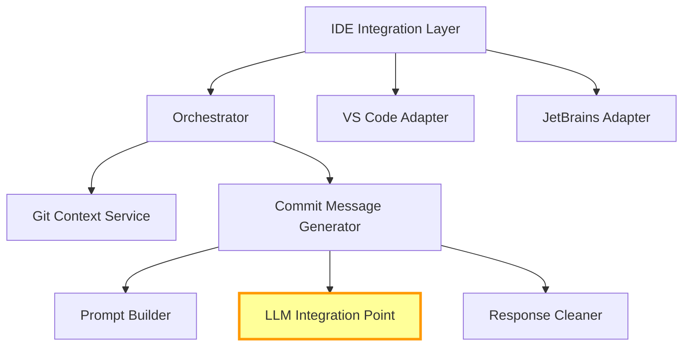

# Commit Message Generation — Reimplementation Guide

## Overview

The commit message generation feature allows users to automatically generate [Conventional Commits](https://www.conventionalcommits.org/) messages from their staged (or unstaged) git changes using an LLM. It is accessible from:

- **VS Code**: The Source Control panel title bar and the command palette (`Kilo Code: Generate Commit Message`)
- **JetBrains**: A button in the commit dialog

The feature collects git context (diffs, branch name, recent commits), builds a prompt, sends it to an LLM, and writes the resulting commit message into the IDE's commit input box.

> **Note:** No screenshots of this feature were found in the repository. A screenshot showing the SCM panel button and generated message would be helpful here.

---

## Architecture

The current implementation has a clean layered architecture that should be preserved. The key change is that the LLM integration layer will use a different calling mechanism — everything else can be largely reused or adapted.

### Layered Design



### Component Responsibilities

| Layer | Component | Responsibility |
|-------|-----------|---------------|
| Entry Point | `registerCommitMessageProvider()` | Wires everything up during extension activation |
| IDE Integration | `CommitMessageProvider` | Registers IDE commands, dispatches to the correct adapter |
| Adapter | `VSCodeCommitMessageAdapter` | VS Code SCM panel progress + writes to input box |
| Adapter | `JetBrainsCommitMessageAdapter` | Returns result string to Kotlin host |
| Orchestrator | `CommitMessageOrchestrator` | Sequences: git discovery → diff collection → AI generation → result delivery |
| Business Logic | `CommitMessageGenerator` | Builds prompt, calls LLM, cleans response |
| Git Operations | `GitExtensionService` | Runs git CLI commands, collects diffs and metadata |
| Utilities | `exclusionUtils` | Filters lock files from diffs |

---

## Components to Implement

### 1. Entry Point — `registerCommitMessageProvider()`

**Responsibility:** Called during extension activation to wire up all components and register commands.

**Reference:** `/Users/mark/dev/kilo/kilocode-5/src/services/commit-message/index.ts`

**Key details:**
- Creates instances of `GitExtensionService`, `CommitMessageGenerator`, `CommitMessageOrchestrator`
- Creates the appropriate adapter(s) based on the IDE environment
- Registers VS Code commands and disposables
- Returns disposables for cleanup

### 2. CommitMessageProvider — Command Router

**Responsibility:** Registers VS Code commands and dispatches generation requests to the correct adapter.

**Reference:** `/Users/mark/dev/kilo/kilocode-5/src/services/commit-message/CommitMessageProvider.ts`

**Interface:**
```typescript
interface CommitMessageProvider {
  // Register VS Code commands and return disposables
  register(): vscode.Disposable[]

  // Handle generation request from either IDE
  handleGenerateRequest(context?: { workspacePath?: string; selectedFiles?: string[] }): Promise<void>
}
```

**Key details:**
- Registers command `kilo-code.vsc.generateCommitMessage` in the `scm/title` menu
- Registers command `kilo-code.jetbrains.generateCommitMessage` for JetBrains RPC
- Determines which adapter to use based on the calling context

### 3. CommitMessageOrchestrator — Workflow Coordinator

**Responsibility:** Sequences the full workflow from git discovery through to delivering the result.

**Reference:** `/Users/mark/dev/kilo/kilocode-5/src/services/commit-message/CommitMessageOrchestrator.ts`

**Interface:**
```typescript
interface CommitMessageOrchestrator {
  generate(options?: {
    workspacePath?: string
    selectedFiles?: string[]
  }): Promise<CommitMessageResult>
}

interface CommitMessageResult {
  message: string
  regenerated: boolean
}
```

**Workflow sequence:**
1. Discover the git repository root
2. Collect git context via `GitExtensionService`
3. Check for re-generation (same diff as last time)
4. Call `CommitMessageGenerator.generateMessage()` with the context
5. Return the result to the adapter for delivery

### 4. CommitMessageGenerator — Business Logic

**Responsibility:** Builds the prompt, calls the LLM, and cleans the response.

**Reference:** `/Users/mark/dev/kilo/kilocode-5/src/services/commit-message/CommitMessageGenerator.ts`

**Interface:**
```typescript
interface CommitMessageGenerator {
  generateMessage(context: GitContext, options?: {
    isRegeneration?: boolean
    previousMessage?: string
  }): Promise<string>
}
```

**Key details:**
- Constructs the prompt using `supportPrompt.create("COMMIT_MESSAGE", ...)` or equivalent
- Loads custom instructions for the "commit" context
- Handles re-generation by prepending "generate a completely different message"
- Calls the LLM (see **Integration Point** below)
- Cleans the response: strips code block markers and surrounding quotes

**Response cleaning logic:**
```typescript
function cleanResponse(raw: string): string {
  let cleaned = raw.trim()
  // Strip code block markers
  cleaned = cleaned.replace(/^```[\w]*\n?/, "").replace(/\n?```$/, "")
  // Strip surrounding quotes
  cleaned = cleaned.replace(/^["']|["']$/g, "")
  return cleaned.trim()
}
```

### 5. GitExtensionService — Git Operations

**Responsibility:** Runs git CLI commands to gather all context needed for prompt construction.

**Reference:** `/Users/mark/dev/kilo/kilocode-5/src/services/commit-message/GitExtensionService.ts`

**Interface:**
```typescript
interface GitContext {
  stagedFiles: FileChange[]
  diffs: Map<string, string>  // filepath → diff content
  branch: string
  recentCommits: string[]     // last 5 commit summaries
}

interface FileChange {
  status: "added" | "modified" | "deleted" | "renamed" | "untracked"
  path: string
}

interface GitExtensionService {
  getGitContext(repoPath: string, selectedFiles?: string[]): Promise<GitContext>
}
```

**See section: [Git Context Gathering](#git-context-gathering) for full details.**

### 6. Exclusion Utilities

**Responsibility:** Filters lock files and ignored files from the diff set.

**Reference:** `/Users/mark/dev/kilo/kilocode-5/src/services/commit-message/exclusionUtils.ts`

**Key details:**
- Uses the `ignore` library to match 60+ lock file patterns
- Patterns include `package-lock.json`, `yarn.lock`, `Cargo.lock`, `poetry.lock`, `pnpm-lock.yaml`, etc.
- Also respects `.kilocode-ignore` / `.roo-ignore` via `RooIgnoreController`

### 7. IDE Adapters

**VS Code Adapter:**

**Reference:** `/Users/mark/dev/kilo/kilocode-5/src/services/commit-message/adapters/VSCodeCommitMessageAdapter.ts`

```typescript
interface VSCodeCommitMessageAdapter {
  generate(orchestrator: CommitMessageOrchestrator): Promise<void>
}
```

- Shows progress via `vscode.window.withProgress(ProgressLocation.SourceControl)`
- Writes result to `repository.inputBox.value`

**JetBrains Adapter:**

**Reference:** `/Users/mark/dev/kilo/kilocode-5/src/services/commit-message/adapters/JetBrainsCommitMessageAdapter.ts`

```typescript
interface JetBrainsCommitMessageAdapter {
  generate(orchestrator: CommitMessageOrchestrator, workspacePath: string, selectedFiles: string[]): Promise<{ message: string }>
}
```

- Returns the message string for the Kotlin host to use

---

## LLM Integration Point

> **⚠️ INTEGRATION POINT — This is the part that will differ from the current implementation.**

### Current Implementation (for reference only)

The current code calls `singleCompletionHandler(config, prompt)` which internally uses `buildApiHandler(apiConfig)` to create a provider-specific handler. If the handler has a `completePrompt()` method, it uses single-shot completion; otherwise it streams and collects the full response. This mechanism **will not be used** in the new implementation.

**Reference:** `/Users/mark/dev/kilo/kilocode-5/src/services/commit-message/CommitMessageGenerator.ts` — see `callAIForCommitMessage()`

### Required Contract

The LLM integration must satisfy this contract:

```typescript
interface CommitMessageLLMProvider {
  /**
   * Send a prompt to the LLM and receive a complete text response.
   *
   * This is a non-streaming, single-shot completion call.
   * The full response must be collected before returning.
   *
   * @param prompt - The complete prompt string including system instructions
   *                 and git context
   * @param config - Which model/provider to use. May be a dedicated
   *                 commit message profile or the default profile.
   * @returns The raw LLM response text (will be cleaned by the caller)
   * @throws If the LLM call fails (network error, auth error, etc.)
   */
  complete(prompt: string, config: LLMConfig): Promise<string>
}

interface LLMConfig {
  /** The API config ID — either `commitMessageApiConfigId` or the default */
  configId: string
  /** Any additional model parameters if needed */
  [key: string]: unknown
}
```

### What the caller provides

- **Input:** A single prompt string (typically 100–2000 tokens depending on diff size). The prompt includes system instructions, git context, and any custom instructions.
- **Config:** An identifier for which API configuration/model to use. This supports the dedicated `commitMessageApiConfigId` setting which lets users pick a different (often cheaper/faster) model for commit messages.

### What the caller expects

- **Output:** A single string containing the commit message. May include code block markers or quotes which will be stripped by the response cleaner.
- **Behavior:** Non-streaming. The call should block until the full response is available.
- **Errors:** Should throw on failure so the orchestrator can catch and display an error to the user.

### Configuration Resolution

The config resolution order is:
1. If `commitMessageApiConfigId` is set in global settings → use that API profile
2. Otherwise → use the default/active API profile

---

## Git Context Gathering

This part is **largely reusable** from the current implementation. It uses `spawnSync` to run git CLI commands.

**Reference:** `/Users/mark/dev/kilo/kilocode-5/src/services/commit-message/GitExtensionService.ts`

### Git Commands Used

| Command | Purpose |
|---------|---------|
| `git diff --name-status --cached` | List staged file changes with status |
| `git status --porcelain` | List all changes (fallback when nothing is staged) |
| `git diff [--cached] -- <file>` | Per-file diff content |
| `git branch --show-current` | Current branch name |
| `git log --oneline -5` | Last 5 commit messages for context |

### File Processing Rules

1. **Lock file exclusion:** Files matching any of the 60+ lock file patterns are excluded (see `exclusionUtils`)
2. **Ignore file exclusion:** Files matching `.kilocode-ignore` / `.roo-ignore` patterns are excluded via `shouldIncludeFile()`
3. **Binary files:** Replaced with placeholder text `"Binary file <path> has been modified"`
4. **Untracked files:** Replaced with placeholder text `"New untracked file: <path>"`
5. **Staged vs unstaged:** Prefers staged changes (`--cached`); falls back to all changes if nothing is staged
6. **Selected files (JetBrains):** When the JetBrains adapter provides `selectedFiles`, only those files are included

### Fallback Behavior

If no staged changes exist, the service falls back to `git status --porcelain` to capture all modified/untracked files. This ensures the feature works even when users haven't explicitly staged changes.

---

## Prompt Engineering

### Prompt Template

The prompt is built using `supportPrompt.create("COMMIT_MESSAGE", { gitContext, customInstructions })`. The template is a ~70-line Conventional Commits guide that includes:

1. **System instruction:** You are a commit message generator following Conventional Commits format
2. **Format specification:** `type(scope): description` with allowed types (`feat`, `fix`, `docs`, `style`, `refactor`, `perf`, `test`, `build`, `ci`, `chore`, `revert`)
3. **Rules:** Keep subject under 72 chars, use imperative mood, no period at end, etc.
4. **Git context injection:** Branch name, recent commits, file changes, diffs
5. **Custom instructions:** User-defined instructions from `.kilocode/rules/` for the "commit" context

### Custom Instructions

Custom instructions are loaded via `addCustomInstructions()` for the `"commit"` mode context. Users can place files in `.kilocode/rules/` that apply to commit message generation.

### Re-generation Logic

When the user requests a new message for the same diff:

1. The orchestrator detects that the diff hash matches the previous generation
2. It prepends to the prompt: `"GENERATE A COMPLETELY DIFFERENT COMMIT MESSAGE. The previous message was: <previous_message>"`
3. This ensures variety when the user isn't satisfied with the first suggestion

### Prompt Template Override

Users can override the entire prompt template via the `customSupportPrompts.COMMIT_MESSAGE` setting. This allows complete customization of the commit message format and style.

---

## IDE Integration

### VS Code

**Command registration:**
```typescript
// In package.json contributes.commands
{ "command": "kilo-code.vsc.generateCommitMessage", "title": "Generate Commit Message" }

// In package.json contributes.menus
{ "scm/title": [{ "command": "kilo-code.vsc.generateCommitMessage" }] }
```

**Progress reporting:**
```typescript
await vscode.window.withProgress(
  { location: vscode.ProgressLocation.SourceControl, title: "Generating commit message..." },
  async () => { /* ... generation logic ... */ }
)
```

**Result delivery:**
```typescript
repository.inputBox.value = generatedMessage
```

**Reference:** `/Users/mark/dev/kilo/kilocode-5/src/services/commit-message/adapters/VSCodeCommitMessageAdapter.ts`

### JetBrains

**Kotlin side:** A `CommitMessageHandler` adds a button to the commit dialog. When clicked, it sends an RPC command.

**RPC command:** `kilo-code.jetbrains.generateCommitMessage` with arguments `[workspacePath, selectedFiles]`

**Result delivery:** The result is returned via RPC to Kotlin which calls `panel.setCommitMessage(result.message)`

**Reference:** `/Users/mark/dev/kilo/kilocode-5/src/services/commit-message/adapters/JetBrainsCommitMessageAdapter.ts`

---

## Configuration

| Setting | Type | Description |
|---------|------|-------------|
| `commitMessageApiConfigId` | `string` | ID of a dedicated API profile for commit messages. Allows using a cheaper/faster model. |
| `customSupportPrompts.COMMIT_MESSAGE` | `string` | Override the entire commit message prompt template |
| Custom instructions in `.kilocode/rules/` | files | Per-project or global instructions applied to the "commit" context |
| `.kilocode-ignore` / `.roo-ignore` | files | File exclusion patterns — excluded files won't appear in diffs |

### Settings UI

**Reference:** `/Users/mark/dev/kilo/kilocode-5/webview-ui/src/components/settings/CommitMessagePromptSettings.tsx`

A dropdown in the Settings panel allows users to select which API configuration to use for commit messages. This is separate from the main chat model selection.

---

## Error Handling

### Edge Cases to Handle

| Scenario | Handling |
|----------|----------|
| No git repository found | Show error message: "No git repository found in the current workspace" |
| No changes detected | Show info message: "No changes to generate a commit message for" |
| Empty diff after filtering | Show info message: "All changed files are excluded by lock file or ignore rules" |
| LLM call fails (network/auth) | Show error with details; do not write to input box |
| LLM returns empty response | Retry once; if still empty, show error |
| Very large diff (token limit) | Truncate diffs, prioritize staged files, include file names even if diffs are cut |
| Git command fails | Log the error, attempt to continue with partial context |
| User cancels during progress | Abort the LLM call if possible, clean up gracefully |
| Binary files in diff | Replace with placeholder text instead of including binary content |
| Concurrent generation requests | Debounce or queue — don't send multiple simultaneous LLM requests |

### Error Display

- **VS Code:** Use `vscode.window.showErrorMessage()` or `showInformationMessage()` as appropriate
- **JetBrains:** Return error in the RPC response for Kotlin-side display

---

## Testing Strategy

### Unit Tests

**Reference for existing tests:**
- `/Users/mark/dev/kilo/kilocode-5/src/services/commit-message/__tests__/CommitMessageGenerator.spec.ts`
- `/Users/mark/dev/kilo/kilocode-5/src/services/commit-message/__tests__/GitExtensionService.spec.ts`
- `/Users/mark/dev/kilo/kilocode-5/src/services/commit-message/__tests__/progress-reporting.spec.ts`

| Component | What to Test |
|-----------|-------------|
| `CommitMessageGenerator` | Prompt construction, response cleaning, re-generation logic, custom instructions injection |
| `GitExtensionService` | Parsing of `git diff --name-status` output, `git status --porcelain` output, branch name extraction, handling of binary files and untracked files |
| `exclusionUtils` | Lock file pattern matching — ensure all 60+ patterns work, edge cases with nested paths |
| `CommitMessageOrchestrator` | Full workflow sequencing, re-generation detection, error propagation |
| `VSCodeCommitMessageAdapter` | Progress reporting, writing to input box, error display |
| `JetBrainsCommitMessageAdapter` | Correct return format, error handling |
| Response cleaner | Stripping code blocks, quotes, whitespace normalization |

### Integration Tests

| Test | Description |
|------|-------------|
| Full generation flow | Mock the LLM call, verify end-to-end from git context to result delivery |
| Re-generation | Verify that requesting a new message for the same diff includes the "different message" instruction |
| Config resolution | Verify `commitMessageApiConfigId` is used when set, falls back to default otherwise |
| Large diff handling | Verify truncation behavior with oversized diffs |

### Mocking Strategy

- **Git commands:** Mock `spawnSync` to return predefined git output
- **LLM calls:** Mock the LLM integration point to return controlled responses
- **VS Code API:** Mock `vscode.window.withProgress`, `repository.inputBox`, and command registration
- **File system:** Mock ignore file reading for exclusion tests

### Test File Convention

Per project convention, test files should use `.spec.ts` extension and live in `__tests__/` directories adjacent to the source code.
