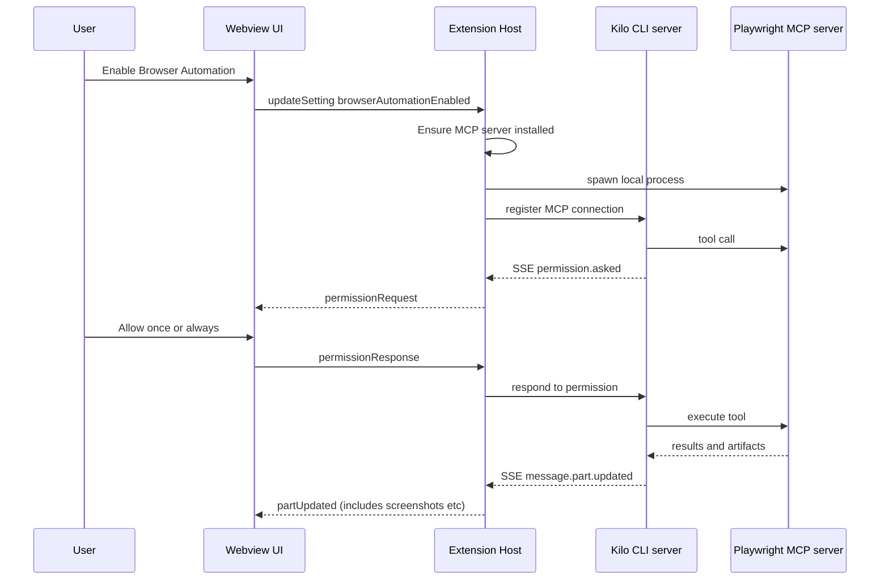

# Plan: Integrated Playwright MCP (local, Cursor-like Chrome window)

## Goal

Provide browser automation via a Playwright-based MCP server **without** telling users to manually install MCP. Users opt-in via settings; the extension handles installation/downloads and lifecycle. Automation drives **system Chrome** in a visible external window (Cursor-like).

## v1 scope decisions (confirmed)

- UX: **A) agent-only tool** (no dedicated browser panel beyond an enable toggle + progress/error messaging).
- Browser profile scope: **per-session** (isolated).
- Domain allowlist: **postpone to v2**.

## Current repo reality check (what exists today)

- The extension talks to a bundled CLI backend started by [`ServerManager.getServer()`](src/services/cli-backend/server-manager.ts:22) and routed through [`KiloProvider.setupWebviewMessageHandler()`](src/KiloProvider.ts:142).
- Tool/permission prompting appears to be driven by CLI SSE events like `permission.asked` and webview responses handled in [`KiloProvider.handlePermissionResponse()`](src/KiloProvider.ts:694).
- There is a placeholder settings tab for browser automation: [`BrowserTab`](webview-ui/src/components/settings/BrowserTab.tsx:1) is not implemented.
- There are docs placeholders for browser session UI but no implementation yet: [`browser-session-controls.md`](docs/chat-ui-features/browser-session-controls.md:1).

Implication: a Playwright MCP integration should ideally plug into the **existing CLI tool execution + permission model**, not invent a parallel tool runtime in the extension.

## Non-goals (initial iteration)

- No remote MCP servers.
- No full embedded browser inside VS Code webviews (hard + CSP + perf). We only need agent-driven automation and (optionally) a minimal status UI.
- No multi-browser matrix; start with Chromium via system Chrome.

---

## Proposed architecture (recommended)

### High-level idea

1. User enables a setting (Browser Automation / Playwright).
2. Extension ensures a **local Playwright MCP server** is available:
   - first-run download/install step (transparent, branded, with progress UI).
   - persisted under extension `globalStorage`.
3. Extension registers/attaches that MCP server with the CLI backend’s MCP hub (preferred), so the agent can call Playwright tools through the existing CLI tool routing and permission prompts.

### Why this architecture

- Keeps one unified permission and tool execution pipeline (the CLI already emits `permission.asked` which the extension UI handles in [`KiloProvider.handleSSEEvent()`](src/KiloProvider.ts:823)).
- Avoids fragile “tool execution in extension host” duplication.
- Keeps all compute local.

### Mermaid: control and data flow

---

## Playwright behavior: Cursor-like external Chrome window

Yes, this is feasible.

Two workable patterns:

1. **Launch system Chrome with Playwright** (simplest UX)
   - Use Playwright Chromium with `channel=chrome` and `headless=false`.
   - Pros: no need to attach to an already-running Chrome; stable.
   - Cons: still requires Playwright node package; may require browser install depending on version, but we can prefer system Chrome.

2. **Connect over CDP** (advanced, more Cursor-like under the hood)
   - Launch Chrome ourselves with a remote debugging port and connect.
   - Pros: can more closely mimic CDP tooling.
   - Cons: port management, process lifecycle, profile directory mgmt.

Recommendation: start with (1), add (2) later if needed.

---

## Packaging / installation strategy (no manual MCP install)

Constraints:

- Shipping Playwright inside the VS Code extension bundle can bloat download size significantly.

Recommended strategy:

- Add a lightweight “installer” that, upon enablement, downloads:
  - the Playwright MCP server JS bundle (or npm tarball), and
  - any required runtime deps,
  into `context.globalStorageUri`.
- Surface progress via:
  - a webview spinner + status text, and
  - a VS Code progress notification.

User-facing wording should be explicit but branded:

- “Downloading browser automation components…”
- “This may download ~XYZ MB the first time.”

Implementation detail options (choose based on what Playwright MCP actually ships as):

- **Option A (preferred):** vendor a prebundled single-file server (esbuild) and download only a versioned artifact.
- **Option B:** run via `npx` internally (still “installing”, but hidden). This can be acceptable if:
  - it installs into globalStorage, not user project,
  - it is initiated only after explicit enablement, and
  - UX messaging never mentions MCP.

---

## Settings + UX plan

### New settings (v1)

Add configuration keys in [`package.json`](package.json:114):

- `kilo-code.new.browserAutomation.enabled` (boolean, default false)
- `kilo-code.new.browserAutomation.useSystemChrome` (boolean, default true)
- `kilo-code.new.browserAutomation.headless` (boolean, default false)
- `kilo-code.new.browserAutomation.downloadPolicy` (enum: onEnable, never)
- `kilo-code.new.browserAutomation.profileScope` (enum: perSession, perWorkspace)

### Webview Settings UI

Implement minimal controls in [`BrowserTab`](webview-ui/src/components/settings/BrowserTab.tsx:1) using `@kilocode/kilo-ui` components (per [`AGENTS.md`](AGENTS.md:1)):

- Enable toggle
- Status text
- Progress UI when downloading
- Error + Retry

UI states:

- Disabled (default)
- Enabling… (download in progress)
- Enabled + Ready
- Error + Retry

---

## Integration point: CLI MCP hub

This plan assumes the CLI backend can:

1. create/manage MCP connections (local stdio),
2. expose them as tools to the agent runtime,
3. route tool calls through the existing permission model.

Docs hint MCP hub is implemented elsewhere in the monorepo (outside this package): [`mcp-and-mcp-hub.md`](docs/non-agent-features/mcp-and-mcp-hub.md:1).

### Work required to validate

- Inspect the CLI backend HTTP API in [`http-client.ts`](src/services/cli-backend/http-client.ts:1) and types in [`types.ts`](src/services/cli-backend/types.ts:1) to see if MCP endpoints already exist.
- If not present: coordinate changes in the CLI backend (likely outside this package) to add endpoints such as:
  - `POST /mcp/connections` (create)
  - `GET /mcp/connections` (status)
  - `DELETE /mcp/connections/:id`

---

## Security posture (baseline)

- Always run locally.
- Domain allowlist enforced at the tool layer (preferably inside CLI runtime so models cannot bypass it).
- Store browser profile/data under extension `globalStorage`.
- Default to a fresh, isolated profile per session or per workspace.

---

## Execution todo list (v1)

- [ ] **Discovery (blocking)**: confirm what MCP hub APIs exist in the CLI backend via [`http-client.ts`](src/services/cli-backend/http-client.ts:1) and [`types.ts`](src/services/cli-backend/types.ts:1).
- [ ] **Packaging strategy (blocking)**: choose between:
  - [ ] prebundled Playwright MCP server artifact downloaded into extension `globalStorage`, or
  - [ ] internal `npx`-style install into `globalStorage` (no project-level installs).
- [ ] **Settings schema**: add `kilo-code.new.browserAutomation.*` keys in [`package.json`](package.json:114).
- [ ] **Webview settings UI**: implement minimal enable/progress/error controls in [`BrowserTab`](webview-ui/src/components/settings/BrowserTab.tsx:1).
- [ ] **Extension lifecycle manager** (new service)
  - [ ] resolve install dir under `context.globalStorageUri`
  - [ ] download/install with progress + cancellation
  - [ ] spawn/stop MCP server process (stdio transport)
  - [ ] record installed version + health status
- [ ] **CLI hookup**
  - [ ] when enabled, register MCP connection with the CLI MCP hub
  - [ ] on disable/uninstall, unregister + stop process
  - [ ] reconnect logic on CLI restart (see [`ServerManager.getServer()`](src/services/cli-backend/server-manager.ts:22))
- [ ] **System Chrome visible window**
  - [ ] default Playwright launch config: `headless=false` + `channel=chrome`
  - [ ] per-session profile directory (under globalStorage)
- [ ] **Smoke tests**
  - [ ] macOS: launch system Chrome and observe visible window
  - [ ] failure modes: Chrome missing, download blocked, spawn fails

---

## Open questions (deferred)

1. Domain allowlist UX (simple list vs wildcards, per-workspace overrides).
2. Whether to add minimal browser session controls in chat UI beyond permission prompts (see [`browser-session-controls.md`](docs/chat-ui-features/browser-session-controls.md:1)).

