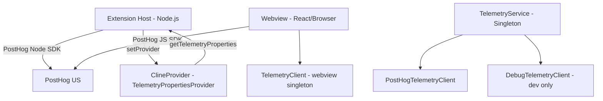
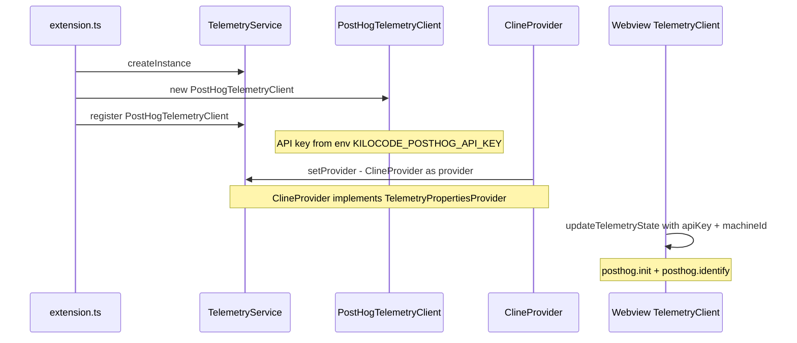

# Telemetry Implementation Plan

## Architecture Overview

The extension uses a **dual-layer telemetry architecture**: server-side (PostHog Node SDK in the extension host) and client-side (PostHog JS in the webview). Both layers communicate with PostHog US (`https://us.i.posthog.com`).



---

## 1. Core Components

### 1.1 `TelemetryService` — Singleton Facade

**File:** `packages/telemetry/src/TelemetryService.ts`

- Created once at extension activation via `TelemetryService.createInstance()`
- Holds an array of `TelemetryClient` implementations
- Exposes typed convenience methods for each event: `captureTaskCreated()`, `captureLlmCompletion()`, etc.
- Also handles: `captureException()`, `updateIdentity()`, `updateTelemetryState()`, `shutdown()`

### 1.2 `BaseTelemetryClient` — Abstract Base

**File:** `packages/telemetry/src/BaseTelemetryClient.ts`

- Holds a `WeakRef` to a `TelemetryPropertiesProvider` (the `ClineProvider`)
- Implements event subscription/filtering (include/exclude lists via `TelemetryEventSubscription`)
- Implements property filtering via `isPropertyCapturable()` — subclasses can override
- Merges provider properties with event-specific properties via `getEventProperties()`

### 1.3 `PostHogTelemetryClient` — Production Client

**File:** `packages/telemetry/src/PostHogTelemetryClient.ts`

- Uses `posthog-node` SDK
- **Distinct ID**: defaults to `vscode.env.machineId`, upgrades to user email when authenticated via `updateIdentity()`
- **Privacy filters**: 
  - Git properties (`repositoryUrl`, `repositoryName`, `defaultBranch`) always filtered
  - Error details (`errorMessage`, `cliPath`, `stderrPreview`) filtered for organization users
- **Opt-in logic**: Requires BOTH VSCode global telemetry level = `"all"` AND user opt-in
- **Event exclusions**: `TASK_MESSAGE` is excluded from PostHog (too verbose)
- **Exception capture**: `captureException()` sends structured errors to PostHog

### 1.4 `DebugTelemetryClient` — Development Client

**File:** `packages/telemetry/src/DebugTelemetryClient.ts`

- Always enabled, logs to console
- Registered only in `NODE_ENV === "development"`

### 1.5 `TelemetryClient` (Webview) — Browser-side PostHog

**File:** `webview-ui/src/utils/TelemetryClient.ts`

- Uses `posthog-js` (browser SDK)
- Initialized with API key from extension state, distinct ID = `machineId`
- Used for frontend-specific events (tab views, button clicks, marketplace interactions)

---

## 2. Initialization Flow



**Key code paths:**

1. `extension.ts:119` — `TelemetryService.createInstance()`
2. `extension.ts:133` — `new PostHogTelemetryClient()` registered
3. `ClineProvider` constructor — `TelemetryService.instance.setProvider(this)`
4. Extension shutdown — `TelemetryService.instance.shutdown()`

---

## 3. Telemetry Events

All events are defined in `TelemetryEventName` enum (`packages/types/src/telemetry.ts`). Here are the categories:

### 3.1 Task Lifecycle

| Event | Properties | Capture Method |
|-------|-----------|-------------|
| `Task Created` | `taskId` | `captureTaskCreated()` |
| `Task Reopened` | `taskId` | `captureTaskRestarted()` |
| `Task Completed` | `taskId` | `captureTaskCompleted()` |
| `Conversation Message` | `taskId`, `source` (user/assistant) | `captureConversationMessage()` |

### 3.2 LLM & AI

| Event | Properties |
|-------|-----------|
| `LLM Completion` | `taskId`, `inputTokens`, `outputTokens`, `cacheWriteTokens`, `cacheReadTokens`, `cost`, `completionTime`, `inferenceProvider` |
| `Context Condensed` | `taskId`, `isAutomaticTrigger`, `usedCustomPrompt`, `usedCustomApiHandler` |
| `Sliding Window Truncation` | `taskId` |

### 3.3 Tools & Modes

| Event | Properties |
|-------|-----------|
| `Tool Used` | `taskId`, `tool`, `toolProtocol` |
| `Mode Switched` | `taskId`, `newMode` |
| `Mode Setting Changed` | `settingName` |
| `Custom Mode Created` | `modeSlug`, `modeName` |
| `Code Action Used` | `actionType` |

### 3.4 Checkpoints

| Event | Properties |
|-------|-----------|
| `Checkpoint Created` | `taskId` |
| `Checkpoint Restored` | `taskId` |
| `Checkpoint Diffed` | `taskId` |

### 3.5 UI Interactions

| Event | Properties |
|-------|-----------|
| `Tab Shown` | `tab` |
| `Title Button Clicked` | `button` |
| `Prompt Enhanced` | `taskId` (optional) |

### 3.6 Marketplace

| Event | Properties |
|-------|-----------|
| `Marketplace Item Installed` | `itemId`, `itemType`, `itemName`, `target`, additional props |
| `Marketplace Item Removed` | `itemId`, `itemType`, `itemName`, `target` |

### 3.7 Account & Auth

| Event | Properties |
|-------|-----------|
| `Account Connect Clicked` | — |
| `Account Connect Success` | — |
| `Account Logout Clicked` | — |
| `Account Logout Success` | — |

### 3.8 Error Tracking

| Event | Properties |
|-------|-----------|
| `Schema Validation Error` | `schemaName`, `error` (Zod formatted) |
| `Diff Application Error` | `taskId`, `consecutiveMistakeCount` |
| `Shell Integration Error` | `taskId` |
| `Consecutive Mistake Error` | `taskId` |
| Exceptions via `captureException()` | Structured via `ApiProviderError` and `ConsecutiveMistakeError` |

### 3.9 Autocomplete (Kilo-specific)

| Event | Properties |
|-------|-----------|
| `Autocomplete Suggestion Requested` | `languageId`, `modelId`, `provider`, `autocompleteType` |
| `Autocomplete LLM Request Completed` | `latencyMs`, `cost`, `inputTokens`, `outputTokens`, context |
| `Autocomplete LLM Request Failed` | `latencyMs`, `error`, context |
| `Autocomplete LLM Suggestion Returned` | context, `suggestionLength` |
| `Autocomplete Suggestion Cache Hit` | `matchType`, `suggestionLength`, context |
| `Autocomplete Accept Suggestion` | `suggestionLength` |
| `Autocomplete Suggestion Filtered` | `reason`, context |
| `Autocomplete Unique Suggestion Shown` | context (only after 300ms visibility) |

### 3.10 Other (Kilo-specific)

- `Commit Message Generated`
- `Agent Manager Opened/Session Started/Session Completed/Session Stopped/Session Error/Login Issue`
- `Auto Purge Started/Completed/Failed`, `Manual Purge Triggered`
- `Webview Memory Usage`, `Memory Warning Shown`
- `Ask Approval`
- `Notification Clicked`
- `Suggestion Button Clicked`
- `Free Models Link Clicked`, `Create Organization Link Clicked`
- `Ghost Service Disabled`

---

## 4. Properties Attached to Every Event

Every event gets enriched with properties from `ClineProvider.getTelemetryProperties()`:

### Static App Properties (computed once)

- `appName`, `appVersion`, `vscodeVersion`, `platform`, `editorName`
- `wrapped`, `wrapper`, `wrapperCode`, `wrapperVersion`, `wrapperTitle` — wrapper/IDE detection
- `machineId`, `vscodeIsTelemetryEnabled`

### Dynamic Properties (per-event)

- `language`, `mode`, `taskId`, `parentTaskId`, `apiProvider`, `modelId`, `diffStrategy`, `isSubtask`
- `currentTaskSize`, `taskHistorySize`, `toolStyle` (XML vs native)
- `todos` object: `{ total, completed, inProgress, pending }`
- `memory` (process memory usage)
- `fastApply` settings, `openRouter` routing config, `autoApprove` settings
- `kilocodeOrganizationId` (when present)

### Git Properties (computed once)

- `repositoryUrl`, `repositoryName`, `defaultBranch` (filtered out before sending by PostHog client)

---

## 5. Privacy & Consent

### User Opt-in Model

- Three states: `"unset"`, `"enabled"`, `"disabled"` (see `TelemetrySetting` type)
- Telemetry enabled only when: **VSCode telemetry level = "all"** AND **user setting ≠ "disabled"**
- Wrapper apps can force telemetry enabled via environment variable

### Identity Management

- Default: `vscode.env.machineId` (anonymous)
- Authenticated: user email fetched from `api.kilo.ai/api/profile` via `updateIdentity()`
- Identity updates are race-safe (counter-based)

### Data Filtering

- Git repository info is **always** stripped before sending
- Error details and file paths are stripped for **organization** users
- `TASK_MESSAGE` events are excluded from PostHog (contain full conversation)
- Expected API errors (429, 402) are not reported via `shouldReportApiErrorToTelemetry()`

---

## 6. Structured Error Classes

The extension defines reusable error classes for structured exception tracking:

### `ApiProviderError`

```typescript
class ApiProviderError extends Error {
  provider: string
  modelId: string
  operation: string
  errorCode?: number
}
```

### `ConsecutiveMistakeError`

```typescript
class ConsecutiveMistakeError extends Error {
  taskId: string
  consecutiveMistakeCount: number
  consecutiveMistakeLimit: number
  reason: "no_tools_used" | "tool_repetition" | "unknown"
  provider?: string
  modelId?: string
}
```

Both have type guards (`isApiProviderError()`, `isConsecutiveMistakeError()`) and property extractors for telemetry.

---

## 7. Implementation Recommendations for New Extension

1. **Use PostHog** as the analytics backend — the extension uses `posthog-node` server-side and `posthog-js` client-side
2. **Singleton service pattern** — single `TelemetryService` instance, multiple pluggable clients
3. **Properties provider pattern** — the main provider class implements `TelemetryPropertiesProvider` to inject context
4. **Typed events** — all event names in an enum, with typed capture methods on the service
5. **Event subscription/filtering** — clients can include/exclude specific events
6. **Property filtering** — per-client property filtering (privacy controls)
7. **Dual opt-in** — respect both IDE-level and extension-level telemetry settings
8. **Identity upgrade** — anonymous by default, upgrade to user identity on auth
9. **Graceful degradation** — never crash on telemetry failures; all capture calls are fire-and-forget
10. **Debug client** — separate console-logging client for development

---

## 8. Package Dependencies

### Server-side (Extension Host)

- `posthog-node` — PostHog Node.js SDK

### Client-side (Webview)

- `posthog-js` — PostHog browser SDK

### Shared Types

- `zod` — for schema validation of telemetry properties
