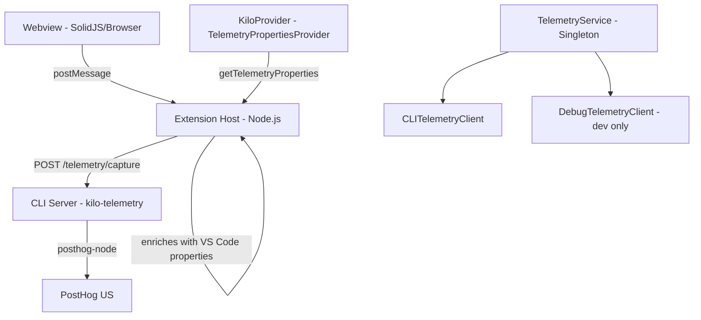
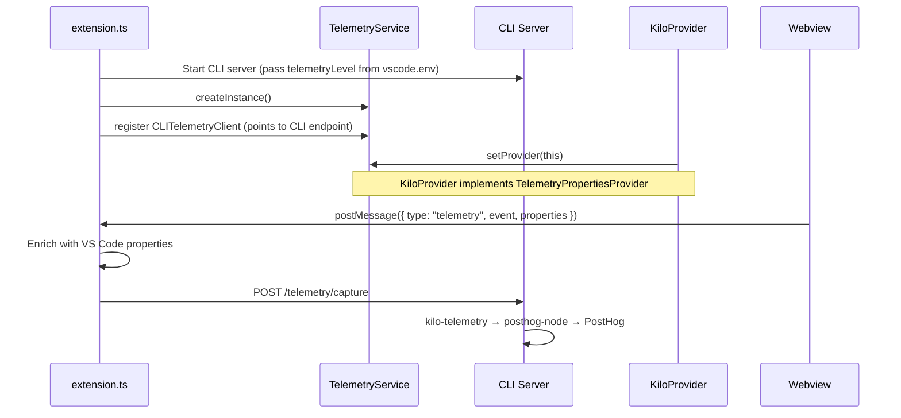

# Telemetry Implementation Plan

## Architecture Overview

The extension uses a **proxy-based telemetry architecture**: all telemetry flows through the CLI's `kilo-telemetry` package, which uses `posthog-node` internally. The extension host and webview never talk to PostHog directly.



---

## Architecture — New Extension

Key architectural decisions for telemetry in the new extension:

1. **CLI/core owns all telemetry sending** — The `kilo-telemetry` package (which uses `posthog-node` internally) is the single point of contact with PostHog. Neither the extension host nor the webview include any PostHog SDK.

2. **Extension proxies UI events through CLI** — The extension host forwards telemetry events to the CLI via `POST /telemetry/capture`. The CLI enriches them with server-side context and sends to PostHog.

3. **Webview sends events via `postMessage`** — The webview has no PostHog SDK. Instead, it fires `postMessage({ type: "telemetry", event, properties })` to the extension host, which enriches the event with VS Code properties and forwards to the CLI endpoint.

4. **VS Code telemetry consent is the master kill switch** — `vscode.env.telemetryLevel` is passed as a startup parameter to the CLI server. If VS Code telemetry is disabled, the CLI suppresses all PostHog sending.

5. **Same PostHog project as old extension** — Events go to the same PostHog project. Old vs new extension events are distinguished via properties (e.g., `extensionVersion`, `architecture: "new"`).

6. **All events from old plan are kept** — Every event category is preserved, including autocomplete, agent manager, marketplace, and memory tracking events.

---

## 1. Core Components

Telemetry is split across two layers: the **CLI** (which owns all agent/LLM/tool events) and the **extension** (which captures UI-only events and proxies them to the CLI).

### 1.1 Extension-side: `TelemetryProxy` — Simple Singleton

A single class that captures UI events from the extension host and webview, then forwards them to the CLI.

- One singleton instance, created at extension activation
- `capture(event, properties)` — sends to CLI via `POST /telemetry/capture` and logs to `console.log`
- Receives webview events via `postMessage` handler
- Enriches all events with VS Code properties (`vscodeVersion`, `editorName`, `machineId`)
- No inheritance, no pluggable backends, no abstract classes
- Respects `vscode.env.telemetryLevel` — if disabled, `capture()` is a no-op

### 1.2 CLI-side: `kilo-telemetry` Package

Already exists at `packages/kilo-telemetry/`. Handles:

- All PostHog communication (`posthog-node`)
- OpenTelemetry integration for AI SDK spans
- Identity management (machineId → email upgrade on auth)
- Privacy filtering (git info stripped, error details filtered for org users)
- The `POST /telemetry/capture` endpoint (to be added) routes through this package

### 1.5 Webview Telemetry — `postMessage` Proxy

**File:** `webview-ui/src/utils/telemetry.ts`

The webview does **not** use any PostHog SDK. Instead:

1. The webview calls a thin helper that fires `postMessage({ type: "telemetry", event, properties })` to the extension host.
2. The extension host receives the message, enriches it with VS Code-specific properties (from `KiloProvider.getTelemetryProperties()`), and forwards the event to the CLI via `POST /telemetry/capture`.
3. The CLI's `kilo-telemetry` package sends the event to PostHog.

This keeps the webview dependency-free for analytics and ensures all telemetry flows through a single, auditable path.

---

## 2. Initialization Flow



**Key code paths:**

1. `extension.ts` — Start CLI server with `telemetryLevel` from `vscode.env.telemetryLevel`
2. `extension.ts` — `TelemetryService.createInstance()`, register `CLITelemetryClient`
3. `KiloProvider` constructor — `TelemetryService.instance.setProvider(this)`
4. Webview posts telemetry messages via `postMessage` → extension host → CLI
5. Extension shutdown — `TelemetryService.instance.shutdown()`

---

## 3. Telemetry Events

All events are defined in `TelemetryEventName` enum (`packages/types/src/telemetry.ts`). Here are the categories:

### 3.1 Task Lifecycle

| Event                  | Properties                          | Capture Method                 |
| ---------------------- | ----------------------------------- | ------------------------------ |
| `Task Created`         | `taskId`                            | `captureTaskCreated()`         |
| `Task Reopened`        | `taskId`                            | `captureTaskRestarted()`       |
| `Task Completed`       | `taskId`                            | `captureTaskCompleted()`       |
| `Conversation Message` | `taskId`, `source` (user/assistant) | `captureConversationMessage()` |

### 3.2 LLM & AI

| Event                       | Properties                                                                                                                    |
| --------------------------- | ----------------------------------------------------------------------------------------------------------------------------- |
| `LLM Completion`            | `taskId`, `inputTokens`, `outputTokens`, `cacheWriteTokens`, `cacheReadTokens`, `cost`, `completionTime`, `inferenceProvider` |
| `Context Condensed`         | `taskId`, `isAutomaticTrigger`, `usedCustomPrompt`, `usedCustomApiHandler`                                                    |
| `Sliding Window Truncation` | `taskId`                                                                                                                      |

### 3.3 Tools & Modes

| Event                  | Properties                       |
| ---------------------- | -------------------------------- |
| `Tool Used`            | `taskId`, `tool`, `toolProtocol` |
| `Mode Switched`        | `taskId`, `newMode`              |
| `Mode Setting Changed` | `settingName`                    |
| `Custom Mode Created`  | `modeSlug`, `modeName`           |
| `Code Action Used`     | `actionType`                     |

### 3.4 Checkpoints

| Event                 | Properties |
| --------------------- | ---------- |
| `Checkpoint Created`  | `taskId`   |
| `Checkpoint Restored` | `taskId`   |
| `Checkpoint Diffed`   | `taskId`   |

### 3.5 UI Interactions

| Event                  | Properties          |
| ---------------------- | ------------------- |
| `Tab Shown`            | `tab`               |
| `Title Button Clicked` | `button`            |
| `Prompt Enhanced`      | `taskId` (optional) |

### 3.6 Marketplace

| Event                        | Properties                                                   |
| ---------------------------- | ------------------------------------------------------------ |
| `Marketplace Item Installed` | `itemId`, `itemType`, `itemName`, `target`, additional props |
| `Marketplace Item Removed`   | `itemId`, `itemType`, `itemName`, `target`                   |

### 3.7 Account & Auth

| Event                     | Properties |
| ------------------------- | ---------- |
| `Account Connect Clicked` | —          |
| `Account Connect Success` | —          |
| `Account Logout Clicked`  | —          |
| `Account Logout Success`  | —          |

### 3.8 Error Tracking

| Event                               | Properties                                                      |
| ----------------------------------- | --------------------------------------------------------------- |
| `Schema Validation Error`           | `schemaName`, `error` (Zod formatted)                           |
| `Diff Application Error`            | `taskId`, `consecutiveMistakeCount`                             |
| `Shell Integration Error`           | `taskId`                                                        |
| `Consecutive Mistake Error`         | `taskId`                                                        |
| Exceptions via `captureException()` | Structured via `ApiProviderError` and `ConsecutiveMistakeError` |

### 3.9 Autocomplete (Kilo-specific)

| Event                                  | Properties                                                  |
| -------------------------------------- | ----------------------------------------------------------- |
| `Autocomplete Suggestion Requested`    | `languageId`, `modelId`, `provider`, `autocompleteType`     |
| `Autocomplete LLM Request Completed`   | `latencyMs`, `cost`, `inputTokens`, `outputTokens`, context |
| `Autocomplete LLM Request Failed`      | `latencyMs`, `error`, context                               |
| `Autocomplete LLM Suggestion Returned` | context, `suggestionLength`                                 |
| `Autocomplete Suggestion Cache Hit`    | `matchType`, `suggestionLength`, context                    |
| `Autocomplete Accept Suggestion`       | `suggestionLength`                                          |
| `Autocomplete Suggestion Filtered`     | `reason`, context                                           |
| `Autocomplete Unique Suggestion Shown` | context (only after 300ms visibility)                       |

### 3.10 Other (Kilo-specific)

- `Commit Message Generated`
- `Agent Manager Opened/Session Started/Session Completed/Session Stopped/Session Error/Login Issue`
- `Auto Purge Started/Completed/Failed`, `Manual Purge Triggered`
- `Webview Memory Usage`, `Memory Warning Shown`
- `Ask Approval`
- `Notification Clicked`
- `Suggestion Button Clicked`
- `Free Models Link Clicked`, `Create Organization Link Clicked`
- `Ghost Service Disabled`

---

## 4. Properties Attached to Every Event

Every event gets enriched with properties from `KiloProvider.getTelemetryProperties()`:

### Static App Properties (computed once)

- `appName`, `appVersion`, `vscodeVersion`, `platform`, `editorName`
- `wrapped`, `wrapper`, `wrapperCode`, `wrapperVersion`, `wrapperTitle` — wrapper/IDE detection
- `machineId`, `vscodeIsTelemetryEnabled`

### Dynamic Properties (per-event)

- `language`, `mode`, `taskId`, `parentTaskId`, `apiProvider`, `modelId`, `diffStrategy`, `isSubtask`
- `currentTaskSize`, `taskHistorySize`, `toolStyle` (XML vs native)
- `todos` object: `{ total, completed, inProgress, pending }`
- `memory` (process memory usage)
- `fastApply` settings, `openRouter` routing config, `autoApprove` settings
- `kilocodeOrganizationId` (when present)

### Git Properties (computed once)

- `repositoryUrl`, `repositoryName`, `defaultBranch` (filtered out before sending by telemetry client)

---

## 5. Privacy & Consent

### User Opt-in Model

- Three states: `"unset"`, `"enabled"`, `"disabled"` (see `TelemetrySetting` type)
- Full telemetry enabled only when: **VS Code telemetry level = `"all"`** AND **user setting ≠ `"disabled"`**
- Wrapper apps can force telemetry enabled via environment variable

### VS Code Telemetry Level as Master Control

`vscode.env.telemetryLevel` is passed as a startup parameter to the CLI server.

Telemetry is only active when `vscode.env.telemetryLevel` is `"all"`. Any other level (`"off"`, `"crash"`, `"error"`) disables all telemetry — the CLI startup parameter will indicate telemetry is disabled and no events will be sent.

This ensures the user's VS Code telemetry preference is respected across the entire stack — webview, extension host, and CLI.

### Identity Management

- Default: `vscode.env.machineId` (anonymous)
- Authenticated: user email fetched from `api.kilo.ai/api/profile` via `updateIdentity()`
- Identity updates are race-safe (counter-based)

### Data Filtering

- Git repository info is **always** stripped before sending
- Error details and file paths are stripped for **organization** users
- `TASK_MESSAGE` events are excluded from PostHog (contain full conversation)
- Expected API errors (429, 402) are not reported via `shouldReportApiErrorToTelemetry()`

### Identity Continuity (Old → New Extension)

Users switching from the old extension to the new one must not appear as two different users in PostHog.

- **Old extension**: Uses `vscode.env.machineId` as PostHog `distinct_id`
- **CLI (`kilo-telemetry`)**: Generates a random UUID stored in `~/.config/kilo/telemetry-id`
- **Authenticated users**: Both old and new call `alias()` on auth, which merges identities server-side — no issue
- **Unauthenticated users**: Will have completely different `distinct_id` values with no link

**Action required:** The extension must pass `vscode.env.machineId` to the CLI at startup so `kilo-telemetry` uses it as the `distinct_id` instead of (or aliased with) its own generated UUID. This ensures unauthenticated users maintain identity continuity.

---

## 6. Structured Error Classes

The extension defines reusable error classes for structured exception tracking:

### `ApiProviderError`

```typescript
class ApiProviderError extends Error {
  provider: string
  modelId: string
  operation: string
  errorCode?: number
}
```

### `ConsecutiveMistakeError`

```typescript
class ConsecutiveMistakeError extends Error {
  taskId: string
  consecutiveMistakeCount: number
  consecutiveMistakeLimit: number
  reason: "no_tools_used" | "tool_repetition" | "unknown"
  provider?: string
  modelId?: string
}
```

Both have type guards (`isApiProviderError()`, `isConsecutiveMistakeError()`) and property extractors for telemetry.

---

## 7. Implementation Recommendations for New Extension

1. **Use `kilo-telemetry` via CLI proxy** — all PostHog communication goes through the CLI's `POST /telemetry/capture` endpoint. The extension does not include `posthog-node` or `posthog-js` directly.
2. **Singleton service pattern** — single `TelemetryService` instance, multiple pluggable clients
3. **Properties provider pattern** — `KiloProvider` implements `TelemetryPropertiesProvider` to inject VS Code context into every event
4. **Typed events** — all event names in an enum, with typed capture methods on the service
5. **Event subscription/filtering** — clients can include/exclude specific events
6. **Property filtering** — per-client property filtering (privacy controls)
7. **Dual opt-in** — respect both IDE-level and extension-level telemetry settings
8. **Identity upgrade** — anonymous by default, upgrade to user identity on auth
9. **Graceful degradation** — never crash on telemetry failures; all capture calls are fire-and-forget
10. **Debug client** — separate console-logging client for development

---

## 8. Package Dependencies

### Server-side (CLI)

- `kilo-telemetry` package (already in monorepo, uses `posthog-node` internally)

### Client-side (Webview)

- No PostHog SDK needed — telemetry events are sent via `postMessage` to the extension host

### Extension Host

- No PostHog SDK — events are proxied through the CLI's `POST /telemetry/capture` endpoint

### Shared Types

- `zod` — for schema validation of telemetry properties

---

## 9. Gateway Integration

### 9.1 `editor_name` Header

The Kilo Gateway records `editor_name` on every API request for cost attribution by feature. The CLI currently defaults to `"Kilo CLI"`, so when the extension spawns the CLI server, all gateway usage gets misattributed as CLI usage.

**Action required:** The extension must pass `editor_name` (e.g., `"Kilo VSCode"`) as a CLI startup parameter so the gateway correctly attributes requests to the VS Code extension.

### 9.2 `platform` Field in Session Ingest

The session ingest API records a `platform` field per session, which also defaults to `"cli"`. This must be set to identify the new extension (e.g., `"vscode"`) so sessions are correctly attributed.

**Action required:** Pass `platform` as a CLI startup parameter alongside `editor_name`.

### 9.3 `X-KILOCODE-TASKID` Persistence (Nice-to-have)

The gateway already sends `X-KILOCODE-TASKID` (session ID) on every request, but the backend doesn't persist it in `microdollar_usage_metadata`. If persisted, usage records could be joined to sessions for deterministic cost attribution, eliminating the time-matching heuristic currently used for ~20% of records. This is a backend change, not an extension change.

---

## 10. Schema Change Process

If any telemetry events or properties are intentionally dropped, renamed, or have their semantics changed, the analytics team (Pedro) must be notified **before** the change ships. This allows analytics dashboards and queries to be updated in parallel.

Checklist for schema changes:

- [ ] Document the change in this file
- [ ] Create a GitHub issue tagged with `telemetry`
- [ ] Notify @pedroheyerdahl in the PR description
