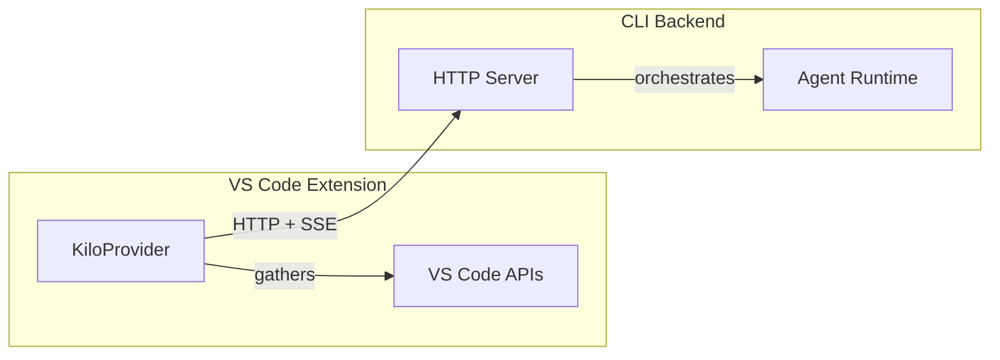
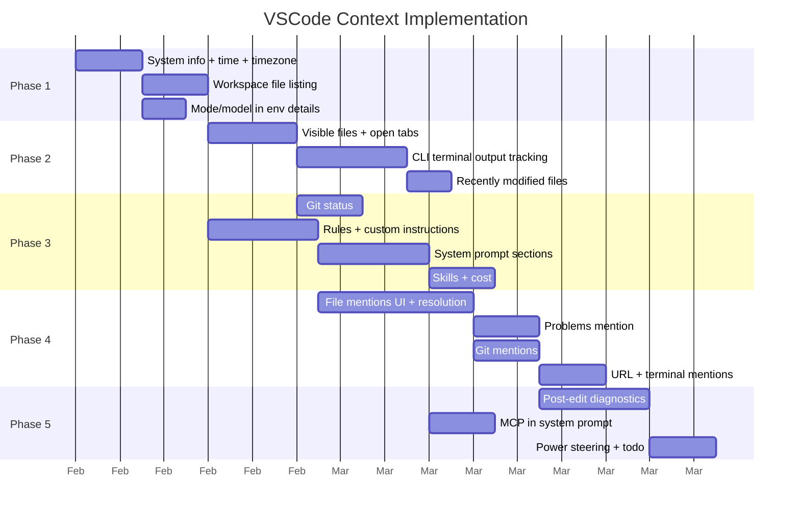

# VSCode Context Plan for `packages/kilo-vscode/`

## Status Quo

PR #307 added the first piece of VSCode context: the active editor file is auto-injected as a `file://` URI part when sending messages. The reimplemented extension currently provides:

- **Active editor file URI** — sent as a `{ type: "file", mime: "text/plain", url }` part
- **Workspace directory** — sent via the `x-opencode-directory` HTTP header on every request

The main extension (`src/`) provides a much richer context surface across four channels. This plan describes how to bring that context to the reimplemented extension in phases.

## Architecture Constraint



The reimplemented extension is a **thin VS Code UI** that communicates with a **CLI backend** over HTTP/SSE.

- **VS Code-only context** — anything requiring `vscode.*` APIs (active editor, open tabs, terminal output, diagnostics) MUST be gathered in the extension and sent to the CLI.
- **Filesystem context** — anything that can be gathered from the filesystem (workspace file listing, git status, rule files, `.kilocodeignore`) could be gathered by the CLI itself, since it already knows the workspace directory.

The protocol between extension and CLI currently supports:
- `parts` array with `text` and `file` parts on `POST /session/{id}/message`
- `x-opencode-directory` header for workspace path

New context will require extending this protocol — most likely with a dedicated `context` or `environment` field on the message payload, or a new endpoint for pushing editor state.

---

## Phase 1: Essential Context — High Impact, Low Complexity

Context every AI coding assistant needs to function well.

### 1.1 System Info

| Item | Where to gather | Priority |
|---|---|---|
| OS type | CLI (Node `os.type()`) | P0 |
| Default shell | Extension (`vscode.env.shell`) | P0 |
| Home directory | CLI (`os.homedir()`) | P0 |
| Current workspace directory | Already provided via header | ✅ Done |

**Architecture**: The CLI already has OS and home dir. Shell must come from the extension — add it to the message payload or a new `context` field. The CLI should include this in the system prompt it builds.

**Config**: None needed — always included.

### 1.2 Current Time + Timezone

| Item | Where to gather | Priority |
|---|---|---|
| UTC timestamp | CLI (`new Date().toISOString()`) | P0 |
| User timezone | Extension (`Intl.DateTimeFormat().resolvedOptions().timeZone`) | P0 |

**Architecture**: Timezone comes from the extension; timestamp from the CLI. Could also be entirely CLI-side if the CLI process runs in the user's timezone (which it does when spawned locally).

**Config**: `includeCurrentTime` (default: `true`).

### 1.3 Workspace File Listing (first message only)

| Item | Where to gather | Priority |
|---|---|---|
| Recursive file listing of workspace | CLI (filesystem) | P0 |

**Architecture**: The CLI has the workspace path and filesystem access. It should build this itself, respecting `.kilocodeignore`. No VS Code API needed.

**Config**: `maxWorkspaceFiles` (default: `200`, `0` = disabled), `showRooIgnoredFiles`.

### 1.4 Current Mode / Model / Protocol

| Item | Where to gather | Priority |
|---|---|---|
| Active mode slug + name | Extension (knows the selected agent) | P0 |
| Active model ID | Extension (knows provider + model selection) | P0 |
| Tool protocol | CLI (derived from model info) | P1 |

**Architecture**: The extension already sends `agent`, `providerID`, `modelID` with each message. The CLI can derive this for environment details.

**Config**: None needed — always included.

---

## Phase 2: Editor-Aware Context — Medium Complexity

Context that makes the AI aware of what the user is doing in their editor.

### 2.1 Visible Files

| Item | Where to gather | Priority |
|---|---|---|
| Currently visible editor file paths | Extension (`vscode.window.visibleTextEditors`) | P0 |

**Architecture**: Extension gathers `editor.document.uri.fsPath` for all visible editors, converts to workspace-relative paths, and sends them in the context payload. The CLI includes them in environment details.

**Config**: Filtered by `.kilocodeignore` (CLI-side).

### 2.2 Open Tabs

| Item | Where to gather | Priority |
|---|---|---|
| Open tab file paths | Extension (`vscode.window.tabGroups`) | P1 |

**Architecture**: Extension gathers tab URIs, converts to workspace-relative paths. Consider sending as a separate field from visible files. Same ignore filtering applies.

**Config**: `maxOpenTabsContext` (default: `20`).

### 2.3 Active Terminal Output

| Item | Where to gather | Priority |
|---|---|---|
| Running terminal commands + output | Extension (`vscode.window.terminals`) or CLI-managed terminals | P1 |

**Architecture**: This is nuanced. In the main extension, terminals are created and managed via `TerminalRegistry`. In the reimplemented extension, the CLI backend runs commands itself. Two approaches:

1. **CLI-managed terminals** (preferred): The CLI already executes commands. It should track its own terminal output and include it in environment details automatically. No VS Code API needed.
2. **VS Code terminals**: If the user has VS Code terminals open, the extension could use `vscode.window.terminals` to read output. However, the VS Code terminal API has limited output access (no `onDidWriteTerminalData` on stable API).

**Recommendation**: Start with CLI-managed terminal output only. VS Code terminal integration can come later if needed.

**Config**: `terminalOutputLineLimit` (default: `500`), `terminalOutputCharacterLimit`.

### 2.4 Recently Modified Files

| Item | Where to gather | Priority |
|---|---|---|
| Files modified since last AI access | CLI (tracks file edits from tool use) | P2 |

**Architecture**: The CLI knows which files it has edited. It can track a "modified files" list and include it in environment details. No VS Code API needed.

**Config**: None — automatic.

---

## Phase 3: Project-Aware Context — Medium-High Complexity

Deeper project understanding context.

### 3.1 Git Status

| Item | Where to gather | Priority |
|---|---|---|
| Changed/staged/untracked files | CLI (`git status`) | P1 |

**Architecture**: CLI has filesystem access and can run `git status`. No VS Code API needed.

**Config**: `maxGitStatusFiles` (default: `0` = disabled).

### 3.2 Rules and Custom Instructions

| Item | Where to gather | Priority |
|---|---|---|
| `.kilocode/rules/` files | CLI (filesystem) | P0 |
| Global rules from `~/.kilocode/rules/` | CLI (filesystem) | P0 |
| Mode-specific rules | CLI (filesystem) | P1 |
| Custom instructions from settings | Extension (VS Code settings) or CLI (config) | P1 |

**Architecture**: All rule files live on the filesystem — the CLI can read them directly. Custom instructions stored in VS Code settings need to be sent by the extension (or stored in the CLI's config, which is already the case for the reimplemented extension).

**Config**: Global custom instructions, mode-specific instructions, `.kilocodeignore` rules.

### 3.3 Skills

| Item | Where to gather | Priority |
|---|---|---|
| Available skills from `.kilocode/skills/` | CLI (filesystem) | P2 |

**Architecture**: Skills are filesystem-based. The CLI can discover and include them in the system prompt.

**Config**: Skills are auto-discovered.

### 3.4 System Prompt

| Item | Where to gather | Priority |
|---|---|---|
| Role definition per mode | CLI (mode config) | P0 |
| Tool catalog | CLI (mode + model capabilities) | P0 |
| Capabilities section | CLI | P1 |
| Available modes listing | CLI | P1 |

**Architecture**: The system prompt is entirely built by the CLI/agent runtime. The extension does not need to be involved.

### 3.5 Current Cost

| Item | Where to gather | Priority |
|---|---|---|
| Running cost for current task | CLI (tracks API usage) | P2 |

**Architecture**: CLI tracks costs. Include in environment details.

**Config**: `includeCurrentCost` (default: `true`).

---

## Phase 4: Interactive Context — @-Mentions

User-triggered context that requires both UI and backend support.

### 4.1 File Mentions (`@/path/to/file`)

| Item | Where to gather | Priority |
|---|---|---|
| File content inline | CLI (filesystem) | P0 |
| Directory listing | CLI (filesystem) | P1 |

**Architecture**: The webview needs a mention picker UI. When a mention is included, it gets sent as part of the message. The CLI resolves file content from the filesystem. This could leverage the existing `file` part type: `{ type: "file", mime: "text/plain", url: "file:///path" }`.

### 4.2 Problems Mention (`@problems`)

| Item | Where to gather | Priority |
|---|---|---|
| Workspace diagnostics | Extension (`vscode.languages.getDiagnostics()`) | P1 |

**Architecture**: Diagnostics are VS Code-only. The extension must gather them and send as a text or structured part. The webview sends `@problems` as a mention, the extension intercepts and resolves it before forwarding to the CLI.

### 4.3 Git Mentions (`@git-changes`, `@<commit-sha>`)

| Item | Where to gather | Priority |
|---|---|---|
| Git working diff | CLI (`git diff`) | P1 |
| Commit info | CLI (`git show`) | P2 |

**Architecture**: CLI can handle these directly — no VS Code API needed.

### 4.4 Terminal Mention (`@terminal`)

| Item | Where to gather | Priority |
|---|---|---|
| Terminal output | Hybrid | P2 |

**Architecture**: If referring to CLI-managed terminals, the CLI handles it. If referring to VS Code terminals, the extension would need to gather output (limited API support).

### 4.5 URL Mention (`@http://...`)

| Item | Where to gather | Priority |
|---|---|---|
| Fetched URL content | CLI (`fetch`) | P2 |

**Architecture**: CLI can fetch URLs directly.

---

## Phase 5: Advanced Context — Power Features

### 5.1 Post-Tool-Use Diagnostics

| Item | Where to gather | Priority |
|---|---|---|
| New diagnostics after file edits | Extension (`vscode.languages.getDiagnostics()`) | P1 |

**Architecture**: After the CLI reports a file edit, the extension should wait briefly, then gather diagnostics and push them to the CLI. This requires a push mechanism (extension → CLI) that doesn't exist yet.

**Options**:
1. **Poll-based**: CLI asks the extension for diagnostics after each edit via a callback endpoint
2. **Push-based**: Extension pushes diagnostics via a new HTTP endpoint on the CLI
3. **Piggyback**: Extension includes fresh diagnostics with the next user message

**Recommendation**: Start with option 3 (piggyback) — include diagnostics in the context payload of the next message.

### 5.2 MCP Servers

| Item | Where to gather | Priority |
|---|---|---|
| Connected MCP server info | CLI (manages MCP connections) | P2 |
| MCP tool catalog | CLI | P2 |

**Architecture**: The CLI already manages MCP servers. Include in system prompt when MCP group is enabled for the mode.

### 5.3 Browser Session Status

| Item | Where to gather | Priority |
|---|---|---|
| Active browser session | CLI (manages browser) | P3 |

**Architecture**: CLI-managed. Include in environment details when active.

### 5.4 Power Steering

| Item | Where to gather | Priority |
|---|---|---|
| Role + instructions in every message | CLI (experiment flag) | P3 |

**Architecture**: CLI includes role definition and custom instructions in environment details when the experiment is enabled.

### 5.5 Todo List / Reminders

| Item | Where to gather | Priority |
|---|---|---|
| Active todo items | CLI (task state) | P2 |

**Architecture**: CLI manages todo state. Include in environment details.

**Config**: `todoListEnabled` (default: `true`).

---

## Protocol Design

The current protocol sends message parts and a workspace directory. To support richer context, we need to extend the `POST /session/{id}/message` payload:

```typescript
interface SendMessagePayload {
  // Existing
  parts: MessagePart[]
  model?: { providerID: string; modelID: string }
  agent?: string

  // NEW: Editor context from VS Code
  editorContext?: {
    visibleFiles?: string[]        // workspace-relative paths
    openTabs?: string[]            // workspace-relative paths
    activeFile?: string            // workspace-relative path (replaces file:// part)
    shell?: string                 // user's default shell
    timezone?: string              // user's timezone
    diagnostics?: DiagnosticInfo[] // workspace diagnostics
  }
}
```

Alternatively, a separate `PUT /session/{id}/context` endpoint could be used to push editor state independently of messages. This would enable:
- Pushing context changes as the user navigates (not just when sending messages)
- Keeping message payloads lean
- Allowing the CLI to request fresh context

**Recommendation**: Start with embedding context in the message payload (simpler). Migrate to a separate endpoint if polling/push patterns are needed for Phase 5.

---

## Implementation Order



---

## Summary Table

| Context Item | Channel | VS Code API Required | Gather In | Phase |
|---|---|---|---|---|
| Workspace directory | B | No | ✅ Done | — |
| Active editor file | B | Yes | ✅ Done | — |
| OS / home dir | A | No | CLI | 1 |
| Default shell | A/B | Yes | Extension | 1 |
| Timezone | B | Yes* | Extension | 1 |
| Current time | B | No | CLI | 1 |
| Workspace file listing | B | No | CLI | 1 |
| Mode / model / protocol | B | Partial | Both | 1 |
| Visible files | B | Yes | Extension | 2 |
| Open tabs | B | Yes | Extension | 2 |
| Terminal output | B | No** | CLI | 2 |
| Recently modified files | B | No | CLI | 2 |
| Git status | B | No | CLI | 3 |
| Rules / custom instructions | A | No | CLI | 3 |
| Skills | A | No | CLI | 3 |
| System prompt sections | A | No | CLI | 3 |
| Current cost | B | No | CLI | 3 |
| @file / @dir mentions | C | No | CLI | 4 |
| @problems mention | C | Yes | Extension | 4 |
| @git-changes / @commit | C | No | CLI | 4 |
| @terminal mention | C | No** | CLI | 4 |
| @url mention | C | No | CLI | 4 |
| Post-edit diagnostics | D | Yes | Extension | 5 |
| MCP servers | A | No | CLI | 5 |
| Browser session | B | No | CLI | 5 |
| Power steering | B | No | CLI | 5 |
| Todo list | B | No | CLI | 5 |

\* Timezone can also be gathered CLI-side if the process runs locally.
\** For CLI-managed terminals only; VS Code terminal access requires the extension.
