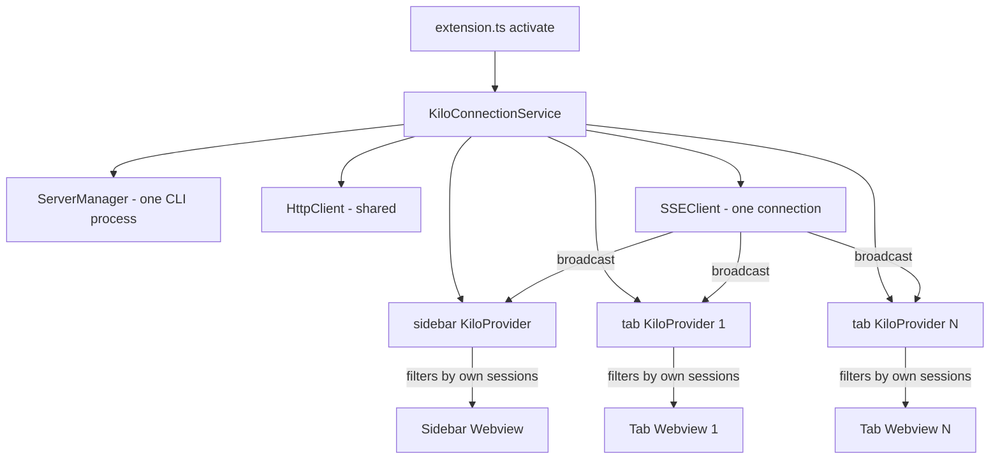

# Implementation Plan: Shared Server + Independent Sessions

## Overview

Extract the server connection lifecycle from [`KiloProvider`](src/KiloProvider.ts) into a shared [`KiloConnectionService`](src/services/cli-backend/connection-service.ts) created once at extension activation. Each `KiloProvider` (sidebar or tab) receives this shared service but maintains its own session state and event filtering.



---

## Step 1: Create `KiloConnectionService`

**New file:** `src/services/cli-backend/connection-service.ts`

This singleton-per-activation service owns the server lifecycle, HTTP client, and SSE stream. Multiple `KiloProvider` instances subscribe to it.

### Interface

```typescript
import type { ServerConfig, SSEEvent } from "./types"
import type { ServerManager } from "./server-manager"
import type { HttpClient } from "./http-client"
import type { SSEClient } from "./sse-client"

type ConnectionState = "connecting" | "connected" | "disconnected" | "error"
type SSEEventListener = (event: SSEEvent) => void
type StateListener = (state: ConnectionState) => void

export class KiloConnectionService {
  private serverManager: ServerManager
  private httpClient: HttpClient | null = null
  private sseClient: SSEClient | null = null
  private serverInfo: { port: number } | null = null
  private connectionState: ConnectionState = "disconnected"
  private connectPromise: Promise<void> | null = null

  // Listener registries
  private eventListeners: Set<SSEEventListener> = new Set()
  private stateListeners: Set<StateListener> = new Set()

  constructor(context: vscode.ExtensionContext) {
    this.serverManager = new ServerManager(context)
  }

  /** Lazily start server + SSE. Multiple callers share the same promise. */
  async connect(workspaceDir: string): Promise<void>

  /** Get the shared HttpClient. Throws if not connected. */
  getHttpClient(): HttpClient

  /** Get server info (port). Returns null if not connected. */
  getServerInfo(): { port: number } | null

  /** Current connection state. */
  getConnectionState(): ConnectionState

  /** Subscribe to SSE events. Returns unsubscribe function. */
  onEvent(listener: SSEEventListener): () => void

  /** Subscribe to connection state changes. Returns unsubscribe function. */
  onStateChange(listener: StateListener): () => void

  /** Clean up everything: kill server, close SSE, clear listeners. */
  dispose(): void
}
```

### Implementation details for `connect()`

```typescript
async connect(workspaceDir: string): Promise<void> {
  // Dedup: if already connecting or connected, return existing promise
  if (this.connectPromise) {
    return this.connectPromise
  }
  if (this.connectionState === "connected") {
    return
  }

  this.connectPromise = this.doConnect(workspaceDir)
  try {
    await this.connectPromise
  } finally {
    this.connectPromise = null
  }
}

private async doConnect(workspaceDir: string): Promise<void> {
  const server = await this.serverManager.getServer()
  this.serverInfo = { port: server.port }

  const config: ServerConfig = {
    baseUrl: `http://127.0.0.1:${server.port}`,
    password: server.password,
  }

  this.httpClient = new HttpClient(config)
  this.sseClient = new SSEClient(config)

  // Wire SSE events → broadcast to all registered listeners
  this.sseClient.onEvent((event) => {
    for (const listener of this.eventListeners) {
      listener(event)
    }
  })

  // Wire SSE state → broadcast to all registered state listeners
  this.sseClient.onStateChange((state) => {
    this.connectionState = state
    for (const listener of this.stateListeners) {
      listener(state)
    }
  })

  this.sseClient.connect(workspaceDir)
}
```

### Export from index

Update [`src/services/cli-backend/index.ts`](src/services/cli-backend/index.ts) to add:

```typescript
export { KiloConnectionService } from "./connection-service"
```

---

## Step 2: Refactor `KiloProvider` to accept shared service

**File:** [`src/KiloProvider.ts`](src/KiloProvider.ts)

### Constructor change

Remove `ServerManager` creation. Accept `KiloConnectionService` instead.

**Before** (line 24-29):

```typescript
constructor(
  private readonly extensionUri: vscode.Uri,
  context: vscode.ExtensionContext,
) {
  this.serverManager = new ServerManager(context)
}
```

**After:**

```typescript
constructor(
  private readonly extensionUri: vscode.Uri,
  private readonly connectionService: KiloConnectionService,
) {}
```

### Remove fields that move to the service

Remove these instance fields from `KiloProvider`:

- [`serverManager`](src/KiloProvider.ts:14) — now in the service
- [`httpClient`](src/KiloProvider.ts:15) — access via `connectionService.getHttpClient()`
- [`sseClient`](src/KiloProvider.ts:16) — the service manages it
- [`serverInfo`](src/KiloProvider.ts:20) — access via `connectionService.getServerInfo()`

Keep these per-instance fields:

- [`webviewView`](src/KiloProvider.ts:17) — per-webview
- [`webview`](src/KiloProvider.ts:18) — per-webview
- [`currentSession`](src/KiloProvider.ts:19) — per-webview session state
- [`connectionState`](src/KiloProvider.ts:21) — per-webview copy of state
- [`loginAttempt`](src/KiloProvider.ts:22) — per-webview

Add new field for tracking subscriptions:

```typescript
private unsubscribeEvent: (() => void) | null = null
private unsubscribeState: (() => void) | null = null
```

### Refactor `initializeConnection()` (line 195-274)

Replace the entire method. Instead of creating clients and managing the server, subscribe to the shared service:

```typescript
private async initializeConnection(): Promise<void> {
  console.log("[Kilo New] KiloProvider: Starting initializeConnection...")
  try {
    const workspaceDir = this.getWorkspaceDirectory()

    // Connect the shared service (no-op if already connected)
    await this.connectionService.connect(workspaceDir)

    // Subscribe to SSE events for this webview
    this.unsubscribeEvent = this.connectionService.onEvent((event) => {
      this.handleSSEEvent(event)
    })

    // Subscribe to connection state changes
    this.unsubscribeState = this.connectionService.onStateChange(async (state) => {
      this.connectionState = state
      this.postMessage({ type: "connectionState", state })

      if (state === "connected") {
        const httpClient = this.connectionService.getHttpClient()
        const profileData = await httpClient.getProfile()
        this.postMessage({ type: "profileData", data: profileData })
        await this.syncWebviewState("sse-connected")
      }
    })

    // Get current state and push to webview
    const serverInfo = this.connectionService.getServerInfo()
    this.connectionState = this.connectionService.getConnectionState()

    if (serverInfo) {
      this.postMessage({ type: "ready", serverInfo })
    }

    this.postMessage({ type: "connectionState", state: this.connectionState })
    await this.syncWebviewState("initializeConnection")
  } catch (error) {
    console.error("[Kilo New] KiloProvider: Failed to initialize connection:", error)
    this.connectionState = "error"
    this.postMessage({
      type: "connectionState",
      state: "error",
      error: error instanceof Error ? error.message : "Failed to connect to CLI backend",
    })
  }
}
```

### Update all `this.httpClient` references

Every method that currently uses `this.httpClient` should instead call `this.connectionService.getHttpClient()`. The affected methods and their line numbers:

| Method                                                  | Lines | Change                                                       |
| ------------------------------------------------------- | ----- | ------------------------------------------------------------ |
| [`syncWebviewState()`](src/KiloProvider.ts:38)          | 68    | `this.httpClient` → `this.connectionService.getHttpClient()` |
| [`handleCreateSession()`](src/KiloProvider.ts:291)      | 292   | Guard check + usage                                          |
| [`handleLoadMessages()`](src/KiloProvider.ts:322)       | 323   | Guard check + usage                                          |
| [`handleLoadSessions()`](src/KiloProvider.ts:361)       | 362   | Guard check + usage                                          |
| [`handleSendMessage()`](src/KiloProvider.ts:390)        | 391   | Guard check + usage                                          |
| [`handleAbort()`](src/KiloProvider.ts:431)              | 432   | Guard check + usage                                          |
| [`handlePermissionResponse()`](src/KiloProvider.ts:452) | 453   | Guard check + usage                                          |
| [`handleLogin()`](src/KiloProvider.ts:480)              | 481   | Guard check + usage                                          |
| [`handleLogout()`](src/KiloProvider.ts:539)             | 540   | Guard check + usage                                          |
| [`handleRefreshProfile()`](src/KiloProvider.ts:556)     | 557   | Guard check + usage                                          |

Add a private helper to simplify the pattern:

```typescript
private get httpClient(): HttpClient | null {
  try {
    return this.connectionService.getHttpClient()
  } catch {
    return null
  }
}
```

This property getter preserves the existing null-check pattern used throughout the class, minimizing changes to all the handler methods.

### Consolidate message handlers (lines 103-147, 166-189)

Currently [`resolveWebviewPanel()`](src/KiloProvider.ts:156) is missing these handlers that [`resolveWebviewView()`](src/KiloProvider.ts:83) has:

- `webviewReady`
- `login`
- `cancelLogin`
- `logout`
- `refreshProfile`
- `openExternal`

Extract the message handler setup into a shared private method:

```typescript
private setupWebviewMessageHandler(webview: vscode.Webview): void {
  webview.onDidReceiveMessage(async (message) => {
    switch (message.type) {
      case "webviewReady":
        this.isWebviewReady = true
        await this.syncWebviewState("webviewReady")
        break
      case "sendMessage":
        await this.handleSendMessage(message.text, message.sessionID)
        break
      case "abort":
        await this.handleAbort(message.sessionID)
        break
      case "permissionResponse":
        await this.handlePermissionResponse(message.permissionId, message.sessionID, message.response)
        break
      case "createSession":
        await this.handleCreateSession()
        break
      case "loadMessages":
        await this.handleLoadMessages(message.sessionID)
        break
      case "loadSessions":
        await this.handleLoadSessions()
        break
      case "login":
        await this.handleLogin()
        break
      case "cancelLogin":
        this.loginAttempt++
        this.postMessage({ type: "deviceAuthCancelled" })
        break
      case "logout":
        await this.handleLogout()
        break
      case "refreshProfile":
        await this.handleRefreshProfile()
        break
      case "openExternal":
        if (message.url) {
          vscode.env.openExternal(vscode.Uri.parse(message.url))
        }
        break
    }
  })
}
```

Then both [`resolveWebviewView()`](src/KiloProvider.ts:83) and [`resolveWebviewPanel()`](src/KiloProvider.ts:156) call `this.setupWebviewMessageHandler(webview)` instead of duplicating the switch statement.

### SSE event filtering — `handleSSEEvent()` (line 572-651)

The current filtering logic at line 574:

```typescript
if ("sessionID" in event.properties) {
  const props = event.properties as { sessionID?: string }
  if (this.currentSession && props.sessionID !== this.currentSession.id) {
    return
  }
}
```

This is almost correct for the shared model, but needs a subtle fix. Currently, if `currentSession` is null, ALL events pass through. With shared SSE, this would leak events from other webviews. The fix:

**Change the filtering to use a tracked set of session IDs:**

Add field:

```typescript
private trackedSessionIds: Set<string> = new Set()
```

Update filtering:

```typescript
private handleSSEEvent(event: SSEEvent): void {
  // Extract sessionID from the event
  const sessionID = this.extractSessionID(event)

  // Events without sessionID (server.connected, server.heartbeat) → always forward
  // Events with sessionID → only forward if this webview tracks that session
  if (sessionID && !this.trackedSessionIds.has(sessionID)) {
    return
  }

  // ... rest of the switch/case stays the same
}

private extractSessionID(event: SSEEvent): string | undefined {
  switch (event.type) {
    case "session.created":
    case "session.updated":
      return event.properties.info.id
    case "session.status":
    case "session.idle":
    case "todo.updated":
      return event.properties.sessionID
    case "message.updated":
      return event.properties.info.sessionID
    case "message.part.updated": {
      const part = event.properties.part as { sessionID?: string }
      return part.sessionID
    }
    case "permission.asked":
    case "permission.replied":
      return event.properties.sessionID
    default:
      return undefined
  }
}
```

**Track sessions when created or selected:**

In [`handleCreateSession()`](src/KiloProvider.ts:291), after creating:

```typescript
this.trackedSessionIds.add(session.id)
```

In [`handleSendMessage()`](src/KiloProvider.ts:390), after auto-creating:

```typescript
this.trackedSessionIds.add(this.currentSession.id)
```

When a webview selects an existing session via `loadMessages`:

```typescript
private async handleLoadMessages(sessionID: string): Promise<void> {
  this.trackedSessionIds.add(sessionID)
  // ... existing logic
}
```

Also handle `session.created` SSE events — when a session is created via HTTP and the SSE notification comes back, if this provider doesn't track it yet but has no current session, adopt it. The current logic at line 640-643 already does this:

```typescript
case "session.created":
  if (!this.currentSession) {
    this.currentSession = event.properties.info
  }
```

Update this to also add to tracked set:

```typescript
case "session.created":
  if (!this.currentSession) {
    this.currentSession = event.properties.info
    this.trackedSessionIds.add(event.properties.info.id)
  }
```

### Update `dispose()` (line 732-735)

**Before:**

```typescript
dispose(): void {
  this.sseClient?.dispose()
  this.serverManager.dispose()
}
```

**After:**

```typescript
dispose(): void {
  this.unsubscribeEvent?.()
  this.unsubscribeState?.()
  this.trackedSessionIds.clear()
}
```

The service is NOT disposed here — it lives for the lifetime of the extension.

### Update `syncWebviewState()` (line 38-81)

Replace `this.serverInfo` with `this.connectionService.getServerInfo()` and `this.httpClient` with the getter.

---

## Step 3: Update `extension.ts`

**File:** [`src/extension.ts`](src/extension.ts)

### Create shared service in `activate()` (line 6-48)

```typescript
export function activate(context: vscode.ExtensionContext) {
  console.log("Kilo Code extension is now active")

  // Create shared connection service (one server for all webviews)
  const connectionService = new KiloConnectionService(context)

  // Create the provider with shared service
  const provider = new KiloProvider(context.extensionUri, connectionService)

  // Register sidebar
  context.subscriptions.push(vscode.window.registerWebviewViewProvider(KiloProvider.viewType, provider))

  // ... commands stay the same ...

  // Tab command uses shared service
  context.subscriptions.push(
    vscode.commands.registerCommand("kilo-code.new.openInTab", () => {
      openKiloInNewTab(context, connectionService)
    }),
  )

  // Dispose service when extension deactivates (kills the server)
  context.subscriptions.push({
    dispose: () => {
      provider.dispose()
      connectionService.dispose()
    },
  })
}
```

### Update `openKiloInNewTab()` (line 52-97)

**Before** (line 83):

```typescript
const tabProvider = new KiloProvider(context.extensionUri, context)
```

**After:**

```typescript
async function openKiloInNewTab(context: vscode.ExtensionContext, connectionService: KiloConnectionService) {
  // ... panel creation stays the same (lines 53-81) ...

  const tabProvider = new KiloProvider(context.extensionUri, connectionService)
  tabProvider.resolveWebviewPanel(panel)

  // ... rest stays the same (lines 86-96) ...
}
```

---

## Step 4: Handle edge cases

### Tab closed

When a tab is disposed (`panel.onDidDispose` at line 89-96), `tabProvider.dispose()` runs. This:

1. Unsubscribes from SSE events (no more broadcasts to this provider)
2. Unsubscribes from state changes
3. Clears tracked session IDs
4. Does NOT kill the server or SSE connection

The server and SSE continue running for other webviews.

### Sidebar hidden and shown again

When the sidebar is hidden by VSCode, the webview is destroyed. When shown again, [`resolveWebviewView()`](src/KiloProvider.ts:83) is called again on the SAME provider instance. The method calls `initializeConnection()` which will:

1. Call `connectionService.connect()` — no-op since already connected
2. Re-subscribe to SSE events (old subscriptions should be cleaned up first)
3. Re-push state to the new webview

Add cleanup of old subscriptions at the start of `initializeConnection()`:

```typescript
private async initializeConnection(): Promise<void> {
  // Clean up any existing subscriptions (e.g., sidebar re-shown)
  this.unsubscribeEvent?.()
  this.unsubscribeState?.()
  // ... rest of the method
}
```

### Server crash / SSE disconnect

The [`SSEClient`](src/services/cli-backend/sse-client.ts) already notifies `"disconnected"` state on error (line 81). The `KiloConnectionService` broadcasts this to all providers, so all webviews show the disconnected state.

Currently there is no auto-reconnect in the `SSEClient`. This is an existing limitation, not something this refactor introduces. If reconnection is needed later, it belongs in the `KiloConnectionService.doConnect()` or `SSEClient`.

### Multiple workspaces

[`getWorkspaceDirectory()`](src/KiloProvider.ts:664) always returns the first workspace folder. This is unchanged by this refactor. All webviews share the same workspace directory.

---

## Implementation Order

### Phase 1: Create `KiloConnectionService` (no existing code changes)

1. Create `src/services/cli-backend/connection-service.ts` with the full class
2. Export from `src/services/cli-backend/index.ts`
3. Compile to verify types are correct

### Phase 2: Refactor `KiloProvider` internals

1. Change constructor to accept `KiloConnectionService`
2. Remove `serverManager`, `httpClient`, `sseClient`, `serverInfo` fields
3. Add `httpClient` getter property, `unsubscribe*` fields, `trackedSessionIds`
4. Rewrite `initializeConnection()` to use service
5. Update `syncWebviewState()` references
6. Update `handleSSEEvent()` filtering with `trackedSessionIds` + `extractSessionID()`
7. Add `trackedSessionIds.add()` in `handleCreateSession()`, `handleSendMessage()`, `handleLoadMessages()`, and `session.created` SSE handler
8. Update `dispose()`

### Phase 3: Consolidate message handlers

1. Extract `setupWebviewMessageHandler()` private method
2. Update `resolveWebviewView()` to call it
3. Update `resolveWebviewPanel()` to call it (fixes missing handlers)
4. Remove duplicated switch statements from both resolve methods

### Phase 4: Update `extension.ts`

1. Import `KiloConnectionService`
2. Create service in `activate()`
3. Pass to sidebar provider constructor
4. Update `openKiloInNewTab()` to accept and pass service
5. Move service dispose to extension subscriptions

### Phase 5: Test and verify

1. `pnpm compile` — verify no type errors
2. Test sidebar loads and connects
3. Test opening a tab — verify it reuses the same server port
4. Test both sidebar and tab can have independent sessions
5. Test that SSE events only appear in the correct webview
6. Test closing a tab doesn't break the sidebar
7. Test sidebar hide/show cycle

---

## Files Changed Summary

| File                                             | Change Type | Description                                                                                     |
| ------------------------------------------------ | ----------- | ----------------------------------------------------------------------------------------------- |
| `src/services/cli-backend/connection-service.ts` | **NEW**     | Shared service holding ServerManager + HttpClient + SSEClient                                   |
| `src/services/cli-backend/index.ts`              | Modified    | Add export for `KiloConnectionService`                                                          |
| `src/KiloProvider.ts`                            | Modified    | Accept service, remove own server/client management, add session tracking, consolidate handlers |
| `src/extension.ts`                               | Modified    | Create service once, pass to all providers                                                      |

No webview changes needed. No changes to `ServerManager`, `HttpClient`, `SSEClient`, or `types.ts`.
