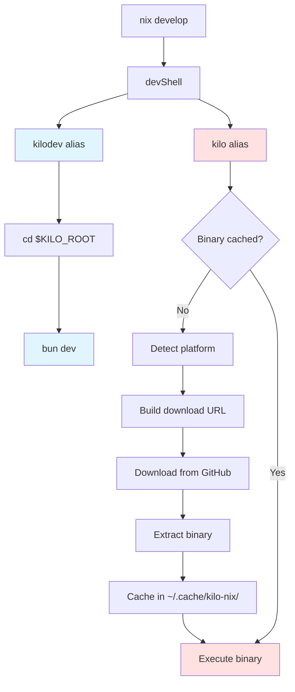

# Flake.nix Kilo Aliases Refactoring Plan

## Overview

Modify [`flake.nix`](flake.nix) to provide two separate aliases in the development shell:

- `kilodev` - runs the local development version (current `kilo` alias)
- `kilo` - downloads and uses the stable published version from GitHub releases

## Current State

The [`flake.nix`](flake.nix:24-27) currently has a single `kilo` alias that runs the dev version:

```nix
kilo = pkgs.writeShellScriptBin "kilo" ''
  cd "$KILO_ROOT"
  exec ${pkgs.bun}/bin/bun dev "$@"
'';
```

## Proposed Changes

### 1. Rename Current Alias to `kilodev`

**Location:** [`flake.nix`](flake.nix:24-27)

Change the existing alias from `kilo` to `kilodev`:

```nix
kilodev = pkgs.writeShellScriptBin "kilodev" ''
  cd "$KILO_ROOT"
  exec ${pkgs.bun}/bin/bun dev "$@"
'';
```

**Also update:** [`flake.nix`](flake.nix:42) - change `kilo` to `kilodev` in the packages list

### 2. Create New Stable `kilo` Alias

**Location:** [`flake.nix`](flake.nix:24-27) (add after `kilodev`)

Create a new script that downloads the stable binary from GitHub releases, following the same logic as the [`install`](install:171-192) script.

#### Key Requirements:

1. **Platform Detection** (based on [`install`](install:81-112)):
   - Detect OS: Linux, Darwin (macOS)
   - Detect architecture: x64, arm64
   - Handle Rosetta 2 detection on macOS
   - Detect musl vs glibc on Linux
   - Detect AVX2 support for baseline builds

2. **Binary URL Pattern** (based on [`install`](install:156)):
   - Format: `kilo-{os}-{arch}[-baseline][-musl].{ext}`
   - Extension: `.tar.gz` for Linux, `.zip` for macOS
   - URL: `https://github.com/Kilo-Org/kilo/releases/latest/download/{filename}`

3. **Download and Extract**:
   - Use `pkgs.fetchurl` or shell script with `curl`
   - Extract using `tar` (Linux) or `unzip` (macOS)
   - Place binary in a location accessible to the shell

4. **Caching**:
   - Cache the downloaded binary to avoid re-downloading on every shell entry
   - Store in `$HOME/.cache/kilo-nix/` or similar

#### Implementation Approach

Use `pkgs.writeShellScriptBin` to create a wrapper script that:

```nix
kilo = pkgs.writeShellScriptBin "kilo" ''
  set -euo pipefail

  CACHE_DIR="$HOME/.cache/kilo-nix"
  KILO_BIN="$CACHE_DIR/kilo"

  # Platform detection
  os=$(uname -s | tr '[:upper:]' '[:lower:]')
  case "$os" in
    darwin) os="darwin" ;;
    linux) os="linux" ;;
    *) echo "Unsupported OS: $os" >&2; exit 1 ;;
  esac

  arch=$(uname -m)
  case "$arch" in
    aarch64) arch="arm64" ;;
    x86_64) arch="x64" ;;
    *) echo "Unsupported architecture: $arch" >&2; exit 1 ;;
  esac

  # Rosetta 2 detection on macOS
  if [ "$os" = "darwin" ] && [ "$arch" = "x64" ]; then
    rosetta_flag=$(sysctl -n sysctl.proc_translated 2>/dev/null || echo 0)
    if [ "$rosetta_flag" = "1" ]; then
      arch="arm64"
    fi
  fi

  # Musl detection on Linux
  is_musl=""
  if [ "$os" = "linux" ]; then
    if [ -f /etc/alpine-release ] || (command -v ldd >/dev/null 2>&1 && ldd --version 2>&1 | grep -qi musl); then
      is_musl="-musl"
    fi
  fi

  # AVX2 detection for baseline builds
  needs_baseline=""
  if [ "$arch" = "x64" ]; then
    if [ "$os" = "linux" ] && ! grep -qi avx2 /proc/cpuinfo 2>/dev/null; then
      needs_baseline="-baseline"
    elif [ "$os" = "darwin" ]; then
      avx2=$(sysctl -n hw.optional.avx2_0 2>/dev/null || echo 0)
      if [ "$avx2" != "1" ]; then
        needs_baseline="-baseline"
      fi
    fi
  fi

  # Determine archive extension
  if [ "$os" = "linux" ]; then
    ext=".tar.gz"
  else
    ext=".zip"
  fi

  # Build filename and URL
  target="$os-$arch$needs_baseline$is_musl"
  filename="kilo-$target$ext"
  url="https://github.com/Kilo-Org/kilo/releases/latest/download/$filename"

  # Download and cache if not present
  if [ ! -f "$KILO_BIN" ]; then
    echo "Downloading stable kilo from $url..." >&2
    mkdir -p "$CACHE_DIR"

    tmp_dir=$(mktemp -d)
    trap "rm -rf $tmp_dir" EXIT

    ${pkgs.curl}/bin/curl -fsSL -o "$tmp_dir/$filename" "$url"

    if [ "$os" = "linux" ]; then
      ${pkgs.gnutar}/bin/tar -xzf "$tmp_dir/$filename" -C "$tmp_dir"
    else
      ${pkgs.unzip}/bin/unzip -q "$tmp_dir/$filename" -d "$tmp_dir"
    fi

    mv "$tmp_dir/kilo" "$KILO_BIN"
    chmod +x "$KILO_BIN"
  fi

  # Execute the cached binary
  exec "$KILO_BIN" "$@"
'';
```

### 3. Update Package List

**Location:** [`flake.nix`](flake.nix:30-43)

Update the packages list to include both aliases:

```nix
packages = with pkgs; [
  bun
  nodejs_20
  pkg-config
  openssl
  git
  gh
  playwright-driver.browsers
  vsce
  unzip
  gnutar
  gzip
  kilodev  # Changed from kilo
  kilo     # New stable version
];
```

## Architecture Diagram



## Benefits

1. **Clear Separation**: Developers can easily switch between dev and stable versions
2. **Matches Install Script**: The stable version uses the same logic as the install script
3. **Cached Downloads**: Binary is downloaded once and cached for subsequent uses
4. **Platform Aware**: Automatically detects and downloads the correct binary for the system
5. **No Breaking Changes**: Existing workflows continue to work with the new `kilodev` alias

## Testing Plan

After implementation:

1. Enter the dev shell: `nix develop`
2. Test `kilodev` runs the local development version
3. Test `kilo` downloads and runs the stable version
4. Verify caching works (second run should be instant)
5. Test on different platforms if possible (Linux x64, Linux arm64, macOS x64, macOS arm64)

## Potential Issues & Solutions

### Issue 1: Download Failures

**Problem**: Network issues or missing releases could cause failures

**Solution**: Add error handling and fallback messages:

```bash
if ! ${pkgs.curl}/bin/curl -fsSL -o "$tmp_dir/$filename" "$url"; then
  echo "Error: Failed to download kilo from $url" >&2
  echo "Please check your internet connection or visit https://github.com/Kilo-Org/kilo/releases" >&2
  exit 1
fi
```

### Issue 2: Cache Invalidation

**Problem**: Cached binary might become outdated

**Solution**: Add version checking or cache expiration:

- Store version info alongside binary
- Check GitHub API for latest version
- Add `--update` flag to force re-download

### Issue 3: Nix Purity

**Problem**: Downloading at runtime violates Nix's purity model

**Solution**: This is acceptable for dev shells where impurity is expected. For production use, consider using `fetchurl` with a fixed hash instead.

## Alternative Approaches Considered

### Approach 1: Use nix/kilo.nix Package

**Pros**: Pure Nix, reproducible builds
**Cons**: Builds from source, slower, doesn't match install script behavior

### Approach 2: Fixed-Output Derivation

**Pros**: More Nix-like, cached in Nix store
**Cons**: Requires updating hash for each release, less flexible

### Approach 3: Flake Input from GitHub Release

**Pros**: Declarative, version-pinned
**Cons**: Requires flake.lock updates, more complex setup

**Selected Approach**: Runtime download with caching (most similar to install script)

## Files to Modify

1. [`flake.nix`](flake.nix) - Main changes to devShells section

## Estimated Complexity

**Medium** - Requires careful platform detection logic and proper error handling, but follows established patterns from the install script.
